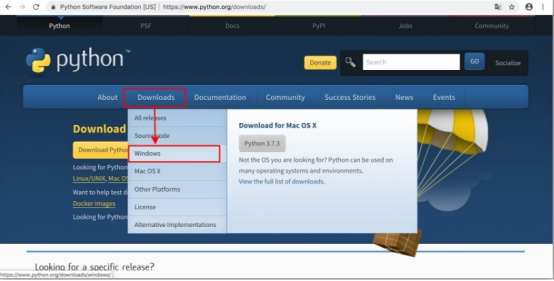
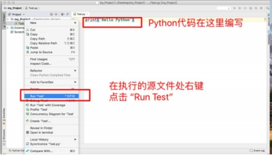

# 一、Python语言家族

## 1 Introduction 

### 1.1 Python 简介

Python 是一个高层次的结合了解释性、编译性、互动性和面向对象的脚本语言。

简单来说，Python是一门编程语言，帮助我们更好的与计算机沟通，功能全面、易学易用、可拓展语言，所以说，人生苦短，我学Python。

Python 的设计具有很强的可读性，相比其他语言经常使用英文关键字，其他语言的一些标点符号，它具有比其他语言更有特色语法结构。

- `Python 是一种解释型高级语言:` 这意味着开发过程中没有了编译这个环节。类似于PHP和Perl语言。
- `Python 是交互式语言:` 这意味着，您可以在一个Python提示符，直接互动执行写你的程序。
- `Python 是面向对象语言:` 这意味着Python支持面向对象的风格或代码封装在对象的编程技术。
- `Python 是初学者的语言:` Python 对初级程序员而言，是一种伟大的语言，开发代码量少，模块扩展库种类繁多，所以它支持广泛的应用程序开发，从简单的文字处理到 WWW 浏览器再到游戏。

##### 扩展：编译型与解释型的原理

- 编译型：编译器将源代码逐条编译成机器代码，任何一条语句 有错，都不能通过编译，最终形成目标代码，以后每次执行只执 行目标代码即可，因此执行速度快。
- 解释型：解释器逐条解释源代码，成功一条就执行一 条，每次执行时都需要解释，所以速度稍慢 

### 1.2 Python发展历史

- Python的作者是荷兰人Guido von Rossum（龟叔）
- 1982年，Guido从阿姆斯特丹大学(University of  Amsterdam)获得了数学和计算机硕士学位。然而，尽管他算得上是一位数学家，但他更加享受计算机带来的乐趣。用他的话说，尽管拥有数学和计算机双料资质，他总趋向于做计算机相关的工作，并热衷于做任何和编程相关的活儿。
- 1989年，为了打发圣诞节假期，Guido开始写Python语言的编译/解释器。Python来自Guido所挚爱的电视剧Monty  Python's Flying Circus  (BBC1960-1970年代播放的室内情景幽默剧，以当时的英国生活为素材)。他希望这个新的叫做Python的语言，能实现他的理念(一种C和shell之间，功能全面，易学易用，可拓展的语言)。Guido作为一个语言设计爱好者，已经有过设计语言的(不很成功)的尝试。这一次，也不过是一次纯粹的hacking行为。
- Python正式诞生于1991年
- Python目前有两个版本，Python2和Python3，代码不完全兼容
- 源文件.py文件猴后缀名
- Python的解释器如今有多个语言实现，通常用的是Cpython或者IPython（官方版本的C语言实现），其他还有Jpython（Java平台）、IronPython（NET和Mono平台）、PyPy（Python实现）

##### 扩展：Python2还是Python3

- py2.7是2.x系列的最后一个版本，已经停止开发，不再增加新功能。2020年终止支持。所有的最新的标准库的更新改进，只会在3.x的版本里出现。Guido决定清理Python2.x ，并且不再兼容旧版本。
- 最大的一个改变就是使用Unicode作为默认编码。Pyhton2.x中直接写中文会报错，Python3中可以直接写中文了。从开源项目看，支持py3的比例已经大大提高，知名的项目一般都支持py2.7和py3+。
- py3比py2更规范统一、去掉了没必要的关键字Python3.x还在持续改进。
- 所以我们还是推荐大家使用Python3.x。

## 2 Python的安装与使用

### 2.1 Python环境搭建

- Python可应用于多平台包括Windows、 Linux/Unix 和 Mac OS。

- Python有不同的搭建环境包括Python解释器(CPython)、编辑器(（)IDLE，PyCharm，Sublime Text)、Python软件包管理系统(pip)

#### 2.1.1 环境下载

- Python最新源码，解释器环境等最新下载 

  Python官网:http://www.python.org/ 

- Python 权威使用技术文档等最新下载 

  Python文档下载地址:http://www.python.org/doc/

#### 2.1.2 Python编辑器

- Ipython IDLE 
- Vim和macVim（linux，unix，macOSX） 
- Eclipse+pyDEV 
- Xcode（macOSX） 
- Notepad++（win） 
- Sublime Text（win，macOSX，linux，unix） 
- PyCharm（全平台）

#### 2.1.3 Unix & Linux 平台安装 Python:(源码式安装)

- 以下为在Unix & Linux 平台上安装 Python 的简单步骤：
  - 打开WEB浏览器访问http://www.python.org/download/
  - 选择适用于Unix/Linux的源码压缩包。
  - 下载及解压压缩包。
  - 如果你需要自定义一些选项修改Modules/Setup
  - 执行 ./configure 脚本
  - make
  - make install
- 执行以上操作后，Python会安装在 /usr/local/bin 目录中，Python库安装在/usr/local/lib/pythonXX，XX为你使用的Python的版本号。

#### 2.1.4 通过ubuntu官方的apt工具包安装

```
   $ sudo apt-get install python  
   $ sudo apt-get install python2.7  
   $ sudo apt-get install python3.6
```

#### 2.1.5 Mac安装Python3

```
   $ brew sreach python
   $ brew install python3
   //在/usr/local/Cellar/这个目录下
```

#### 2.1.6 windows下直接安装

##### ① 首先访问http://www.python.org/download/ 下载最新环境



##### ② 然后选择最新版本，并适用于自己系统的环境


##### ③ 下载后，双击安装,选择“Install Now”默认安装，但一定勾选“Add Python 3.7 toPATH”


##### ④ 如果没有添加环境，在安装之后，配置环境


## 3 Python的运行

##### 运行Python的三种方式

1. 交互式解释器 

2. 命令行运行Python源代码 

3. 使用编辑器或集成开发环境（IDE）例如：pycharm

### 3.1 交互式解释器

- 你可以通过命令行窗口进入python并开在交互式解释器中开始编写Python代码。
- 你可以在Unix，DOS或任何其他提供了命令行或者shell的系统进行python编码工作。

```
$ python # Unix/Linux 
或者 
C:>python # Windows/DOS
```

- 以下为Python命令行参数：

| 选项   | 描述                                                   |
| ------ | ------------------------------------------------------ |
| -d     | 在解析时显示调试信息                                   |
| -O     | 生成优化代码 ( .pyo 文件 )                             |
| -S     | 启动时不引入查找Python路径的位置                       |
| -V     | 输出Python版本号                                       |
| -X     | 从 1.6版本之后基于内建的异常（仅仅用于字符串）已过时。 |
| -c cmd | 执行 Python 脚本，并将运行结果作为 cmd 字符串。        |
| file   | 在给定的python文件执行python脚本。                     |

### 3.2 命令行脚本

- 在记事本中输入下列代码，另存为test.py文件 

```
import requests
response=requests.get(https://img-bss.csdnimg.cn/201906261028104896.png)
pic = open('photo.jpg','wb')
pic.write(response.content)
```

- 在你的应用程序中通过引入解释器可以在命令行中执行Python脚本，如下所示：

```
$ python test.py # Unix/Linux 
或者 
C:>python test.py # Windows/DOS
```

### 3.3 集成开发环境

- PyCharm 是由 JetBrains 打造的一款 Python IDE，支持 macOS、 Windows、 Linux 系统。
- PyCharm 功能 : 调试、语法高亮、Project管理、代码跳转、智能提示、自动完成、单元测试、版本控制……
- PyCharm 下载地址 : https://www.jetbrains.com/pycharm/download/

#### 3.3.1 Pycharm的基本使用

##### 下载安装后，新建一个项目


##### 选择Python解释器，并确定项目名称


#####  新建一个Python源代码文件


#####  给源文件起名字


#####  运行源文件



#####  得到运行结果


##  4 Python基础语法

### 4.1 Python注释

#### Python中的注释有单行注释和多行注释：

- python中单行注释采用 # 开头。

```python
#!/usr/bin/python
# -*- coding: UTF-8 -*-
# 文件名：test.py

# 第一个注释
print("Hello, Python!")  # 第二个注释
```

输出结果：

```
Hello, Python!
```

注释可以在语句或表达式行末：

```python
name = "Madisetti" # 这是一个注释
```

- python 中多行注释使用三个单引号(''')或三个双引号(""")。

```python
#!/usr/bin/python
# -*- coding: UTF-8 -*-
# 文件名：test.py

'''
这是多行注释，使用单引号。
这是多行注释，使用单引号。
这是多行注释，使用单引号。
'''

"""
这是多行注释，使用双引号。
这是多行注释，使用双引号。
这是多行注释，使用双引号。
"""
```


### 4.2 Python语法格式-缩进

- python最具特色的就是使用缩进来表示代码块，不需要使用大括号({})。
- 缩进的空格数是可变的，但是同一个代码块的语句必须包含相同的缩进空格数。
-  缩进强迫大家写出格式化的代码 
- 当语句以’:’结尾时，缩进的语句视为代码块 
- 约定俗成管理，4个空格为一个缩进 
- Python大小写敏感 

实例如下：

```
if True:
    print ("True")
else:
    print ("False")
```

- 以下代码最后一行语句缩进数的空格数不一致，会导致运行错误：

```
if True:
    print ("Answer")
    print ("True")
else:
    print ("Answer")
  print ("False")    # 缩进不一致，会导致运行错误
```

- 以上程序由于缩进不一致，执行后会出现类似以下错误：

```
 File "test.py", line 6
    print ("False")    # 缩进不一致，会导致运行错误
                                      ^
IndentationError: unindent does not match any outer indentation level
```

##### 多行语句

- Python 通常是一行写完一条语句，但如果语句很长，我们可以使用反斜杠()来实现多行语句，例如：

```
total = item_one + \
        item_two + \
        item_three
```

- 在 [], {}, 或 () 中的多行语句，不需要使用反斜杠()，例如：

```
total = ['item_one', 'item_two', 'item_three',
        'item_four', 'item_five']
```

##### 空行

- 函数之间或类的方法之间用空行分隔，表示一段新的代码的开始。类和函数入口之间也用一行空行分隔，以突出函数入口的开始。
- 空行与代码缩进不同，空行并不是Python语法的一部分。书写时不插入空行，Python解释器运行也不会出错。但是空行的作用在于分隔两段不同功能或含义的代码，便于日后代码的维护或重构。
- 记住：空行也是程序代码的一部分。

### 4.3 输入和输出：

#### input()输入：

- input()的小括号中放入的是，提示信息，用来在获取数据之前给用户的一个简单提示
- input()在从键盘获取了数据以后，会存放到等号右边的变量中
- input()会把用户输入的任何值都作为字符串来对待
- 注意：在python2中还有一个raw_input()输入，但到python3中没有了

```
#!/usr/bin/python3

str = input("请输入：");
print ("你输入的内容是: ", str)
```

- 这会产生如下的对应着输入的结果：

```
请输入：Hello Python!
你输入的内容是:  Hello Python!
```

#### Print()输出：

- print 默认输出是换行的，如果要实现不换行需要在变量末尾加上 end=""：

```python
#!/usr/bin/python3

x="a"
y="b"
# 换行输出
print( x )
print( y )

print('---------')
# 不换行输出
print( x, end=" " )
print( y, end=" " )
print()

# 同时输出多个变量
print(x,y)
```

#### format的格式化函数（了解）

- 格式化字符串的函数 str.format()，它增强了字符串格式化的功能。
- 基本语法是通过 {} 和 : 来代替以前的 % 。

```
>>>"{} {}".format("hello", "world")    # 不设置指定位置，按默认顺序
'hello world'

>>> "{0} {1}".format("hello", "world")  # 设置指定位置
'hello world'

>>> "{1} {0} {1}".format("hello", "world")  # 设置指定位置
'world hello world'

>>> print("网站名：{name}, 地址 {url}".format(name="百度", url="www.baidu.com")) #指定参数名
'网站名：百度, 地址 www.baidu.com'


>>>site = {"name": "百度", "url": "www.baidu.com"}
>>>print("网站名：{name}, 地址 {url}".format(**site)) # 通过字典设置参数
'网站名：百度, 地址 www.baidu.com' 

>>>my_list = ['百度', 'www.baidu.com']
>>>print("网站名：{0[0]}, 地址 {0[1]}".format(my_list))  # "0" 是必须的 通过列表索引设置参数
'网站名：百度, 地址 www.baidu.com'

>>> print("{:.2f}".format(3.1415926)); #数字格式化
3.14
```

| 数字       | 格式                                                         | 输出                 | 描述                         |
| ---------- | ------------------------------------------------------------ | -------------------- | ---------------------------- |
| 3.1415926  | {:.2f}                                                       | 3.14                 | 保留小数点后两位             |
| 3.1415926  | {:+.2f}                                                      | +3.14                | 带符号保留小数点后两位       |
| -1         | {:+.2f}                                                      | -1.00                | 带符号保留小数点后两位       |
| 2.71828    | {:.0f}                                                       | 3                    | 不带小数                     |
| 5          | {:0>2d}                                                      | 05                   | 数字补零 (填充左边, 宽度为2) |
| 5          | {:x<4d}                                                      | 5xxx                 | 数字补x (填充右边, 宽度为4)  |
| 10         | {:x<4d}                                                      | 10xx                 | 数字补x (填充右边, 宽度为4)  |
| 1000000    | {:,}                                                         | 1,000,000            | 以逗号分隔的数字格式         |
| 0.25       | {:.2%}                                                       | 25.00%               | 百分比格式                   |
| 1000000000 | {:.2e}                                                       | 1.00e+09             | 指数记法                     |
| 13         | {:10d}                                                       | 13                   | 右对齐 (默认, 宽度为10)      |
| 13         | {:<10d}                                                      | 13                   | 左对齐 (宽度为10)            |
| 13         | {:^10d}                                                      | 13                   | 中间对齐 (宽度为10)          |
| 11         | '{:b}'.format(11) '{:d}'.format(11) '{:o}'.format(11) '{:x}'.format(11) '{:#x}'.format(11) '{:#X}'.format(11) | 1011 11 13 b 0xb 0XB | 进制                         |

#### Python中的变量

- Python 中的变量不需要声明。每个变量在使用前都必须赋值，变量赋值以后该变量才会被创建。
- 在 Python 中，变量就是变量，它没有类型，我们所说的"类型"是变量所指的内存中对象的类型。
- 等号（=）用来给变量赋值。
- 等号（=）运算符左边是一个变量名,等号（=）运算符右边是存储在变量中的值。例如：
- 实例(Python 3.0+)

```python
#!/usr/bin/python3

counter = 100          # 整型变量
miles   = 1000.0       # 浮点型变量
name    = "demo"     # 字符串

print (counter)
print (miles)
print (name)
```

- 执行以上程序会输出如下结果：

  ```
  100
  1000.0
  demo
  ```

#### 多个变量赋值

- Python允许你同时为多个变量赋值。例如：

  ```
  a = b = c = 1
  ```

- 以上实例，创建一个整型对象，值为1，三个变量被分配到相同的内存空间上。

- 您也可以为多个对象指定多个变量。例如：

  ```
  a, b, c = 1, 2, "demo"
  ```

- 以上实例，两个整型对象 1 和 2 的分配给变量 a 和 b，字符串对象 "demo" 分配给变量 c。

####  变量的命名

- 在一个代码段内，尽量不要重名 
- 变量名由字母、数字、下划线组成,但不能以数字开头 
- Python 中的标识符是区分大小写 
- Python保留字: 保留字即关键字，我们不能把它们用作任何变量名称
- 变量命名要符合PEP8规范，驼峰命名法


```
例如：
teacherName = 'yh'
stu_self = MiddleStudent( 'yh',20)
```

#### 标识符

- 在`Python`里，**标识符: 由字母、数字、下划线组成,但不能以数字开头**。

- Python 中的标识符是区分大小写的。

- 特殊标识符：

  - 以下划线开头的标识符是有特殊意义的。以单下划线开头 `_foo` 的代表不能直接访问的类属性，需通过类提供的接口进行访问，不能用 `from xxx import *` 而导入；
  - 以双下划线开头的 `__foo` 代表类的私有成员；以双下划线开头和结尾的 `__foo__` 代表 Python 里特殊方法专用的标识，如 `__init__()` 代表类的构造函数。

- python保留字： 保留字即关键字，我们不能把它们用作任何标识符名称。Python 的标准库提供了一个 keyword 模块，可以输出当前版本的所有关键字：

  ```python
  >>> import keyword
  >>> keyword.kwlist
  ['False', 'None', 'True', 'and', 'as', 'assert', 'break', 'class', 'continue', 
  'def', 'del', 'elif', 'else', 'except', 'finally', 'for', 'from', 'global', 
  'import', 'in', 'is', 'lambda', 'nonlocal', 'not', 'or', 'pass', 'raise', 'if',
  'return','try', 'while', 'with', 'yield']
  ```

## 5 数据类型

### 5.1 内置的基本数据类型


- Python3中，只有一种整型类型int
- 内置的type()函数可以查询变量所指的对象类型
- 也可以使用内置的isinstance()函数来判断
- Python3中True的值是1，False的值是0
- 浮点只有单精度float，没有double双精度

### 5.2  Number 数字

- Python3 支持 int、float、bool、complex（复数）。
- 在Python 3里，只有一种整数类型 int，表示为长整型，没有 python2 中的 Long。
- 像大多数语言一样，数值类型的赋值和计算都是很直观的。
- 内置的 type() 函数可以用来查询变量所指的对象类型。

```python
>>> a, b, c, d = 20, 5.5, True, 4+3j
>>> print(type(a), type(b), type(c), type(d))
<class 'int'> <class 'float'> <class 'bool'> <class 'complex'>
```

- 此外还可以用 isinstance 来判断：

```python
>>>a = 111
>>> isinstance(a, int)
True
>>>
```

- isinstance 和 type 的区别在于：

```python
class A:
    pass

class B(A):
    pass

isinstance(A(), A)  # returns True
type(A()) == A      # returns True
isinstance(B(), A)    # returns True
type(B()) == A        # returns False
```

- 区别就是:
  - type()不会认为子类是一种父类类型。
  - isinstance()会认为子类是一种父类类型。

```
注意：在 Python2 中是没有布尔型的，它用数字 0 表示 False，用 1 表示 True。
到 Python3 中，把 True 和 False 定义成关键字了，但它们的值还是 1 和 0，它们可以和数字相加。
```

- 当你指定一个值时，Number 对象就会被创建：

```python
var1 = 1
var2 = 10
```

- 您也可以使用del语句删除一些对象引用。
  - del语句的语法是：
  - del var1[,var2[,var3[....,varN]]]]
- 您可以通过使用del语句删除单个或多个对象。例如

```python
del var
del var_a, var_b
```

##### 整数的进制:

```python
# 输出其他进制数值

>>> bin(255) #255的二进制
'0b11111111'
>>> oct(255) #255的八进制
'0o377'
>>> hex(255) #255的十六进制
'0xff'

>>> a=0b10   #赋值二进制数值
>>> a
2
>>> a=0o10   #赋值八进制数值
>>> a
8
>>> a=0x10   #赋值十六进制数值
>>> a
16
```

### 5.2 字符串

- Python中字符串三种标示
  - 使用单引号(’) str=‘this is string’
  - 使用双引号(") str=“this is string”
  - 使用三引号(’’’) str=’’‘this is string’’’
-  字符串切片截取语法如下：
  - 变量[起始下标：结束下标：步进]
- 反斜杠可以转义特殊字符

- 常用字符串操作函数 len(),replace(),index(),find(),split()等

- 加号 (+) 是字符串的连接符， 星号 (*) 表示复制当前字符串，紧跟的数字为复制的次数。实例如下：

```python
#!/usr/bin/python3

str = 'zhangsan'

print (str)          # 输出字符串
print (str[0:-1])    # 输出第一个到倒数第二个的所有字符
print (str[0])       # 输出字符串第一个字符
print (str[2:5])     # 输出从第三个开始到第五个的字符
print (str[2:])      # 输出从第三个开始的后的所有字符
print (str * 2)      # 输出字符串两次
print (str + "TEST") # 连接字符串
```

- Python 使用反斜杠()转义特殊字符，如果你不想让反斜杠发生转义，可以在字符串前面添加一个`r`，表示原始字符串：

```python
>>> print('Ru\noob')
Ru
oob
>>> print(r'Ru\noob')
Ru\noob
>>>
```

- 另外，反斜杠()可以作为续行符，表示下一行是上一行的延续。也可以使用 """...""" 或者 '''...''' 跨越多行。
- 注意，Python 没有单独的字符类型，一个字符就是长度为1的字符串。

```python
>>>word = 'Python'
>>> print(word[0], word[5])
P n
>>> print(word[-1], word[-6])
n P
```

- 与 C 字符串不同的是，Python 字符串不能被改变。向一个索引位置赋值，比如word[0] = 'm'会导致错误。
- 注意：
  - 反斜杠可以用来转义，使用`r`可以让反斜杠不发生转义。
  - 字符串可以用+运算符连接在一起，用`*`运算符重复。
  - Python中的字符串有两种索引方式，从左往右以0开始，从右往左以-1开始。
  - Python中的字符串不能改变。

### 5.3 列表

- List（列表）是一种有序集合，可以随时添加和删除其中元素

- 列表的元素可以不同

- 列表同样支持切片截取语法如下：

  - 变量[起始下标：结束下标：步进]

- 列表格式[“yh”,“micheal”,“jack”]，[]之间，元素逗号隔开

- 索引值从0开始，-1代表末尾

- 使用(+)可以连接两个列表，(*)是重复操作

  ```python
  #!/usr/bin/python3
  
  list = [ 'abcd', 786 , 2.23, 'demo', 70.2 ]
  tinylist = [123, 'demo']
  
  print (list)            # 输出完整列表
  print (list[0])         # 输出列表第一个元素
  print (list[1:3])       # 从第二个开始输出到第三个元素
  print (list[2:])        # 输出从第三个元素开始的所有元素
  print (tinylist * 2)    # 输出两次列表
  print (list + tinylist) # 连接列表
  ```

  - 以上实例输出结果：

    ```
    ['abcd', 786, 2.23, 'demo', 70.2]
    abcd
    [786, 2.23]
    [2.23, 'demo', 70.2]
    [123, 'demo', 123, 'demo']
    ['abcd', 786, 2.23, 'demo', 70.2, 123, 'demo']
    ```

- 与Python字符串不一样的是，列表中的元素是可以改变的：

  ```python
  >>> a = [1, 2, 3, 4, 5, 6]
  >>> a[0] = 9
  >>> a[2:5] = [13, 14, 15]
  >>> a
  [9, 2, 13, 14, 15, 6]
  >>> a[2:5] = []   # 将对应的元素值设置为 [] 
  >>> a
  [9, 2, 6]
  ```

  - List内置了有很多方法，例如append()、pop()等

- 注意

  * List写在方括号之间，元素用逗号隔开。
  * 和字符串一样，list可以被索引和切片。
  * List可以使用+操作符进行拼接。
  * List中的元素是可以改变的。

### 5.4 元组

- Tuple（元组）与列表类似，不同之处在于元组的元素不能修改
- 元组写在小括号()里，元素之 间用逗号隔开
- 元组中元素类型也可以不同
- 列表同样支持切片
- 索引值从0开始，-1代表末尾
- 如果元组中的元素只有一个，那么写成(1,)，不要写成(1)

```python
#!/usr/bin/python3

tuple = ( 'abcd', 786 , 2.23, 'demo', 70.2  )
tinytuple = (123, 'demo')

print (tuple)             # 输出完整元组
print (tuple[0])          # 输出元组的第一个元素
print (tuple[1:3])        # 输出从第二个元素开始到第三个元素
print (tuple[2:])         # 输出从第三个元素开始的所有元素
print (tinytuple * 2)     # 输出两次元组
print (tuple + tinytuple) # 连接元组
```

- 以上实例输出结果：

  ```
  ('abcd', 786, 2.23, 'demo', 70.2)
  abcd
  (786, 2.23)
  (2.23, 'demo', 70.2)
  (123, 'demo', 123, 'demo')
  ('abcd', 786, 2.23, 'demo', 70.2, 123, 'demo')
  ```

- 元组与字符串类似，可以被索引且下标索引从0开始，-1 为从末尾开始的位置。

- 也可以进行截取（看上面，这里不再赘述）。

- 其实，可以把字符串看作一种特殊的元组。

```python
>>>tup = (1, 2, 3, 4, 5, 6)
>>> print(tup[0])
1
>>> print(tup[1:5])
(2, 3, 4, 5)
>>> tup[0] = 11  # 修改元组元素的操作是非法的
Traceback (most recent call last):
  File "<stdin>", line 1, in <module>
TypeError: 'tuple' object does not support item assignment
>>>
```

- 虽然tuple的元素不可改变，但它可以包含可变的对象，比如list列表。
- 构造包含 0 个或 1 个元素的元组比较特殊，所以有一些额外的语法规则：

```python
tup1 = ()    # 空元组
tup2 = (20,) # 一个元素，需要在元素后添加逗号
string、list和tuple都属于sequence（序列）。
```

- 注意：
  - 与字符串一样，元组的元素不能修改。
  - 元组也可以被索引和切片，方法一样。
  - 注意构造包含0或1个元素的元组的特殊语法规则。
  - 元组也可以使用+操作符进行拼接。

### 5.5 集合

- Set（集合），是一个无序不重复元素的序列

- 可以使用大括号 { } 或者set()函数创建集合
  
  - 注意:创建一个空集合必须用set()而不是 { }，因为 { } 是用来创建一个空字典
- 创建格式：
  
  - {value1, value2, value3, value4,….} 或者 set（value）
- 集合之间可以进行:-差集 &交集 |并集 ^反交集

- ```python
  # set可以进行集合运算
  a = set('abracadabra')
  b = set('alacazam')
  print(a)
  
  print(a - b)     # a和b的差集
  print(a | b)     # a和b的并集
  print(a & b)     # a和b的交集
  print(a ^ b)     # a和b中不同时存在的元素
  ```

  - 以上实例输出结果：

  ```
  {'Mary', 'Jim', 'Rose', 'Jack', 'Tom'}
  Rose 在集合中
  {'b', 'a', 'c', 'r', 'd'}
  {'b', 'd', 'r'}
  {'l', 'r', 'a', 'c', 'z', 'm', 'b', 'd'}
  {'a', 'c'}
  {'l', 'r', 'z', 'm', 'b', 'd'}
  ```

### 5.6 字典

- 字典（dictionary）是无序集合对象，元素是通过key-value键值对来存取的

- 字典是一种映射类型，字典用"{ }"标识，它是一个无序的键(key) : 值(value) 对集合

- 键(key)必须使用不可变类型、在同一个字典中，键(key)必须是唯一的

- 另外，字典类型也有一些内置的函数，例如clear()、keys()、values()等。

- 字典方便我们使用查找和搜索功能


```python
#!/usr/bin/python3

dict = {}
dict['one'] = "1 - Python教程"
dict[2] = "2 - Python工具"

tinydict = {'name': 'demo','code':1, 'site': 'www.demo.com'}


print (dict['one'])       # 输出键为 'one' 的值
print (dict[2])           # 输出键为 2 的值
print (tinydict)          # 输出完整的字典
print (tinydict.keys())   # 输出所有键
print (tinydict.values()) # 输出所有值
```

以上实例输出结果：

```
1 - Python教程
2 - Python工具
{'name': 'demo', 'site': 'www.demo.com', 'code': 1}
dict_keys(['name', 'site', 'code'])
dict_values(['demo', 'www.demo.com', 1])
```

- 构造函数 dict() 可以直接从键值对序列中构建字典如下：
- 实例

```python
>>>dict([('demo', 1), ('Google', 2), ('Taobao', 3)])
{'Taobao': 3, 'demo': 1, 'Google': 2}

>>> {x: x**2 for x in (2, 4, 6)}
{2: 4, 4: 16, 6: 36}

>>> dict(demo=1, Google=2, Taobao=3)
{'Taobao': 3, 'demo': 1, 'Google': 2}
```

- 另外，字典类型也有一些内置的函数，例如clear()、keys()、values()等。
- 注意：
  - 1、字典是一种映射类型，它的元素是键值对。
  - 2、字典的关键字必须为不可变类型，且不能重复。
  - 3、创建空字典使用 { }。

### 5.7 数据类型转换【扩展内容】

- 有时候，我们需要对数据内置的类型进行转换，数据类型的转换，你只需要将数据类型作为函数名即可。
- 以下几个内置的函数可以执行数据类型之间的转换。这些函数返回一个新的对象，表示转换的值

| 函数                  | 描述                                                |
| --------------------- | --------------------------------------------------- |
| int(x [,base])        | 将x转换为一个整数                                   |
| float(x)              | 将x转换到一个浮点数                                 |
| complex(real [,imag]) | 创建一个复数                                        |
| str(x)                | 将对象 x 转换为字符串                               |
| repr(x)               | 将对象 x 转换为表达式字符串                         |
| eval(str)             | 用来计算在字符串中的有效Python表达式,并返回一个对象 |
| tuple(s)              | 将序列 s 转换为一个元组                             |
| list(s)               | 将序列 s 转换为一个列表                             |
| set(s)                | 转换为可变集合                                      |
| dict(d)               | 创建一个字典。d 必须是一个序列 (key,value)元组。    |
| frozenset(s)          | 转换为不可变集合                                    |
| chr(x)                | 将一个整数转换为一个字符                            |
| unichr(x)             | 将一个整数转换为Unicode字符                         |
| ord(x)                | 将一个字符转换为它的整数值                          |
| hex(x)                | 将一个整数转换为一个十六进制字符串                  |
| oct(x)                | 将一个整数转换为一个八进制字符串                    |

##### 数据类型转换分类：

- 数据类型转换一共分为2类：自动数据类型转换(隐式转换)和强制数据类型转换(显示转换)

##### 自动数据类型转换/隐式转换

- 自动类型转换是程序根据运算要求进行的转换，不需要人工干预   1.自动类型转换不需要人工干预   2.自动类型转换多发生在运算或者判断过程中   3.转化时向着更加精确的类型转换

##### 强制类型转换/显示转换

- 根据程序需要，由编写程序人员人为改变数据类型的方式就是强制数据类型转换。
- int() 将其他类型转化为整型

```
1.数字整型转化之后，还是原来的味道
2.浮点类型转化之后，舍去小数部分
3.布尔值转化之后 True -> 1 False->0
4.字符串转换，仅纯整型字符串可以转化（浮点型或者带有其他字符都不可以转化）
5.复数不可以转换
```

- float() 将其他类型转化为浮点型

```
1.整型转换之后变为浮点型，后面+.0
2.浮点数不需要转化，转化也不会变化
3.布尔值转化 True->1.0  False ->0.0
4.字符串，纯整型字符串和纯浮点型字符串可以转换，其他都不可以
```

- complex() 将其他数据转化为复数

```
1.整型转换之后变为 （整型+0j）
2.浮点型转换之后变为(浮点型 + 0j)
3.布尔值转化之后 True->（1+0j） False(0j)
4.字符串，纯整型和浮点型字符串可以转化，其他都不行
5.复数，无需转换
```

- bool() 将其他类型转化为布尔值

```
#下面转化为布尔值false的情况
    1.整型   0
    2.浮点型  0.0
    3.复数  0+0j
    4.布尔  False
    5.字符串  '' 空字符串
    6.列表   [] 空列表
    7.元组   ()空元组
    8.字典   {} 空字典
    9.集合   set() 空集合
```

- str() 将其他类型转化为字符串
  - 所有转换均改变类型为字符串，表示方式依旧不变
- list() 将其他类型转化为列表类型
  - 在python中有5中可迭代序列，可以互相转换，他们分别是：
  - 字符串，列表，元组，字典，集合

```python
var = ('张三','李四','王老五')

newvar = list(var)

newvar的值为 ['张三','李四','王老五']
```

- 注意：
  - 1.字符串转换时每个字符变成列表中的一个值
  - 2.字典类型转换时，仅将字典的键部分转换成列表，忽略值部分
- tuple() 将其他类型转化为元组类型

```python
var = {'张三','李四','王老五'}

newvar = tuple(var)

newvar的值为 ('张三','李四','王老五')
```

- 注意：
  - 1.字符串转换时每个字符变成元组中的一个值
  - 2.字典类型转换时，仅将字典的键部分转换成元组，忽略值部分

- set（） 将其他类型转化为集合类型

```python
var = ['张三','李四','王老五']
newvar = set(var)
newvar的值为 {'张三','李四','王老五'}  #值的顺序不定
```

- 注意：
  - 1.字符串转换时每个字符变成集合中的一个值
  - 2.字典类型转换时，仅将字典的键部分转换集合，忽略值部分

- dict() 将其他类型转换为字典类型
- 其他类型转化为字典时需要按照指定的格式才可以转化：（列表和元组的组合可以）

```
[['cat', '黑猫警长'], ['mouse', '一只耳'], ['next', '请看夏季']]
[('cat', '黑猫警长'), （'mouse', '一只耳'）, （'next', '请看夏季'）]
```

## 6 分支结构

- 流程: 计算机执行代码的顺序就是流程
- 流程控制: 对计算机代码执行顺序的管理就是流程控制 流程分类:
- 流程控制一共分为三类:
  - 顺序结构
  - 分支结构/选择结构
  - 循环结构
- 分支结构一共分为4类：
  - 单项分支
  - 双项分支
  - 多项分支
  - 巢状分支

### 6.1 单项分支

```Python
'''
if <条件判断1>:
	 <执行1>
'''
# 例子
age = 30
if age >= 18:
	print('your age is', age) 
	print('adult')
```

- 特征：
  - if条件表达式结果为真，则执行if之后所控制代码组，如果为假，则不执行后面的代码组（`:`后面的N行中有相同缩进的代码）
  - `:`之后下一行的内容必须缩进，否则语法错误！
  - if之后的代码中如果缩进不一致，则不会if条件表达式是的控制，也不是单项分支的内容，是顺序结构的一部分
  - if`:`后面的代码是在条件表达式结果为真的情况下执行，所以称之为真区间或者if区间、

### 6.2 双项分支

```Python
'''
if <条件判断1>:
	 <执行1>
else:
	<执行2>
'''
# 例子
age = 13
if age >= 16:
	print('your age is', age)
	print('adult')
else:
	print('your age is', age)
	print('teenager')
```

- 特征:
  - 1.双项分支有2个区间:分别是True控制的if区间和False控制的else区间（假区间）
  - 2.if区间的内容在双项分支中必须都缩进，否则语法错误！

### 6.3 多项分支

```python
'''
if <条件判断1>:
	 <执行1>
elif <条件判断2>: 
	<执行2>
elif <条件判断3>:
	 <执行3>
else:
	<执行4>
'''
# 例子
age = 20
if age >= 6:
	print('teenager')
elif age >= 18:
	print('adult')
else:
	print('kid')
```

- 特征：
  - 1.多项分支可以添加无限个elif分支，无论如何只会执行一个分支
  - 2.执行完一个分支后，分支结构就会结束，后面的分支都不会判断也不会执行
  - 3.多项分支的判断顺序是自上而下逐个分支进行判断
  - 4.在Python中没有switch – case语句。
- 实例-演示了狗的年龄计算判断：

```python
#!/usr/bin/python3

age = int(input("请输入你家狗狗的年龄: "))
print("")
if age < 0:
    print("你是在逗我吧!")
elif age == 1:
    print("相当于 14 岁的人。")
elif age == 2:
    print("相当于 22 岁的人。")
elif age > 2:
    human = 22 + (age -2)*5
    print("对应人类年龄: ", human)
### 退出提示
input("点击 enter 键退出")
```

### 6.4 巢状分支【*扩展内容】

- 巢状分支是其他分支结构的嵌套结构，无论哪个分支都可以嵌套

```python
# !/usr/bin/python3

num=int(input("输入一个数字："))
if num%2==0:
    if num%3==0:
        print ("你输入的数字可以整除 2 和 3")
    else:
        print ("你输入的数字可以整除 2，但不能整除 3")
else:
    if num%3==0:
        print ("你输入的数字可以整除 3，但不能整除 2")
    else:
        print  ("你输入的数字不能整除 2 和 3")
```

- 上述程序，执行后输出结果为：

```
输入一个数字：6
你输入的数字可以整除 2 和 3
```

## 7 循环结构

- 循环是让计算机做重复任务的有效方法
- 循环结构分为2类：`while`循环 和 `for..in`循环

### 7.1 break语句与continue语句

- break作用:在循环中break的作用是终止当前循环结构的后续操作，一旦程序运行了break，循环也就终止了！
- break 语句可以跳出 for 和 while 的循环体。如果你从 for 或 while 循环中终止，任何对应的循环 else 块将不执行。 实例如下

- continue语句被用来告诉Python跳过当前循环块中的剩余语句，然后继续进行下一轮循环。

### 7.2 while循环和break

```Python
# 1到100求和
n = 1
while n <= 100:
	if n > 10: # 当n = 11时，条件满足，执行break语句
		break # break语句会结束当前循环
	print(n)
	n = n + 1
print('END')
```

- while循环，只要条件满足，就不断循环，条件不满足时退出循环
- 在循环中，break语句可以提前退出循环

##### 注意：死循环就是循环不会终止的循环类型

### 7.3 while循环和continue

```Python
n = 0
while n < 10:
	n = n + 1
	if n % 2 == 0: # 如果n是偶数，执行continue语句
		continue # continue语句会直接继续下一轮循环，后续的print()语句不会执行
	print(n)
```

- 在循环过程中，也可以通过continue语句，跳过当前的这次循环，直接开始下一次循环
- 执行上面的代码可以看到，打印的不再是1～10，而是1，3，5，7，9

### 7.4 for…in循环

```Python
# 1到10求和
sum = 0
for x in [1, 2, 3, 4, 5, 6, 7, 8, 9, 10]:
	sum = sum + x
print(sum)

# 遍历list
names = [’小红‘, ’小军‘, ’小明']
for name in names:
	print(name)

在for…in 循环用
```

在for…in 循环用于遍历容器类的数据(字符串，列表，元组，字典，集合)

### 7.5 range()函数

如果你需要遍历数字序列，可以使用内置range()函数。它会生成数列，例如:

```python
for i in range(5): # 遍历出0~4的值
	print(i)
for i in range(5,9): # 遍历出5~8的值
	print(i)
for i in range(0,10,3): # 遍历出0,3,6,9的值
	print(i)
for i in range(5-10,-100,-30): # 遍历出-10,-40,-70的值
	print(i) 
a = ['Google', 'Baidu', 'Sina', 'Taobao', 'QQ']
for i in range(len(a)): #遍历列表
	print(i, a[i])
```

### 7.6 pass 语句 【扩展内容】

- Python pass是空语句，是为了保持程序结构的完整性。
- pass 不做任何事情，一般用做占位语句，如下实例

## 8 函数

- 函数的本质就是功能的封装。使用函数可以大大提高编程效率与程序的可读性。
- 函数是能够实现特定功能的计算机代码而已，他是一种特定的代码组结构。
- 函数的作用
  - 1.提升代码的重复利用率，避免重复开发相同代码
  - 2.提高程序开发效率
  - 3.便于程序维护

### 8.1 函数的定制

- 函数代码块以 def 关键词开头，后接函数标识符名称和圆括号 ()。
- 任何传入参数和自变量必须放在圆括号中间，圆括号之间可以用于定义参数。
- 函数的第一行语句可以选择性地使用文档字符串—用于存放函数说明。
- 函数内容以冒号起始，并且缩进。
- return [表达式] 结束函数，选择性地返回一个值给调用方。不带表达式的return相当于返回 None。

### 8.2 函数的命名

函数名的命名规则:和变量基本一样
- 1.推荐使用英文或者拼音,禁止使用中文
- 2.可以使用数字，但是不能用数字开头
- 3.不可以使用特殊字符，除了_
- 4.函数名严格区分大小写
- 5.函数名必须要有意义。
- 6.不能和系统已经存在的保留关键字冲突!
- 7.禁止使用和系统提供函数相同的函数名

### 8.3 带有参数的函数格式

```
def 函数名(参数,参数….): 
	函数功能代码...
	函数功能代码... 
	return（没有return 默认返回None）
调用函数: 函数名(参数,参数….)
```

- 形参: 形式上的参数,声明函数时()中的参数是形参
- 实参: 实际上的参数,调用函数时()中的参数是实参
- 注意: 实参将值传递给形参的过程本质上就是简单的变量赋值仅此而已
- 参数须以正确的顺序传入函数。调用时的数量必须和声明时的一样

形参: 形式上的参数,声明函数时()中的参数是形参
实参: 实际上的参数,调用函数时()中的参数是实参
注意: 实参将值传递给形参的过程本质上就是简单的变量赋值仅此而已
参数须以正确的顺序传入函数。调用时的数量必须和声明时的一样

#### 8.3.1 函数参数格式

1. 默认值的参数：可选择性输入的参数
2. 可变参数 ：可以输入0到任意个参数，函数内组装成tuple
3. 关键字参数：可以输入0到任意个含参数名参数，函数内组装成一个dict
4. 命名关键字参数
5. 多种参数混合：顺序是必选，默认，可变，命名关键字，关键字

### 8.4 函数返回值

- 调函数根据执行完毕是否可以得到一个结果，将函数分为2个类型:
  - 执行过程函数: print()
  - 具有返回值的函数:id(),type()
- return的特征:
  - 具有return语句的函数称为具有返回值的函数
  - return可以为当前函数执行完毕返回一个结果，这样的函数调用可以被接受
  - return执行之后，函数则会终止，所有return之后的语句不会被执行
  - 一个函数可以书写多个return语句，但是一般会放入分支结构当中
  - 一个函数若要返回多个数据，可借助复合数据类型(list，tuple，set，dict) 来操作即可!
  - 不带参数值的return语句返回None

### 8.5 函数文档

- 函数文档就是用来查看当前函数相关信息介绍的一个特定格式而已
- 查看函数文档的方法:
  - help(函数名称) # 直接输出显示函数文档的内容字符串
  - 函数名.doc # 直接输出显示函数文档的内容元字符串(转义字符不转义)
  - 官方文档 http://docs.python.org/3/library/functions.html

```
def 函数名(参数...): 
	'''
	在此处声明函数文档
	''' 
	函数功能代码... 
```

- 注意:函数文档的作用是对函数进行说明，便于阅读和快速掌握函数的使用，通常函数文档需要具有以下信息:
  - 函数的作用
  - 函数的参数介绍(个数，数据类型)
  - 函数的返回值(数据和类型)

### 8.6 局部变量和全局变量

- 定义在函数内部的变量拥有一个局部作用域，定义在函数外的拥有全局作用域。
- 局部变量只能在其被声明的函数内部访问，而全局变量可以在整个程序范围内访问。调用函数时，所有在函数内声明的变量名称都将被加入到作用域中。如下实例：

```python
#!/usr/bin/python3

total = 0; # 这是一个全局变量
# 可写函数说明
def sum( arg1, arg2 ):
    #返回2个参数的和."
    total = arg1 + arg2; # total在这里是局部变量.
    print ("函数内是局部变量 : ", total)
    return total;

#调用sum函数
sum( 10, 20 );
print ("函数外是全局变量 : ", total)
```

- 以上实例输出结果：

```
函数内是局部变量 :  30
函数外是全局变量 :  0
```

### 8.7 匿名函数【扩展内容】

- python 使用 lambda 来创建匿名函数。
- 所谓匿名，意即不再使用 def 语句这样标准的形式定义一个函数。
- lambda 只是一个表达式，函数体比 def 简单很多。
- lambda的主体是一个表达式，而不是一个代码块。仅仅能在lambda表达式中封装有限的逻辑进去。
- lambda 函数拥有自己的命名空间，且不能访问自己参数列表之外或全局命名空间里的参数。
- 虽然lambda函数看起来只能写一行，却不等同于C或C++的内联函数，后者的目的是调用小函数时不占用栈内存从而增加运行效率。
- 语法:
- lambda 函数的语法只包含一个语句，如下：

```python
lambda [arg1 [,arg2,.....argn]]:expression
```

- 如下实例：

```python
#!/usr/bin/python3

# 可写函数说明
sum = lambda arg1, arg2: arg1 + arg2;

# 调用sum函数
print ("相加后的值为 : ", sum( 10, 20 ))
print ("相加后的值为 : ", sum( 20, 20 ))
```

- 以上实例输出结果：

```
相加后的值为 :  30
相加后的值为 :  40
```

## 9 文件读写

### 9.1 Python 内置的文件读写操作

- open（） 打开或者创建一个文件

```
    格式：open('文件路径','打开模式')
    返回值：文件io对象
    打开模式一共N种：
        w模式 写模式write  文件不存在时会创建文件，如果文件已存在则会清空文件
        r模式  读模式read  文件不存在就报错，存在则准备读取文件
        a模式 追加模式 append 文件不存在则新建，文件存在则在文件末尾追加内容
        x模式 抑或模式 xor 文件存在则报错，文件 不存在则新建文件
        b模式 二进制模式 binary 辅助模式不能单独使用
        +模式 增强模式plus  也是辅助模式不能单独使用
```

- 以上模式可以互相组合：wrax不可以互相组合:

| 模式 | 说明                                                         |
| ---- | ------------------------------------------------------------ |
| r    | 以只读方式打开文件。文件的指针将会放在文件的开头。这是默认模式。 |
| w    | 打开一个文件只用于写入。如果该文件已存在则将其覆盖。如果该文件不存在，创建新文件。 |
| a    | 打开一个文件用于追加。如果该文件已存在，文件指针将会放在文件的结尾。也就是说，新的内容将会被写入到已有内容之后。如果该文件不存在，创建新文件进行写入。 |
| rb   | 以二进制格式打开一个文件用于只读。文件指针将会放在文件的开头。这是默认模式。 |
| wb   | 以二进制格式打开一个文件只用于写入。如果该文件已存在则将其覆盖。如果该文件不存在，创建新文件。 |
| ab   | 以二进制格式打开一个文件用于追加。如果该文件已存在，文件指针将会放在文件的结尾。也就是说，新的内容将会被写入到已有内容之后。如果该文件不存在，创建新文件进行写入。 |
| r+   | 打开一个文件用于读写。文件指针将会放在文件的开头。           |
| w+   | 打开一个文件用于读写。如果该文件已存在则将其覆盖。如果该文件不存在，创建新文件。 |
| a+   | 打开一个文件用于读写。如果该文件已存在，文件指针将会放在文件的结尾。文件打开时会是追加模式。如果该文件不存在，创建新文件用于读写。 |
| rb+  | 以二进制格式打开一个文件用于读写。文件指针将会放在文件的开头。 |
| wb+  | 以二进制格式打开一个文件用于读写。如果该文件已存在则将其覆盖。如果该文件不存在，创建新文件。 |
| ab+  | 以二进制格式打开一个文件用于追加。如果该文件已存在，文件指针将会放在文件的结尾。如果该文件不存在，创建新文件用于读写 |

- close() 关闭文件

### 9.2 读写函数：

- read() 读取文件

```Python
'''
格式：文件io对象.read()
返回值：整个文件的字符

格式：文件io对象.read(字符长度)
返回值：指定长度的字符
'''
f = open('test.txt', 'r')
content = f.read(5)
print(content)
print("-"*30)
content = f.read()
print(content)
f.close()
```

- readline() 读取一行文件

```Python
'''
格式:文件io对象.readline()
返回值：一行内容的字符串

格式：文件io对象.readline（字符长度）
返回值：一行内容的字符串

注意：字符长度<当前行内内容，则读取指定长度的字符串，并且下次再读取还是在
这个一行中获取没有读取的内容。字符长度>=当前行内容，直接读取当前行
'''
#coding=utf-8

f = open('test.txt', 'r')
content = f.readline()
print("1:%s"%content)
content = f.readline()
print("2:%s"%content)
f.close()
```

- readlines() 将文件中的内容读取到序列当中。

```python
'''
格式：文件io对象.readlines()
返回值：列表

格式：文件io对象.readlines(字符长度)
返回值：列表

注意：读取的行数由字符长度决定，如果字符长度读取了N行后，还有指定长度的字符
     没有读取，则直接读取下一行进来
'''
#coding=utf-8

f = open('test.txt', 'r')
content = f.readlines()
print(type(content))
i=1
for temp in content:
    print("%d:%s"%(i, temp))
    i+=1
f.close()
```

- write() 写入文件

```
格式：文件io对象.write(字符串)
返回值：写入字符串的长度
```

- writelines() 将序列写入文件中

```
格式：文件io对象.writelines(序列)
返回值：None
```

- truncate() 字符串截取操作

```
格式：文件io对象.truncate(字节长度)
返回值：截取的字节长度
```

### 9.3  OS模块

- OS -- 操作系统的简称
- os模块就是对操作系统进行操作
- 使用该模块必须先导入模块：

```
import os
```

##### os模块中的函数:

| 序号 | 函数名称     | 描述                                          | 格式                                                         |
| ---- | ------------ | --------------------------------------------- | ------------------------------------------------------------ |
| 1    | getcwd()     | 获取当前的工作目录                            | 格式：os.getcwd()   返回值：路径字符串                       |
| 2    | chdir()      | 修改当前工作目录                              | 格式:os.chdir()   返回值:None                                |
| 3    | listdir()    | 获取指定文件夹中的 所有文件和文件夹组成的列表 | 格式:os.listdir(目录路径)   返回值：目录中内容名称的列表     |
| 4    | mkdir()      | 创建一个目录/文件夹                           | 格式：os.mkdir(目录路径)   返回值：None                      |
| 5    | makedirs()   | 递归创建文件夹                                | 格式:os.makedirs(路径)                                       |
| 6    | rmdir()      | 移除一个目录（必须是空目录）                  | 格式：os.rmdir(目录路径)   返回值:None                       |
| 7    | removedirs() | 递归删除文件夹                                | 格式：os.removedirs(目录路径)   返回值：None   注意最底层目录必须为空 |
| 8    | rename()     | 修改文件和文件夹的名称                        | 格式：os.rename(源文件或文件夹，目标文件或文件夹)   返回值：None |
| 9    | stat()       | 获取文件的相关 信息                           | 格式：os.stat(文件路径)   返回值：包含文件信息的元组         |
| 10   | system()     | 执行系统命令                                  | 格式:os.system()   返回值：整型   慎用！ 玩意来个rm -rf 你就爽了！ |
| 11   | getenv()     | 获取系统环境变量                              | 格式：os.getenv(获取的环境变量名称)   返回值：字符串         |
| 12   | putenv()     | 设置系统环境变量                              | 格式：os.putenv('环境变量名称',值)   返回值：无 注意：无法正常的getenv检测到。 |
| 13   | exit()       | 推出当前执行命令，直接关闭当前操作            | 格式:exit() 返回值：无                                       |

#### 当前os模块的值:

| 序号 | 函数名称 | 描述                                                         |
| ---- | -------- | ------------------------------------------------------------ |
| 1    | curdir   | os.curdir  获取当前路径   都是.                              |
| 2    | pardir   | os.pardir 获取上层目录路径 都是..                            |
| 3    | path     | os.path os中的一个子模块，操作非常多                         |
| 4    | name     | os.name  当前系统的内核名称  win->nt  linux/unix->posix      |
| 5    | sep      | os.sep 获取当前系统的路径分割符号 window -> \  linux/unix -> / |
| 6    | extsep   | os.extsep 获取当前系统中文件名和后缀之间的分割符号，所有系统都是. |
| 7    | linesep  | os.linesep 获取当前系统的换行符号 window -> \r\n  linux/unix -> \n |

##### os.environ模块

- os.environ 可以直接获取所有环境变量的信息组成的字典，如果希望更改环境变量，并且可以查询得到，就需要对os.environ进行操作
- 该模块的所有方法均是字典的方法，可以通过字典的os.environ的结果进行操作。
- 注意：无论使用os.getenv，putenv 还是使用os.environ进行环境变量的操作，都是只对当前脚本，临时设置而已，无法直接更新或者操作系统的环境变量设置。

##### os.path模块

- os.path是os模块中的子模块，包含很多和路径相关的操作
- 函数部分:

| 序号 | 函数名称   | 描述                                                    | 格式                                                         |
| ---- | ---------- | ------------------------------------------------------- | ------------------------------------------------------------ |
| 1    | abspath()  | 将一个相对路径转化为绝对路径                            | 格式：os.path.abspath(相对路径)  返回值：绝对路径字符串      |
| 2    | basename() | 获取路径中的文件夹或者文件名称 （只要路径的最后一部分） | 格式：os.path.basename(路径)  返回值：路径的最后一部分(可能是文件名也可能是文件夹名) |
| 3    | dirname()  | 获取路径中的路径部分(出去最后一部分)                    | 格式:os.path.dirname(路径)   返回值：路径中除了最后一部分的内容字符串 |
| 4    | join()     | 将2个路径合成一个路径                                   | 格式：os.path.join(路径1,路径2)   返回值：合并之后的路径     |
| 5    | split（）  | 将一个路径切割成文件夹和文件名部分                      | 格式：os.path.split(路径)   返回值：元组                     |
| 6    | splitext() | 将一个文件名切成名字和后缀两个部分                      | 格式：os.path.splitext(文件名称) 返回值：元组  （名称,后缀） |
| 7    | getsize()  | 获取一个文件的大小                                      | 格式:os.path.getsize(路径)   返回值：整数                    |
| 8    | isfile()   | 检测一个路径是否是一个文件                              | 格式：os.path.isfile(路径)   返回值：布尔值                  |
| 9    | isdir()    | 检测一个路径是否是一个文件夹                            | 格式：os.path.isdir(路径)   返回值：布尔值                   |
| 10   | getctime() | 获取文件的创建时间！ get create time                    | 格式：os.path.getctime(文件路径)  返回值：时间戳浮点数       |
| 11   | getmtime() | 获取文件的修改时间！ get modify time                    | 格式：os.path.getmtime(文件路径)   返回值：时间戳浮点数      |
| 12   | getatime() | 获取文件的访问时间！ get active time                    | 格式：os.path.getatime(文件路径)   返回值：时间戳浮点数      |
| 13   | exists()   | 检测指定的路径是否存在                                  | 格式：os.path.exists(路径)   返回值：布尔值                  |
| 14   | isabs()    | 检测一个路径是否是绝对路径                              | 格式:os.path.isabs(路径)   返回值：布尔值                    |
| 15   | islink()   | 检测一个路径是否是链接                                  | 格式:os.path.islink(路径)   返回值:布尔值                    |
| 16   | samefile() | 检测2个路径是否指向同一个文件                           | 格式:os.path.samefile(路径1,路径2)   返回值：布尔值          |

## 10 Python运算符【扩展内容】

- 本章节主要说明Python的运算符。举个简单的例子 4 +5 = 9 。 例子中，4 和 5 被称为操作数，"+" 称为运算符。
- Python语言支持以下类型的运算符:
  1. 算术运算符
  2. 比较（关系）运算符
  3. 赋值运算符
  4. 逻辑运算符
  5. 位运算符
  6. 成员运算符
  7. 身份运算符
  8. 运算符优先级

#### 10.1 Python算术运算符:

- 以下假设变量a为10，变量b为21：

| 运算符 | 描述                                        | 实例                                     |
| ------ | ------------------------------------------- | ---------------------------------------- |
| +      | 加 - 两个对象相加                           | a + b 输出结果 31                        |
| -      | 减 - 得到负数或是一个数减去另一个数         | a - b 输出结果 -11                       |
| *      | 乘 - 两个数相乘或是返回一个被重复若干次字串 | a * b 输出结果 210                       |
| /      | 除 - x 除以 y                               | b / a 输出结果 2.1                       |
| %      | 取模 - 返回除法的余数                       | b % a 输出结果 1                         |
| **     | 幂 - 返回x的y次幂                           | a**b 为10的21次方                        |
| //     | 取整除 - 返回商的整数部分                   | 9//2 输出结果 4 ,  9.0//2.0 输出结果 4.0 |

#### 10.2 Python比较运算符:

- 以下假设变量a为10，变量b为20：

| 运算符 | 描述                                                         | 实例                  |
| ------ | ------------------------------------------------------------ | --------------------- |
| ==     | 等于 - 比较对象是否相等                                      | (a == b) 返回 False。 |
| !=     | 不等于 - 比较两个对象是否不相等                              | (a != b) 返回 True。  |
| >      | 大于 - 返回x是否大于y                                        | (a > b) 返回 False。  |
| <      | 小于 - 返回x是否小于y。返回1表示真，返回0表示假。 这分别与特殊的变量True和False等价。注意，这些变量名的大写。 | (a < b) 返回 True。   |
| >=     | 大于等于 - 返回x是否大于等于y。                              | (a >= b) 返回 False。 |
| <=     | 小于等于 - 返回x是否小于等于y。                              | (a <= b) 返回 True。  |

#### 10.3 Python赋值运算符:

- 以下假设变量a为10，变量b为20：

| 运算符 | 描述             | 实例                                  |
| ------ | ---------------- | ------------------------------------- |
| =      | 简单的赋值运算符 | c = a + b 将 a + b 的运算结果赋值为 c |
| +=     | 加法赋值运算符   | c += a 等效于 c = c + a               |
| -=     | 减法赋值运算符   | c -= a 等效于 c = c - a               |
| `*=`   | 乘法赋值运算符   | `c *= a` 等效于 `c = c * a`           |
| /=     | 除法赋值运算符   | c /= a 等效于 c = c / a               |
| %=     | 取模赋值运算符   | c %= a 等效于 c = c % a               |
| `**=`  | 幂赋值运算符     | `c **= a` 等效于 `c = c ** a`         |
| //=    | 取整除赋值运算符 | c //= a 等效于 c = c // a             |

#### 10.4 Python位运算符：

- 按位运算符是把数字看作二进制来进行计算的。Python中的按位运算法则如下：
- 下表中变量 a 为 60，b 为 13二进制格式如下：

```python
>>> a=18        
>>> bin(a)      # 将变量a的数值转成二进制数值输出
'0b10010'

>>> b = 0b10010  #将二进制的数值赋给变量b
>>> b
18

# 下面是二进制运算
a = 0011 1100
b = 0000 1101
-----------------
a&b = 0000 1100
a|b = 0011 1101
a^b = 0011 0001
~a  = 1100 0011
```

| 运算符 | 描述                                                         | 实例                                                         |
| ------ | ------------------------------------------------------------ | ------------------------------------------------------------ |
| &      | 按位与运算符：参与运算的两个值,如果两个相应位都为1,则该位的结果为1,否则为0 | (a & b) 输出结果 12 ，二进制解释： 0000 1100                 |
| l      | 按位或运算符：只要对应的二个二进位有一个为1时，结果位就为1。 | (a l b) 输出结果 61 ，二进制解释： 0011 1101                 |
| ^      | 按位异或运算符：当两对应的二进位相异时，结果为1              | (a ^ b) 输出结果 49 ，二进制解释： 0011 0001                 |
| ~      | 按位取反运算符：对数据的每个二进制位取反,即把1变为0,把0变为1。~x 类似于 -x-1 | (~a ) 输出结果 -61 ，二进制解释： 1100 0011， 在一个有符号二进制数的补码形式。 |
| <<     | 左移动运算符：运算数的各二进位全部左移若干位，由"<<"右边的数指定移动的位数，高位丢弃，低位补0。 | a << 2 输出结果 240 ，二进制解释： 1111 0000                 |
| >>     | 右移动运算符：把">>"左边的运算数的各二进位全部右移若干位，">>"右边的数指定移动的位数 | a >> 2 输出结果 15 ，二进制解释： 0000 1111                  |

#### (5). Python逻辑运算符:

- Python语言支持逻辑运算符，以下假设变量 a 为 10, b为 20:

| 运算符 | 逻辑表达式 | 描述                                                         | 实例                    |
| ------ | ---------- | ------------------------------------------------------------ | ----------------------- |
| and    | x and y    | 布尔"与" - 如果 x 为 False，x and y 返回 False，否则它返回 y 的计算值。 | (a and b) 返回 20。     |
| or     | x or y     | 布尔"或" - 如果 x 是 True，它返回 x 的值，否则它返回 y 的计算值。 | (a or b) 返回 10。      |
| not    | not x      | 布尔"非" - 如果 x 为 True，返回 False 。如果 x 为 False，它返回 True。 | not(a and b) 返回 False |

#### 10.5 Python成员运算符:

- 除了以上的一些运算符之外，Python还支持成员运算符，测试实例中包含了一系列的成员，包括字符串，列表或元组。

| 运算符 | 描述                                                    | 实例                                              |
| ------ | ------------------------------------------------------- | ------------------------------------------------- |
| in     | 如果在指定的序列中找到值返回 True，否则返回 False。     | x 在 y 序列中 , 如果 x 在 y 序列中返回 True。     |
| not in | 如果在指定的序列中没有找到值返回 True，否则返回 False。 | x 不在 y 序列中 , 如果 x 不在 y 序列中返回 True。 |

```python
#!/usr/bin/python3

a = 10
b = 20
list = [1, 2, 3, 4, 5 ];

if ( a in list ):
   print ("1 - 变量 a 在给定的列表中 list 中")
else:
   print ("1 - 变量 a 不在给定的列表中 list 中")

if ( b not in list ):
   print ("2 - 变量 b 不在给定的列表中 list 中")
else:
   print ("2 - 变量 b 在给定的列表中 list 中")

# 修改变量 a 的值
a = 2
if ( a in list ):
   print ("3 - 变量 a 在给定的列表中 list 中")
else:
   print ("3 - 变量 a 不在给定的列表中 list 中")
```

以上实例输出结果：

```
1 - 变量 a 不在给定的列表中 list 中
2 - 变量 b 不在给定的列表中 list 中
3 - 变量 a 在给定的列表中 list 中
```

#### 10.6 Python身份运算符

- 身份运算符用于比较两个对象的存储单元

| 运算符 | 描述                                        | 实例                                                         |
| ------ | ------------------------------------------- | ------------------------------------------------------------ |
| is     | is是判断两个标识符是不是引用自一个对象      | x is y, 类似 id(x) == id(y) , 如果引用的是同一个对象则返回 True，否则返回 False |
| is not | is not 是判断两个标识符是不是引用自不同对象 | x is not y ， 类似 id(a) != id(b)。如果引用的不是同一个对象则返回结果 True，否则返回 False。 |

- 注： `id()` 函数用于获取对象内存地址。

```python
#!/usr/bin/python3

a = 20
b = 20

if ( a is b ):
   print ("1 - a 和 b 有相同的标识")
else:
   print ("1 - a 和 b 没有相同的标识")

if ( id(a) == id(b) ):
   print ("2 - a 和 b 有相同的标识")
else:
   print ("2 - a 和 b 没有相同的标识")

# 修改变量 b 的值
b = 30
if ( a is b ):
   print ("3 - a 和 b 有相同的标识")
else:
   print ("3 - a 和 b 没有相同的标识")

if ( a is not b ):
   print ("4 - a 和 b 没有相同的标识")
else:
   print ("4 - a 和 b 有相同的标识")
```

- 以上实例输出结果：

```
1 - a 和 b 有相同的标识
2 - a 和 b 有相同的标识
3 - a 和 b 没有相同的标识
4 - a 和 b 没有相同的标识
```

##### is 与 == 区别：

```
# is 用于判断两个变量引用对象是否为同一个， == 用于判断引用变量的值是否相等。
>>>a = [1, 2, 3]
>>> b = a
>>> b is a 
True
>>> b == a
True
>>> b = a[:]   # 其中[:]表示复制传值
>>> b is a
False
>>> b == a
True
```

#### 10.7 Python运算符优先级:

- 以下表格列出了从最高到最低优先级的所有运算符：

| 运算符                   | 描述                                                   |
| ------------------------ | ------------------------------------------------------ |
| **                       | 指数 (最高优先级)                                      |
| ~ + -                    | 按位翻转, 一元加号和减号 (最后两个的方法名为 +@ 和 -@) |
| * / % //                 | 乘，除，取模和取整除                                   |
| + -                      | 加法减法                                               |
| >> <<                    | 右移，左移运算符                                       |
| &                        | 位 'AND'                                               |
| ^ l                      | 位运算符                                               |
| <= < > >=                | 比较运算符                                             |
| <> == !=                 | 等于运算符                                             |
| = %= /= //= -= += *= **= | 赋值运算符                                             |
| is is not                | 身份运算符                                             |
| in not in                | 成员运算符                                             |
| not or and               | 逻辑运算符                                             |

## 11 Python数据类型的操作【扩展内容】

### 11.1 Number数字

#### 11.1.1 数学函数

| 函数            | 返回值 ( 描述 )                                              |
| --------------- | ------------------------------------------------------------ |
| abs(x)          | 返回数字的绝对值，如abs(-10) 返回 10                         |
| ceil(x)         | 返回数字的上入整数，如math.ceil(4.1) 返回 5                  |
| cmp(x, y)       | 如果 x < y 返回 -1, 如果 x == y 返回 0, 如果 x > y 返回 1。   Python 3 已废弃 。使用 使用 (x>y)-(x<y) 替换。 |
| exp(x)          | 返回e的x次幂(ex),如math.exp(1) 返回2.718281828459045         |
| fabs(x)         | 返回数字的绝对值，如math.fabs(-10) 返回10.0                  |
| floor(x)        | 返回数字的下舍整数，如math.floor(4.9)返回 4                  |
| log(x)          | 如math.log(math.e)返回1.0,math.log(100,10)返回2.0            |
| log10(x)        | 返回以10为基数的x的对数，如math.log10(100)返回 2.0           |
| max(x1, x2,...) | 返回给定参数的最大值，参数可以为序列。                       |
| min(x1, x2,...) | 返回给定参数的最小值，参数可以为序列。                       |
| modf(x)         | 返回x的整数部分与小数部分，两部分的数值符号与x相同，整数部分以浮点型表示。 |
| pow(x, y)       | `x**y` 运算后的值。                                          |
| round(x [,n])   | 返回浮点数x的四舍五入值，如给出n值，则代表舍入到小数点后的位数。 |
| sqrt(x)         | 返回数字x的平方根。                                          |

#### 11.1.2 随机数函数

| 函数                              | 描述                                                         |
| --------------------------------- | ------------------------------------------------------------ |
| choice(seq)                       | 从序列的元素中随机挑选一个元素，比如random.choice(range(10))，从0到9中随机挑选一个整数。 |
| randrange ([start,] stop [,step]) | 从指定范围内，按指定基数递增的集合中获取一个随机数，基数缺省值为1 |
| random()                          | 随机生成下一个实数，它在[0,1)范围内。                        |
| seed([x])                         | 改变随机数生成器的种子seed。如果你不了解其原理，你不必特别去设定seed，Python会帮你选择seed。 |
| shuffle(lst)                      | 将序列的所有元素随机排序                                     |
| uniform(x, y)                     | 随机生成下一个实数，它在[x,y]范围内。                        |

#### 11.1.3 三角函数

| 函数        | 描述                                              |
| ----------- | ------------------------------------------------- |
| acos(x)     | 返回x的反余弦弧度值。                             |
| asin(x)     | 返回x的反正弦弧度值。                             |
| atan(x)     | 返回x的反正切弧度值。                             |
| atan2(y, x) | 返回给定的 X 及 Y 坐标值的反正切值。              |
| cos(x)      | 返回x的弧度的余弦值。                             |
| hypot(x, y) | 返回欧几里德范数 sqrt(x*x + y*y)。                |
| sin(x)      | 返回的x弧度的正弦值。                             |
| tan(x)      | 返回x弧度的正切值。                               |
| degrees(x)  | 将弧度转换为角度,如degrees(math.pi/2) ， 返回90.0 |
| radians(x)  | 将角度转换为弧度                                  |

#### 11.1.4 数学常量

| 常量 | 描述                                  |
| ---- | ------------------------------------- |
| pi   | 数学常量 pi（圆周率，一般以π来表示）  |
| e    | 数学常量 e，e即自然常数（自然常数）。 |

## 11.2 String字符串

#### 11.2.1 Python转义字符

| 转义字符   | 描述                                         |
| ---------- | -------------------------------------------- |
| (在行尾时) | 续行符                                       |
| \          | 反斜杠符号                                   |
| \'         | 单引号                                       |
| \"         | 双引号                                       |
| \a         | 响铃                                         |
| \b         | 退格(Backspace)                              |
| \e         | 转义                                         |
| \000       | 空                                           |
| \n         | 换行                                         |
| \v         | 纵向制表符                                   |
| \t         | 横向制表符                                   |
| \r         | 回车                                         |
| \f         | 换页                                         |
| \oyy       | 八进制数，yy代表的字符，例如：\o12代表换行   |
| \xyy       | 十六进制数，yy代表的字符，例如：\x0a代表换行 |
| \other     | 其它的字符以普通格式输出                     |

#### 11.2.2 Python字符串运算符

- 下表实例变量a值为字符串 "Hello"，b变量值为 "Python"：

| 操作符 | 描述                                                         | 实例                                           |
| ------ | ------------------------------------------------------------ | ---------------------------------------------- |
| +      | 字符串连接                                                   | a + b 输出结果： HelloPython                   |
| *      | 重复输出字符串                                               | a*2 输出结果：HelloHello                       |
| []     | 通过索引获取字符串中字符                                     | a[1] 输出结果 e                                |
| [ : ]  | 截取字符串中的一部分                                         | a[1:4] 输出结果 ell                            |
| in     | 成员运算符 - 如果字符串中包含给定的字符返回 True             | H in a 输出结果 1                              |
| not in | 成员运算符 - 如果字符串中不包含给定的字符返回 True           | M not in a 输出结果 1                          |
| r/R    | 原始字符串 - 原始字符串：所有的字符串都是直接按照字面 的意思来使用，没有转义特殊或不能打印的字符。 原始字符串除在字符串的第一个引号前加上字母"r"（可以大 小写）以外，与普通字符串有着几乎完全相同的语法。 | print r'\n' prints \n 和 print R'\n' prints \n |
| %      | 格式字符串                                                   | 请看下一节内容。                               |

```python
#!/usr/bin/python3

a = "Hello"
b = "Python"

print("a + b 输出结果：", a + b)
print("a * 2 输出结果：", a * 2)
print("a[1] 输出结果：", a[1])
print("a[1:4] 输出结果：", a[1:4])

if( "H" in a) :
    print("H 在变量 a 中")
else :
    print("H 不在变量 a 中")

if( "M" not in a) :
    print("M 不在变量 a 中")
else :
    print("M 在变量 a 中")

print (r'\n')
print (R'\n')
```

- 以上实例输出结果为：

```
a + b 输出结果： HelloPython
a * 2 输出结果： HelloHello
a[1] 输出结果： e
a[1:4] 输出结果： ell
H 在变量 a 中
M 不在变量 a 中
\n
\n
```

#### 11.2.3 Python字符串格式化:

- Python 支持格式化字符串的输出 。尽管这样可能会用到非常复杂的表达式，但最基本的用法是将一个值插入到一个有字符串格式符 %s 的字符串中。
- 在 Python 中，字符串格式化使用与 C 中 sprintf 函数一样的语法。

```python
#!/usr/bin/python3

print ("我叫 %s 今年 %d 岁!" % ('小明', 10))

# 以上实例输出结果：
# 我叫 小明 今年 10 岁!
```

*python字符串格式化符号:

| 符   号 | 描述                                 |
| ------- | ------------------------------------ |
| %c      | 格式化字符及其ASCII码                |
| %s      | 格式化字符串                         |
| %d      | 格式化整数                           |
| %u      | 格式化无符号整型                     |
| %o      | 格式化无符号八进制数                 |
| %x      | 格式化无符号十六进制数               |
| %X      | 格式化无符号十六进制数（大写）       |
| %f      | 格式化浮点数字，可指定小数点后的精度 |
| %e      | 用科学计数法格式化浮点数             |
| %E      | 作用同%e，用科学计数法格式化浮点数   |
| %g      | %f和%e的简写                         |
| %G      | %f 和 %E 的简写                      |
| %p      | 用十六进制数格式化变量的地址         |

- 格式化操作符辅助指令:

| 符号  | 功能                                                         |
| ----- | ------------------------------------------------------------ |
| *     | 定义宽度或者小数点精度                                       |
| -     | 用做左对齐                                                   |
| +     | 在正数前面显示加号( + )                                      |
|       | 在正数前面显示空格                                           |
| #     | 在八进制数前面显示零('0')，在十六进制前面显示'0x'或者'0X'(取决于用的是'x'还是'X') |
| 0     | 显示的数字前面填充'0'而不是默认的空格                        |
| %     | '%%'输出一个单一的'%'                                        |
| (var) | 映射变量(字典参数)                                           |
| m.n.  | m 是显示的最小总宽度,n 是小数点后的位数(如果可用的话)        |

- Python2.6 开始，新增了一种格式化字符串的函数 str.format()，它增强了字符串格式化的功能。

#### 11.2.4 Python 的字符串内建函数:

| 序号 | 名称                                            | 描述                                                         |
| ---- | ----------------------------------------------- | ------------------------------------------------------------ |
| 1    | capitalize()                                    | 将字符串的第一个字符转换为大写                               |
| 2    | center(width, fillchar)                         | 返回一个指定的宽度 width 居中的字符串，fillchar 为填充的字符，默认为空格。 |
| 3    | count(str, beg= 0,end=len(string))              | 返回 str 在 string 里面出现的次数，如果 beg 或者 end 指定则返回指定范围内 str 出现的次数 |
| 4    | bytes.decode(encoding="utf-8", errors="strict") | Python3 中没有 decode 方法，但我们可以使用 bytes 对象的 decode() 方法来解码给定的 bytes 对象，这个 bytes 对象可以由 str.encode() 来编码返回。 |
| 5    | encode(encoding='UTF-8',errors='strict')        | 以 encoding 指定的编码格式编码字符串，如果出错默认报一个ValueError 的异常，除非 errors 指定的是'ignore'或者'replace' |
| 6    | endswith(suffix, beg=0, end=len(string))        | 检查字符串是否以 obj 结束，如果beg 或者 end 指定则检查指定的范围内是否以 obj 结束，如果是，返回 True,否则返回 False. |
| 7    | expandtabs(tabsize=8)                           | 把字符串 string 中的 tab 符号转为空格，tab 符号默认的空格数是 8 。 |
| 8    | find(str, beg=0 end=len(string))                | 检测 str 是否包含在字符串中，如果指定范围 beg 和 end ，则检查是否包含在指定范围内，如果包含返回开始的索引值，否则返回-1 |
| 9    | index(str, beg=0, end=len(string))              | 跟find()方法一样，只不过如果str不在字符串中会报一个异常.     |
| 10   | isalnum()                                       | 如果字符串至少有一个字符并且所有字符都是字母或数字则返 回 True,否则返回 False |
| 11   | isalpha()                                       | 如果字符串至少有一个字符并且所有字符都是字母则返回 True, 否则返回 False |
| 12   | isdigit()                                       | 如果字符串只包含数字则返回 True 否则返回 False..             |
| 13   | islower()                                       | 如果字符串中包含至少一个区分大小写的字符，并且所有这些(区分大小写的)字符都是小写，则返回 True，否则返回 False |
| 14   | isnumeric()                                     | 如果字符串中只包含数字字符，则返回 True，否则返回 False      |
| 15   | isspace()                                       | 如果字符串中只包含空白，则返回 True，否则返回 False.         |
| 16   | istitle()                                       | 如果字符串是标题化的(见 title())则返回 True，否则返回 False  |
| 17   | isupper()                                       | 如果字符串中包含至少一个区分大小写的字符，并且所有这些(区分大小写的)字符都是大写，则返回 True，否则返回 False |
| 18   | join(seq)                                       | 以指定字符串作为分隔符，将 seq 中所有的元素(的字符串表示)合并为一个新的字符串 |
| 19   | len(string)                                     | 返回字符串长度                                               |
| 20   | ljust(width[, fillchar])                        | 返回一个原字符串左对齐,并使用 fillchar 填充至长度 width 的新字符串，fillchar 默认为空格。 |
| 21   | lower()                                         | 转换字符串中所有大写字符为小写.                              |
| 22   | lstrip()                                        | 截掉字符串左边的空格或指定字符。                             |
| 23   | maketrans()                                     | 创建字符映射的转换表，对于接受两个参数的最简单的调用方式，第一个参数是字符串，表示需要转换的字符，第二个参数也是字符串表示转换的目标。 |
| 24   | max(str)                                        | 返回字符串 str 中最大的字母。                                |
| 25   | min(str)                                        | 返回字符串 str 中最小的字母。                                |
| 26   | replace(old, new [, max])                       | 把 将字符串中的 str1 替换成 str2,如果 max 指定，则替换不超过 max 次。 |
| 27   | rfind(str, beg=0,end=len(string))               | 类似于 find()函数，不过是从右边开始查找.                     |
| 28   | rindex( str, beg=0, end=len(string))            | 类似于 index()，不过是从右边开始.                            |
| 29   | rjust(width,[, fillchar])                       | 返回一个原字符串右对齐,并使用fillchar(默认空格）填充至长度 width 的新字符串 |
| 30   | rstrip()                                        | 删除字符串字符串末尾的空格.                                  |
| 31   | split(str="", num=string.count(str))            | num=string.count(str)) 以 str 为分隔符截取字符串，如果 num 有指定值，则仅截取 num 个子字符串 |
| 32   | splitlines([keepends])                          | 按照行('\r', '\r\n', \n')分隔，返回一个包含各行作为元素的列表，如果参数 keepends 为 False，不包含换行符，如果为 True，则保留换行符。 |
| 33   | startswith(str, beg=0,end=len(string))          | 检查字符串是否是以 obj 开头，是则返回 True，否则返回 False。如果beg 和 end 指定值，则在指定范围内检查。 |
| 34   | strip([chars])                                  | 在字符串上执行 lstrip()和 rstrip()                           |
| 35   | swapcase()                                      | 将字符串中大写转换为小写，小写转换为大写                     |
| 36   | title()                                         | 返回"标题化"的字符串,就是说所有单词都是以大写开始，其余字母均为小写(见 istitle()) |
| 37   | translate(table, deletechars="")                | 根据 str 给出的表(包含 256 个字符)转换 string 的字符, 要过滤掉的字符放到 deletechars 参数中 |
| 38   | upper()                                         | 转换字符串中的小写字母为大写                                 |
| 39   | zfill (width)                                   | 返回长度为 width 的字符串，原字符串右对齐，前面填充0         |
| 40   | isdecimal()                                     | 检查字符串是否只包含十进制字符，如果是返回 true，否则返回 false。 |

## 11.3 List列表

- 序列是Python中最基本的数据结构。序列中的每个元素都分配一个数字 - 它的位置，或索引，第一个索引是0，第二个索引是1，依此类推。
- 列表操作实例：

```python
#!/usr/bin/python3

# 定义 
list0 = [] # 创建一个空列表 或者  变量 = list()
list1 = ['Google', 'Python', 1997, 2000];
list2 = [1, 2, 3, 4, 5, 6, 7 ];

#输出
print ("list1[0]: ", list1[0])  # Google
print ("list2[1:5]: ", list2[1:5]) # [2, 3, 4, 5]

#更新其中的值
print ("第三个元素为 : ", list[2])    # 2000
list[2] = 2001
print ("更新后的第三个元素为 : ", list[2])  # 2001

#删除其中一个元素
del list[2]
print ("删除第三个元素 : ", list)  #  ['Google', 'Python', 2000]
```

#### 11.3.1 列表的遍历操作:

```
1.使用for...in 遍历列表

    for 变量 in 列表：
        使用变量

2.使用while循环遍历列表

    i = 0
    while i<len(列表):
        使用列表中的元素(列表[i])
        i += 1

3.同等长度二级列表的遍历

    列表 = [[值1,值2],[值1,值2],....]

    for 变量1,变量2 in 列表:
        使用变量1和变量2

    注意：变量1取二级列表中的第一个值，变量2取第二个值
4.非同等长度的二级列表的遍历

    列表 = [[值1，值2]，[值1，值2,值3],[值]...]

    for 变量1 in 列表：
        for 变量2 in 变量1：
            使用变量2(变量2是二级列表中的每个值)
```

#### 11.3.2 Python列表脚本操作符：

- 列表对 + 和  *的操作符与字符串相似。+ 号用于组合列表，* 号用于重复列表。

| Python 表达式                         | 结果                         | 描述                 |
| ------------------------------------- | ---------------------------- | -------------------- |
| len([1, 2, 3])                        | 3                            | 长度                 |
| [1, 2, 3] + [4, 5, 6]                 | [1, 2, 3, 4, 5, 6]           | 组合                 |
| ['Hi!'] * 4                           | ['Hi!', 'Hi!', 'Hi!', 'Hi!'] | 重复                 |
| 3 in [1, 2, 3]                        | True                         | 元素是否存在于列表中 |
| for x in [1, 2, 3]: print(x, end=" ") | 1 2 3                        | 迭代                 |

#### 11.3.3 Python列表截取与拼接：

- Python的列表截取与字符串操作类型，如下所示：L=['Google', 'Python', 'Taobao']

| Python | 表达式    结果       | 描述                                               |
| ------ | -------------------- | -------------------------------------------------- |
| L[2]   | 'Taobao'             | 读取第三个元素                                     |
| L[-2]  | 'Python'             | 从右侧开始读取倒数第二个元素: count from the right |
| L[1:]  | ['Python', 'Taobao'] | 输出从第二个元素开始后的所有元素                   |

- 使用嵌套列表即在列表里创建其它列表，例如：

```python
>>>a = ['a', 'b', 'c']
>>> n = [1, 2, 3]
>>> x = [a, n]
>>> x
[['a', 'b', 'c'], [1, 2, 3]]
>>> x[0]
['a', 'b', 'c']
>>> x[0][1]
'b'
```

#### 11.3.4 Python列表函数&方法:

- Python包含以下函数:

| 序号 | 函数名称  | 说明               |
| ---- | --------- | ------------------ |
| 1    | len(list) | 列表元素个数       |
| 2    | max(list) | 返回列表元素最大值 |
| 3    | min(list) | 返回列表元素最小值 |
| 4    | list(seq) | 将元组转换为列表   |

- Python包含以下方法:

| 序号 | 方法名称                | 说明                                                         |
| ---- | ----------------------- | ------------------------------------------------------------ |
| 1    | list.append(obj)        | 在列表末尾添加新的对象                                       |
| 2    | list.count(obj)         | 统计某个元素在列表中出现的次数                               |
| 3    | list.extend(seq)        | 在列表末尾一次性追加另一个序列中的多个值（用新列表扩展原来的列表） |
| 4    | list.index(obj)         | 从列表中找出某个值第一个匹配项的索引位置                     |
| 5    | list.insert(index, obj) | 将对象插入列表                                               |
| 6    | list.pop(obj=list[-1])  | 移除列表中的一个元素（默认最后一个元素），并且返回该元素的值 |
| 7    | list.remove(obj)        | 移除列表中某个值的第一个匹配项                               |
| 8    | list.reverse()          | 反向列表中元素                                               |
| 9    | list.sort([func])       | 对原列表进行排序                                             |
| 10   | list.clear()            | 清空列表                                                     |
| 11   | list.copy()             | 复制列表                                                     |

## 11.4 Tuple元组

- Python 的元组与列表类似，不同之处在于元组的元素不能修改。
- 元组使用小括号，列表使用方括号。
- 元组创建很简单，只需要在括号中添加元素，并使用逗号隔开即可。

```python
# 定义元组的方式：
tup0 = ()  #定义一个空元组 或者 变量 = tuple()
tup1 = ('Google', 'Python', 1997, 2000)
tup2 = (1, 2, 3, 4, 5 )
tup3 = "a", "b", "c", "d"

# 输出元组：
print ("tup1[0]: ", tup1[0])       # tup1[0]:  Google
print ("tup2[1:5]: ", tup2[1:5])   # tup2[1:5]:  (2, 3, 4, 5)

# 注意下面这种定义不加逗号，类型为整型
tup4 = (50)
print(type(tup4))  # <class 'int'>

# 正确定义方式加上逗号，类型为元组
tup5 = (50,)
print(type(tup5))  # <class 'tuple'>

# 以下修改元组元素操作是非法的。
# tup1[0] = 100

#元组中的元素值是不允许删除的，但我们可以使用del语句来删除整个元组
del tup0;
```

#### 11.4.1 元组运算符：

- 与字符串一样，元组之间可以使用 + 号和 * 号进行运算。这就意味着他们可以组合和复制，运算后会生成一个新的元组。

| Python 表达式                         | 结果                         | 描述                 |
| ------------------------------------- | ---------------------------- | -------------------- |
| len((1, 2, 3))                        | 3                            | 长度                 |
| (1, 2, 3) + (4, 5, 6)                 | (1, 2, 3, 4, 5, 6)           | 组合                 |
| ('Hi!') * 4                           | ('Hi!', 'Hi!', 'Hi!', 'Hi!') | 重复                 |
| 3 in (1, 2, 3)                        | True                         | 元素是否存在于元组中 |
| for x in (1, 2, 3): print(x, end=" ") | 1 2 3                        | 迭代                 |

#### 11.4.2 元组索引，截取：

- 因为元组也是一个序列，所以我们可以访问元组中的指定位置的元素，也可以截取索引中的一段元素
- 如下所示：L=('Google', 'Python', 'Taobao')

| Python | 表达式    结果       | 描述                                               |
| ------ | -------------------- | -------------------------------------------------- |
| L[2]   | 'Taobao'             | 读取第三个元素                                     |
| L[-2]  | 'Python'             | 从右侧开始读取倒数第二个元素: count from the right |
| L[1:]  | ('Python', 'Taobao') | 输出从第二个元素开始后的所有元素                   |

#### 11.4.3元组内置函数:

- Python元组包含了以下内置函数:

| 序号 | 函数名称   | 说明               |
| ---- | ---------- | ------------------ |
| 1    | len(tuple) | 元组元素个数       |
| 2    | max(tuple) | 返回元组元素最大值 |
| 3    | min(tuple) | 返回元组元素最小值 |
| 4    | tuple(seq) | 将元组转换为元组   |

```python
list1= ['Google', 'Taobao', 'Runoob', 'Baidu']

tuple1=tuple(list1)

print(tuple1)

#('Google', 'Taobao', 'Runoob', 'Baidu')
```

## 11.5 set集合

- 集合（set）是一个无序不重复元素的序列。
- 基本功能是进行成员关系测试和删除重复元素。
- 可以使用大括号 { } 或者 set() 函数创建集合，注意：创建一个空集合必须用 set() 而不是 { }，因为 { } 是用来创建一个空字典。

```python
# 集合的定义
set1 = set()  #定义一个空的集合
set2 = {1,2,3}

# 增加一个元素
set1.add(5)  

#增加多个：
set1.update([5,6,7,8])

#删除某个值
set1.remove(1)

#查：无法通过下标索引

#改：不可变类型无法修改元素

a={10,20,30}
b={20,50}
print(a - b)     # a和b的差集 

print(a | b)     # a和b的并集

print(a & b)     # a和b的交集

print(a ^ b)     # a和b中不同时存在的元素
```

#### 11.5.1 集合的遍历:

```
1.普通序列的遍历

    for 变量 in 集合：
        使用变量

2.多级集合

    集合 = {（值,值..）,（值，值..）。。。}

    for 变量1，变量2 in 集合：

        使用变量1和变量2
```

#### 11.5.2 集合的序列函数：

- len() 计算集合的长度
- max() 获取集合中的最大值
- min() 获取集合中的最小值
- set() 创建空集合或者将其他数据转换为集合

#### 11.5.3 集合中的方法：

- add -- 增加集合元素 

```
name = {'d', 's'}
name.add('d')
name
返回结果：{'d', 's'}
name.add('sd')
name
返回结果：{'sd', 'd', 's'}
```

- update--更新已有集合

```
name = {'sd', 'd', 's'}
name.update('df')
name
返回结果：{'sd', 'd', 'f', 's'}
```

- remove--移除指定集合元素

```
name = {'sd','d','s'}
name.remove('s')
返回结果：name
{'sd', 'd'}
```

- discard--移除元素

```
name = {'sd', 'd', 's'}
name.discard('s')
返回结果：name 
        {'sd', 'd'}

# remove移除非成员值会报错，discard移除非成员值，啥也不错！
```

- clear--清空集合元素

```
name = {'d', 's'}
name.clear()
name
返回结果：{}
```

- copy--浅拷贝

```
name = {'sd', 'd', 's'}
li = name.copy()
返回结果：li
        {'sd', 'd', 's'}
```

- difference -- 求差集

```
name.difference(li)
set()
>>> name.difference()
{'sd', 'd', 's'}
```

- union--并集，创建新的对象

```
name = {'sd', 'd', 's'}
li = {'s', 'd','h'}
name.union(li)
返回结果：{'h', 's', 'd', 'sd'}
```

- difference_update---删除当前set中的所有包含在 new set 里的元素

```
li = ('s', 'd')
name = {'sd', 'd', 's'}
name.difference_update(li)
name
返回结果：{'sd'}
```

- intersection--取交集,建立新的set集合

```
li = ('s', 'd')
name = {'sd', 'd', 's'}
name.intersection(li)
返回结果：{'d', 's'}
```

- intersection_update--取交集,更新原来的set集合

```
li = ('s', 'd')
name = {'sd', 'd', 's'}
name.intersection_update(li)
返回结果：{'d', 's'}
```

- isdisjoint--判断没有交集，返回True,否则,返回False

```
li = {'s', 'd'}
name = {'sd', 'd', 's'}
name.isdisjoint(li)
```

- issubset--判断是否是子集

```
li = {'s', 'd'}
name = {'sd', 'd', 's'}
name.issubset(li)  #判断name是不是li的子集
返回结果：False
li.issubset(name)  #判断li是不是name的子集
返回结果：True
```

- issuperset--判断是否是父集

```
li = {'s', 'd'}
name = {'sd', 'd', 's'}
name.issuperset(li)  #判断name是不是li的父集
返回结果：True
li.issuperset(name)  #判断li是不是name的父集
返回结果：False
```

- pop--移除集合元素

```
name = {'sd', 'd', 's'}
name.pop()
返回结果：'sd' #同一个集合，删除集合元素的顺序固定
se1 = {'a','s','sb'}
se1.pop()
返回结果：'sb'
```

- symmetric_difference--去两个集合的差集，建立新的set集合对象

```
name = {'sd', 'd', 's'}
li = {'s', 'd'}
name.symmetric_difference(li)
返回结果：{'sd'}
```

- symmetric_difference_update--去两个集合的差集，更新原来的集合对象

```
name = {'sd', 'd', 's'}
li = {'s', 'd'}
name.symmetric_difference_update(li)
返回结果：{'sd'}
```

## 11.6 Dictionary字典

- 字典是另一种可变容器模型，且可存储任意类型对象。
- 字典的每个键值(key=>value)对用冒号(:)分割，每个对之间用逗号(,)分割，整个字典包括在花括号({})中 ,格式如下所示：

```
d = {key1 : value1, key2 : value2 }
```

- 键必须是唯一的，但值则不必。

#### 11.6.1 创建字典:

```
1.创建空字典
    变量 = {} 或者 变量 = dict()

2.创建多个元素的字典：
    方法1：
        变量 = {键:值,键:值....}

    方法2：
        变量 = dict({键:值,键:值....})

    方法3：
        变量 = dict(键=值,键=值...)
        注意：该方式键作为形参名使用不可以添加引号，必须符合变量规则

    方法4：
        变量 = dict([(键,值),(键,值)...])
        变量 = dict([[键,值],[键,值]...])
        变量 = dict(((键,值),(键,值)...))

    方法5：
        变量 = dict(zip((键，键...),(值,值...)))
```

#### 11.6.2 字典的基本操作:

```
访问字典的元素：
    变量[键]

添加字典的元素
    变量[新键] = 值

修改字典元素
    变量[键] = 新值

删除字典元素
    del 变量[键]
```

- 案例：

```python
#!/usr/bin/python3

# 定义一个字典
dict = {'Name': 'Python', 'Age': 17, 'Class': 'First'}

# 输出子典中的信息
print ("dict['Name']: ", dict['Name']) #Python
print ("dict['Age']: ", dict['Age'])   #17

# 输出错误信息：KeyError: 'Alice'
#print ("dict['Alice']: ", dict['Alice'])


# 修改和添加内容
dict['Age'] = 18;              # 更新 Age
dict['School'] = "云课堂"      # 添加信息

# 删除信息
del dict['Name'] # 删除键 'Name'一个元素值
dict.clear()     # 清空字典
del dict         # 删除字典
```

#### 11.6.3 字典的遍历:

```
1.键的遍历
    for 变量i in 字典：
        使用i遍历所有的键，有键就可以通过变量访问其值

2.键值遍历
    for 变量i，变量j in 字典.items()：
        使用变量i遍历所有键，通过变量j遍历所有值
```

#### 11.6.4 字典内涵/字典推导式:

```
1.普通的字典内涵
    变量= {key:value for key,value in 字典.items()}

2.带有判断条件的字典内涵
    变量= {key:value for key,value in 字典.items() if 条件表达式}

3，多个循环的字典内涵
    变量 = {i+x:j+y for i，j in 字典1.items for x，y in 字典2.items()}

4.带有判断条件的多个循环的字典内涵
    变量 = {i+x:j+y for i，j in 字典1.items for x，y in 字典2.items() if 条件表达式}
```

#### 11.6.5 字典内置函数&方法：

- Python字典包含了以下内置函数：

| 序号 | 函数名称       | 描述                                                 | 实例                                                         |
| ---- | -------------- | ---------------------------------------------------- | ------------------------------------------------------------ |
| 1    | len(dict)      | 计算字典元素个数， 即键的总数。                      | >>> dict = {'Name': 'py', 'Age': 7, 'Class': 'First'}  >>> len(dict)   3 |
| 2    | str(dict)      | 输出字典， 以可打印的字符串表示。                    | >>> dict = {'Name': 'py', 'Age': 7, 'Class': 'First'}   >>> str(dict)   "{'Name': 'py', 'Class': 'First', 'Age': 7}" |
| 3    | type(variable) | 返回输入的变量类型， 如果变量是字典 就返回字典类型。 | >>> dict = {'Name': 'py', 'Age': 7, 'Class': 'First'}   >>> type(dict)   <class 'dict'> |

- Python字典包含了以下内置方法：

| 序号 | 方法名称                                  | 描述                                                         |
| ---- | ----------------------------------------- | ------------------------------------------------------------ |
| 1    | radiansdict.clear()                       | 删除字典内所有元素                                           |
| 2    | radiansdict.copy()                        | 返回一个字典的浅复制                                         |
| 3    | radiansdict.fromkeys()                    | 创建一个新字典，以序列seq中元素做字典的键，val为字典所有键对应的初始值 |
| 4    | radiansdict.get(key, default=None)        | 返回指定键的值，如果值不在字典中返回default值                |
| 5    | key in dict                               | 如果键在字典dict里返回true，否则返回false                    |
| 6    | radiansdict.items()                       | 以列表返回可遍历的(键, 值) 元组数组                          |
| 7    | radiansdict.keys()                        | 以列表返回一个字典所有的键                                   |
| 8    | radiansdict.setdefault(key, default=None) | 和get()类似, 但如果键不存在于字典中，将会添加键并将值设为default |
| 9    | radiansdict.update(dict2)                 | 把字典dict2的键/值对更新到dict里                             |
| 10   | radiansdict.values()                      | 以列表返回字典中的所有值                                     |
| 11   | pop(key[,default])                        | 删除字典给定键 key 所对应的值，返回值为被删除的值。key值必须给出。 否则，返回default值。 |
| 12   | popitem()                                 | 随机返回并删除字典中的一对键和值(一般删除末尾对)。           |

