# 二  程序设计与数据结构

## 1 万物皆对象、Python不例外

### 1.1 面向对象编程基本概念：

- Python从设计之初就已经是一门面向对象的语言，比如Java, C#, Javascript,C++都是典型的面向对象语言.C语言和汇编语言是典型的面向过程语言.
- 面向过程的语言更倾向于功能的实现与封装,体现计算机实现功能
- 面向对象的语言更倾向于业务层面的流程实现,体现解决具体事物流程
- 现代计算机程序都是面向过程和面向对象的结合使用,面向对象同样也支持面向过程

#### 1.1.1 面向对象技术简介

- `类(Class)`: 用来描述具有相同的属性和方法的对象的集合。它定义了该集合中每个对象所共有的属性和方法。对象是类的实例。
- `类变量`：类变量在整个实例化的对象中是公用的。类变量定义在类中且在函数体之外。类变量通常不作为实例变量使用。
- `数据成员`：类变量或者实例变量用于处理类及其实例对象的相关的数据。
- `方法重写`：如果从父类继承的方法不能满足子类的需求，可以对其进行改写，这个过程叫方法的覆盖（override），也称为方法的重写。
- `实例变量`：定义在方法中的变量，只作用于当前实例的类。
- `继承`：即一个派生类（derived class）继承基类（base class）的字段和方法。继承也允许把一个派生类的对象作为一个基类对象对待。例如，有这样一个设计：一个Dog类型的对象派生自Animal类，这是模拟"是一个（is-a）"关系（例图，Dog是一个Animal）。
- `实例化`：创建一个类的实例，类的具体对象。
- `方法`：类中定义的函数。
- `对象`：通过类定义的数据结构实例。对象包括两个数据成员（类变量和实例变量）和方法。

### 1.2 类和对象：

#### 1.2.1 类定义:

```python
class ClassName:
    <statement-1>
    .
    .
    
    <statement-N>
```

#### 1.2.2 类的使用--实例化类的对象：

```python
#!/usr/bin/python3

# 类的定义
class MyClass:
    i = 12345
    def f(self):
        return 'hello world'

# 实例化类
x = MyClass()

# 访问类的属性和方法
print("MyClass 类的属性 i 为：", x.i)
print("MyClass 类的方法 f 输出为：", x.f())

# 结果：
# MyClass 类的属性 i 为： 12345
# MyClass 类的方法 f 输出为： hello world
```

### 1.3 类的组成--实例属性和方法：

- 类由三个部分组成
  1. 实例属性或者叫对象属性  或简称属性
  2. 方法--可理解为在面向过程中定义的函数, 但是首个参数必须是‘self’
  3. 类属性--没有前两个那么常用和重要
- 代码示例:

```python
# 实例属性  必须通过初始化或者实例化对象，通过对象去访问，
class Student(object):
    def __init__(self, name):
        self.name = name
s = Student('Bob')
print(s.name )

# 类属性  不需要实例化对象，直接通过类名访问
class Student(object):
    name = 'Student'
print(Student.name)


# 面向对象
# 属性和方法
class Student(object):
    # 初始化方法  self指向创建的实例本身
    def __init__(self,name,score):
        self.name = name
        self.score = score

    def print_score(self):
        print('%s: %s' % (self.name,self.score))

# 实例化对象1
xiaohong = Student('xiaohong',98)
print(id(xiaohong))
# 实例化对象2
xiaobai = Student('xiaobai',81)
print(id(xiaobai))
# 实例化对象3
xiaobai = Student('xiaobai',81)
print(id(xiaobai))
```

### 

### 1.4 构造方法--对象方法中的特殊方法：

- 很多类都倾向于将对象创建为有初始状态的。因此类可能会定义一个名为 **init**() 的特殊方法（构造方法），像下面这样：

```python
def __init__(self):
    self.data = []
```

- 类定义了 **init**() 方法的话，类的实例化操作会自动调用 **init**() 方法。所以在下例中，可以这样创建一个新的实例:

```python
x = MyClass()
```

- 当然， **init**() 方法可以有参数，参数通过 **init**() 传递到类的实例化操作上。例如:

```python
#!/usr/bin/python3

class Complex:
    def __init__(self, realpart, imagpart):
        self.r = realpart
        self.i = imagpart
x = Complex(3.0, -4.5)
print(x.r, x.i)   # 输出结果：3.0 -4.5
```

#### 1.4.1 self关键字--代表类的实例，而非类

- 方法与普通的函数只有一个特别的区别——它们必须有一个额外的第一个参数名称, 按照惯例它的名称是 self。

```python
class Test:
    def prt(self):
        print(self)
        print(self.__class__)

t = Test()
t.prt()
```

- 以上实例执行结果为：

```
<__main__.Test instance at 0x100771878>
__main__.Test
```

- 从执行结果可以很明显的看出，self 代表的是类的实例，代表当前对象的地址，而 self.class 则指向类。
- self 不是 python 关键字，我们可以换成其他变量名

### 1.5 总结

#### 1.5.1 面向对象编程概括

- 面向对象编程是一种程序设计思想 
- 面向对象把类和对象作为程序的基本单元 
- 对象包含属性和方法 
- 面向过程编程为：函数的调用集合 
- 面向对象编程为：对象之间传递信息的集合 
- 处处皆对象

#### 1.5.2 类和实例总结

- 类可以理解为图纸或者模版 

- 实例是根据类的图纸或者模版创建出来的一个一个对象 

- 类定义class，关键字self 

- 类的初始化函数__init__ 

- 面向对象三大特点：继承，封装，多态 

- 属性和方法


### 1.6 访问限制

- 通过”__”两个下划线可以修饰私有变量 
- 通过编写get和set方法来修改对象的属性 
- Python中没有真正的私有属性和私有方法

```Python
class Student(object):
    # 方法  self指向创建的实例本身
    def __init__(self,name,score):
        self.__name = name
        self.__score = score

    def print_score(self):
        print('%s: %s' % (self.__name,self.__score))

    def get_grade(self):
        if self.__score >= 90:
            return 'A'
        elif self.__score >= 60:
            return 'B'
        else:
            return 'C'

    def set_score(self,score):
        if  0<=score<=100:
            self.__score=score
        else:
            raise ValueError('分数请大于0小于等于100')

    def get_score(self):
        return self.__score

xiaolv = Student('xiaolv',45)


print(xiaolv.set_score(98))
print(xiaolv.get_score())
# python没有真正的是私有，把私有改名称_Student__name
print(xiaolv._Student__name)
```

## 2 面向对象—继承和多态

### 2.1 继承

- 定义一个class的时候，可以从某个现有的class继承，新的 class称为子类（Subclass） 
- 被继承的class称为基类、父类或超类（Base class、Super  class）

```Python
class Animal(object):
    def run(self):
        print('Animal is running')

class Dog(Animal):
    pass

class Cat(Animal):
    pass

dog = Dog()
# dog.run()

cat = Cat()
# cat.run()
```

#### 2.1.1 多继承【扩展】

- Python同样有限的支持多继承形式。

- 需要注意圆括号中父类的顺序，若是父类中有相同的方法名，而在子类使用时未指定，python从左至右搜索 即方法在子类中未找到时，从左到右查找父类中是否包含方法。

```Python

#类定义
class People:
    #定义基本属性
    name = ''
    age = 0
    #定义私有属性,私有属性在类外部无法直接进行访问
    __weight = 0
    #定义构造方法
    def __init__(self,n,a,w):
        self.name = n
        self.age = a
        self.__weight = w
    def speak(self):
        print("%s 说: 我 %d 岁。" %(self.name,self.age))

#单继承示例
class Student(people):
    grade = ''
    def __init__(self,n,a,w,g):
        #调用父类的构函
        people.__init__(self,n,a,w)
        self.grade = g
    #覆写父类的方法
    def speak(self):
        print("%s 说: 我 %d 岁了，我在读 %d 年级"%(self.name,self.age,self.grade))

#另一个类，多重继承之前的准备
class Speaker():
    topic = ''
    name = ''
    def __init__(self,n,t):
        self.name = n
        self.topic = t
    def speak(self):
        print("我叫 %s，我是一个演说家，我演讲的主题是 %s"%(self.name,self.topic))

#多重继承
class Sample(speaker,student):
    a =''
    def __init__(self,n,a,w,g,t):
        student.__init__(self,n,a,w,g)
        speaker.__init__(self,n,t)

test = Sample("Tim",25,80,4,"Python")
test.speak()   #方法名同，默认调用的是在括号中排前地父类的方法


# 执行以上程序输出结果为：
# 我叫 Tim，我是一个演说家，我演讲的主题是 Python
```

#### 2.2.2 方法重写

- 如果你的父类方法的功能不能满足你的需求，你可以在子类重写你父类的方法

```Python
class Animal(object):
    def run(self):
        print('Animal is running')

class Dog(Animal):
    def run(self): # 重写
        # 调用父类的run方法
        # super().run()
        print('Dog is running')

    def eat(self):
        print('eat meat')

dog = Dog()
dog.run()

class Cat(Animal):
    def run(self): # 重写
        # 调用父类的run方法
        # super().run()
        print('Cat is running')

    def eat(self):
        print('eat fish')
```

### 2.3 多态

- 代码运行时才确定对象的具体类型

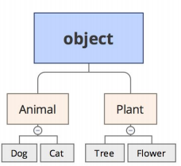

```Python
b=Animal() # b是Animal类型
c=Dog() # c是Dog类型


print(isinstance(b, Animal))
print(isinstance(c, Dog))
print(isinstance(c, Animal))
print(isinstance(b, Dog))

# 调用run_twice方法，需要传递Animal类的对象或者Animal的子类
def run_twice(animal):
    animal.run()
    animal.run()


run_twice(Dog())
run_twice(Cat())

run_twice(Animal())
```

### 2.4 类型判断

- type() 
- isinstance() 
- dir() #获得一个对象的所有属性和方法

```Python

import types
def fn():
    pass

print(type(fn)==types.FunctionType)

print(type(abs)==types.BuiltinFunctionType)

# getattr(),setattr(),hasattr()

class MyObject(object):
    def __init__(self):
        self.x = 9

    def power(self):
        return self.x * self.x
obj = MyObject()

# obj 有属性'x'吗？
print(hasattr(obj, 'x'))
print(obj.x)

# 设置一个属性'y'
setattr(obj, 'y', 19)
print(hasattr(obj, 'y'))
print(getattr(obj, 'y'))

# dir()
print(obj.__dir__())
print(dir(obj))

a = [1,2]
print(len(a))
print(a.__len__())
```

### 2.5 封装

- 通过类的实例直接访问修改对象属性,在实际的开发过程中会造成代码的安全性和健壮性受到影响
- 通过把对象属性私有化, 不直接提供对外部的直接访问. 如果外部需要修改或者获取属性值,可以通过建立set和get方法来间接修改属性,叫属性的封装.
- 例子:参看4.5.1


## 3 设计模式

### 3.1 列表生成式

- Python内置的非常简单却强大的可以用来创建list的生成式 
- 快速的把字典内容转变成list

```Python
d = {'x': 'A', 'y': 'B', 'z': 'C' }
print([k + '=' + v for k, v in d.items()])

# 生成list,[1,2,3...10]

print(list(range(1, 11)))
# 生成[1*1,2*2,3*3...]

print([x*x for x in range(1, 11)])

# 'abc','123' 输出a1,a2,a3,b1,b2,b3
print([m + n for m in 'abc' for n in '123'])

print([m + n for m in 'a.b.c' for n in '123' if m != '.'])
```

### 3.2 生成器

- 循环的过程中不断推算出后续的元素呢？这样就不必创建完整 的list，这种一边循环一边计算的机制，称为生成器： generator 
- 两种定义 
  - 列表生成式
  - 带yield的generator function

```Python
g = (x * x for x in range(10))
print(g)

print(next(g))
print(next(g))
print(next(g))
print(next(g))
print(next(g))

for n in g:
    print(n)

# yield
# 斐波那契数列 1，1，2，3，5，8
def fib(max):
    n, a, b = 0, 0, 1
    while n < max:
        print(b)
        a, b = b, a + b
        n = n + 1
    return 'done'

fib(6)

# 输出关键字换成yield
def fib(max):
    n, a, b = 0, 0, 1
    while n < max:
        yield b
        a, b = b, a + b
        n = n + 1
    return 'done'

g = fib(6)

print(next(g))
print(next(g))
print(next(g))

for n in g:
    print(n)
```

#### 3.2.1 Python中yield关键字的使用

- `yield` 是一个类似 `return` 的关键字，只是这个函数返回的是个生成器
- 当你调用这个函数的时候，函数内部的代码并不立马执行 ，这个函数只是返回一个生成器对象
- 当你使用for进行迭代的时候，函数中的代码才会执行
- `生成器`特点：可迭代；只能读取一次；实时生成数据，不全存在内存中。

### 3.3 迭代器

- for循环可以应用下列类型： 
  - 集合数据类型，list，tuple，dict，set，str等 
  - generator ，生成器和带yield的generator function等 
- 直接可作用于for循环的叫可迭代对象：Iterable 
- 直接可作用于next方法的叫可以生成器对象：Iterator 
- 生成器可以同时作用于for循环和next()函数，不断调用， 直到抛出StopIteration错误

```Python
# 判断一个对象是否可迭代 Iterable
from collections import Iterable
# print(isinstance([],Iterable))
# print(isinstance({},Iterable))
# print(isinstance('abc',Iterable))
# print(isinstance(123,Iterable))


# 判断一个对象是否是生成器 Iterator
from collections.abc import Iterator
# print(isinstance([],Iterator))
# print(isinstance({},Iterator))
# print(isinstance('abc',Iterator))
# print(isinstance(123,Iterator))

print(isinstance(iter([]),Iterator))
print(isinstance(iter({}),Iterator))
print(isinstance(iter('abc'),Iterator))
```

## 4 函数的高级应用

### 4.1 函数即变量

- 变量可以指向函数 
- 函数名也是变量 
- 函数可以作为参数传入到方法内部
- 函数本身也可以赋值给变量，即：变量可以指向函数

```Python
# abs(-10)函数调用，abs是函数本身
print(abs(-10))

f = abs
print(f)
print(f(-10))
```

### 4.2 Python内置的map函数

- map()函数接收两个参数，一个是函数，一个是Iterable 
- map将传入的函数依次作用到序列的每个元素，并把结果作为 新的Iterator返回

```Python
l = [1,2,3,4,5,6,7,8,9]

def f(x):
    return x*x

m = map(f,l)
print(m)
# print(list(m))

# for n in m:
#     print(n)

print(next(m))
print(next(m))
print(next(m))


# l 列表中每个int转换成字符串
l = [1, 2, 3, 4, 5, 6, 7, 8, 9]

print(list(map(str,l)))
```

### 4.3 Python内置的reduce函数

- reduce把一个函数作用在一个序列[x1, x2, x3, ...]上 ，reduce 把结果继续和序列的下一个元素做累积计算 
- reduce(f, [x1, x2, x3, x4]) = f(f(f(x1, x2), x3), x4) 

```Python
l = [4,2,5,7,8,9]  #获得425789

from functools import reduce

def f(x, y):
    return x * 10 + y

print(reduce(f,l))
print(type(reduce(f,l)))
```

### 4.4 练习

```Python
# str()——》int()
 '5632'——》5632  
    
# 思路 
# 1. 字符串每个元素取出来，转化成对应的数字,得到一个数字序列
# 2. 通过数字序列每两个*10 相加，得到一个整数

def f(x,y):
    return x * 10 + y

def char2num(s):
    digits = {'0': 0, '1': 1, '2' :2, '3': 3, '4': 4, '5': 5, '6': 6, '7': 7, '8': 8, '9': 9}
    return digits[s]

s1 = '5632'
nums = reduce(f,map(char2num, s1))

print(type(nums))
print(nums) 
```

### 4.5 装饰器

- python装饰器就是用于拓展原来函数功能的一种函数，这个函数的特殊之处在于它的返回值也是一个函数，
- 使用python装饰器的好处就是在`不用更改原函数的代码前提下给函数增加新的功能`。

```Python
import datetime

# 装饰器 以一个函数作为参数，并返回一个函数

def log(f):
    def write_log(*args, **kw):
        with open('./a.txt', 'w') as f1:
            f1.write(f.__name__)
            print('写入日志成功，函数名字是:%s'%f.__name__)
            return f(*args, **kw)
    return write_log

@log
def now():
    print(datetime.datetime.now().strftime('%Y-%m-%d %H:%M:%S'))
```

#### 4.5.1 Python内置的装饰器 @property @setter实现对象属性的封装

- @property 使调用类中的方法像引用类中的字段属性一样。
- @property 负责装饰一个对象函数，让其生成对应的setter和getter函数，调用的时候，直接可以使用对象名.函数名这种类似于属性的调用方式来执行函数

```Python
class Student(object):
    def __init__(self, score):
        self.__score = score

    def get_score(self):
         return self.__score

    def set_score(self, value):
        if not isinstance(value, int):
            raise ValueError('score must be an integer!')
        if value < 0 or value > 100:
            raise ValueError('score must between 0 ~ 100!')
        self.__score = value

stu1 = Student(90)

print(stu1.set_score(85))
print(stu1.get_score())


# 加上装饰器，方法变属性
class Student(object):
    def __init__(self, score):
        self.__score = score

    @property
    def score(self):
         return self.__score

    @score.setter
    def score(self, value):
        if not isinstance(value, int):
            raise ValueError('score must be an integer!')
        if value < 0 or value > 100:
            raise ValueError('score must between 0 ~ 100!')
        self.__score = value


stu2 = Student('67')

stu2.score = 59
print(stu2.score)

```

#### 4.5.2  静态方法与类方法

- **@staticmethod** 将类中的方法装饰为静态方法，即类不需要创建实例的情况下，可以通过类名直接引用。到达将函数功能与实例解绑的效果。

```Python
class TestClass:
    name = "test"

    def __init__(self, name):
        self.name = name

    @staticmethod
    def fun(self, x, y):
        return  x + y

cls = TestClass("felix")
print ("通过实例引用方法")
print (cls.fun(None, 2, 3)) # 参数个数必须与定义中的个数保持一致，否则报错

print ("类名直接引用静态方法")
print (TestClass.fun(None, 2, 3))# 参数个数必须与定义中的个数保持一致，否则报错

```

- **@classmethod** 类方法的第一个参数是一个类，是将类本身作为操作的方法。类方法被哪个类调用，就传入哪个类作为第一个参数进行操作。

```python 
class Car(object):
    car = "audi"

    @classmethod
    def value(self, category): # 可定义多个参数，但第一个参数为类本身
        print ("%s car of %s" % (category, self.car)）

class BMW(Car):
    car = "BMW"

class Benz(Car):
    car = "Benz"

print ("通过实例调用")
baoma = BMW()
baoma.value("Normal") # 由于第一个参数为类本身，调用时传入的参数对应的时category

print ("通过类名直接调用")
Benz.value("SUV")

```

## 5 异常处理

### 5.1 异常介绍：

- 即便Python程序的语法是正确的，在运行它的时候，也有可能发生错误。运行期检测到的错误被称为异常。
- 大多数的异常都不会被程序处理，都以错误信息的形式展现在这里:
- 异常以不同的类型出现，这些类型都作为信息的一部分打印出来: 例子中的类型有 ZeroDivisionError，NameError 和 TypeError

```python
>>> 10 * (1/0)
Traceback (most recent call last):
  File "<stdin>", line 1, in ?
ZeroDivisionError: division by zero
>>> 4 + spam*3
Traceback (most recent call last):
  File "<stdin>", line 1, in ?
NameError: name 'spam' is not defined
>>> '2' + 2
Traceback (most recent call last):
  File "<stdin>", line 1, in ?
TypeError: Can't convert 'int' object to str implicitly
```

- Python的一些內建异常：

```
Exception       常规错误的基类
AttributeError  对象没有这个属性
IOError         输入/输出操作失败
IndexError      序列中没有此索引(index)
KeyError        映射中没有这个键
NameError       未声明/初始化对象 (没有属性)
SyntaxError     Python 语法错误
TypeError       对类型无效的操作
ValueError      传入无效的参数
ZeroDivisionError   除(或取模)零 (所有数据类型)
```

### 5.2 使用异常可以让你的程序继续执行:

- 没有异常处理的:特点是出现异常会终止程序执行

```python
print("start.....")
x = int(input("Please enter a number: "))
print("number:",x)
print("ok....")
print("end.....")
```

- 使用了有异常处理的代码，程序会执行到最后

```python
print("start.....")
try:
    x = int(input("Please enter a number: "))
    print("number:",x)
    print("ok....")
except ValueError:
    print("Oops!  That was no valid number.  Try again")
print("end.....")
```

- try语句按照如下方式工作；
  - 首先，执行try子句（在关键字try和关键字except之间的语句）
  - 如果没有异常发生，忽略except子句，try子句执行后结束。
  - 如果在执行try子句的过程中发生了异常，那么try子句余下的部分将被忽略。如果异常的类型和 except 之后的名称相符，那么对应的except子句将被执行。最后执行 try 语句之后的代码。
  - 如果一个异常没有与任何的except匹配，那么这个异常将会传递给上层的try中。
- 一个 try 语句可能包含多个except子句，分别来处理不同的特定的异常。最多只有一个分支会被执行。
- 处理程序将只针对对应的try子句中的异常进行处理，而不是其他的 try 的处理程序中的异常。
- 一个except子句可以同时处理多个异常，这些异常将被放在一个括号里成为一个元组，例如:

```
    except (RuntimeError, TypeError, NameError):
        pass
```

- 最后一个except子句可以忽略异常的名称，它将被当作通配符使用。你可以使用这种方法打印一个错误信息，然后再次把异常抛出。

```python
import sys

try:
    f = open('myfile.txt')
    s = f.readline()
    i = int(s.strip())
except OSError as err:
    print("OS error: {0}".format(err))
except ValueError:
    print("Could not convert data to an integer.")
except:
    print("Unexpected error:", sys.exc_info()[0])
    raise
```

### 5.3:使用异常可以定位问题原因

- 一个 try 语句可能包含多个except子句，分别来处理不同的特定的异常。最多只有一个分支会被执行
- 最后一个except子句可以忽略异常的名称，它将被当作通配符使用

```python
print("start.....")
try:
    x = int(input("Please enter a number: "))
    print("number:",x)
    print(100/x)
    print("ok....")
except ValueError:
    print("非纯数字错误！")
except ZeroDivisionError:
    print("不可以为零错误！")
except:
    print("可选的未知错误！")
print("end.....")
```

- 一个except子句可以同时处理多个异常，这些异常将被放在一个括号里成为一个元组

```python
print("start.....")
try:
    x = int(input("Please enter a number: "))
    print("number:",x)
    print(100/x)
    print("ok....")
except (ValueError,ZeroDivisionError):
    print("非纯数字或不可以为零错误！")
except:
    print("可选的未知错误！")
    raise   #重新抛出这个异常
print("end.....")
```

### 5.4 抛出异常（发现问题让其他函数解决）:

- Python 使用 raise 语句抛出一个指定的异常。例如:

```
>>> raise NameError('HiThere')
Traceback (most recent call last):
  File "<stdin>", line 1, in ?
NameError: HiThere
```

- raise 唯一的一个参数指定了要被抛出的异常。它必须是一个异常的实例或者是异常的类（也就是 Exception 的子类）。
- 如果你只想知道这是否抛出了一个异常，并不想去处理它，那么一个简单的 raise 语句就可以再次把它抛出。

```
>>> try:
        raise NameError('HiThere')
    except NameError:
        print('An exception flew by!')
        raise

An exception flew by!
Traceback (most recent call last):
  File "<stdin>", line 2, in ?
NameError: HiThere
```

### 5.5 使用异常可以定位到代码执行中出现问题的函数

- 代码顺序执行，函数之间互相调用，如果发生错误。我们并不知道那里发生了错误，需要测试一下我们的代码。


```python
def foo(s):
    return 100/int(s)

def bar(s):
    return foo(s)*2

# 在python中，如果py是单独运行，__name__=='__main__', \
# 如果py文件被其他模块引入调用的时候就不等于 import
if __name__ == '__main__':
    '''
        测试 给我们自己调用
    '''
    try:
        bar('0')
    except Exception as e:
        print('Error:',e)
    finally:
        print('finally...')
```

## 6 第三方模块的安装与调用

### 6.1 自定义Python模块

- 在导入一个包的时候，Python 会根据 sys.path 中的目录来寻找这个包中包含的子目录。
- 目录只有包含一个叫做`__init__.py` 的文件才会被认作是一个包，主要是为了避免一些滥俗的名字（比如叫做 `string`）不小心的影响搜索路径中的有效模块。
- 最简单的情况，放一个空的 :`file:__init__.py`就可以了。当然这个文件中也可以包含一些初始化代码或者为（将在后面介绍的）`__all__`变量赋值。

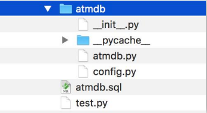

### 6.2 模块的使用

- 一个.Py文件称之为一个模块(Module) 
- 好处： 
  - 便于代码维护，把很多函数放到不同文件，一个.py文件 的 代码数量少 
  - 一个模块可以被其他地方引用，代码不必从零写起 
  - 使用模块还可以避免函数名和变量名冲突。相同名字的函数和变量完全可以分别存在不同的模块中

#### 6.2.1 模块的导入与使用

##### import 语句：

- 想使用 Python 源文件，只需在另一个源文件里执行 import 语句

```Python
import time

# 格式化成2016-03-20 11:45:39形式
print (time.strftime("%Y-%m-%d %H:%M:%S", time.localtime()))
```

##### from…import 语句:

- Python的from语句让你从模块中导入一个指定的部分到当前命名空间中

```python
from time import strftime,localtime

# 格式化成2016-03-20 11:45:39形式
print (strftime("%Y-%m-%d %H:%M:%S", localtime()))
```

##### 模块的使用

- 模块分内置模块和第三方模块 
- 好处Python解释器把一个特殊变量__name__置为__main__， 而如果在其他地方导入该hello模块时，if判断将失败 
- 使用import hello

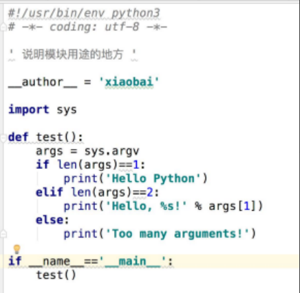

### 6.3 第三方模块的安装

用pip命令安装

- pip install 模块名
- pip uninstall 模块名
- pip freeze    --查看都安装了哪些模块名

whl下载安装的方式

- 网址： https://www.lfd.uci.edu/~gohlke/pythonlibs/  下载

- 安装：pip install 文件包名 

  - > pip 命令的详细使用方法请参照附录[9 附录：pip命令]()

- 使用Python的另一个发行版本，anaconda

- Pycharm 里面安装

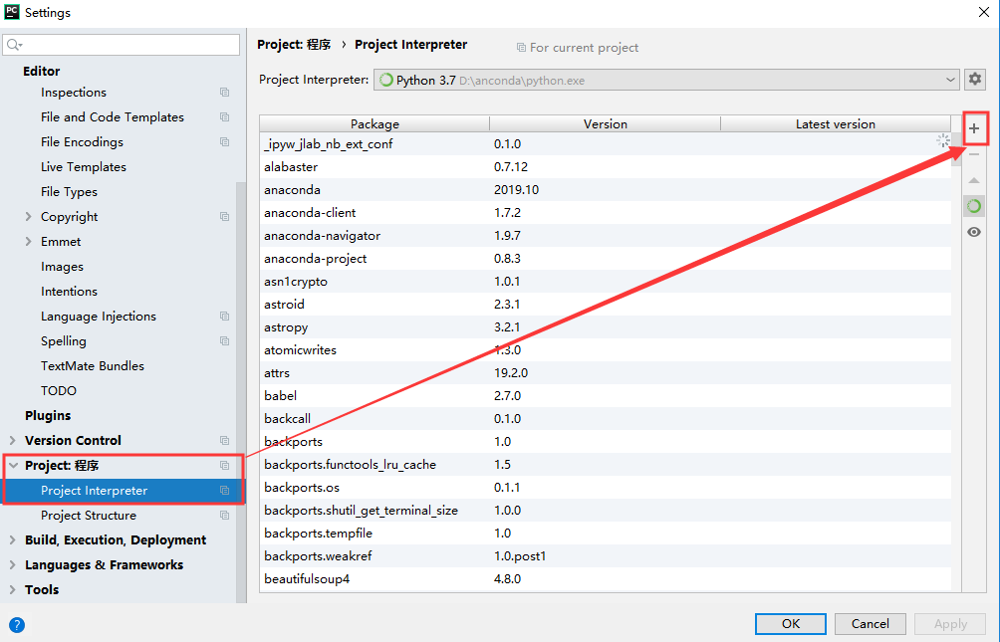

## 7 字符编码

### 7.1 字符编码类型

- ASCII编码
- 中文GB2312 
- Unicode 
- UTF8

```python
print(ord('A'))
print(ord('我'))
print(chr(65))
print(chr(25105))
# 传输和保存  需要对字符进行 编解码，utf-8通用编解码
x = b'ABC' # 字节数组，byte数组
print(x)
# 中文编码范围超过了ASC编码范围，报错
# x = b'你好' # 字节数组，byte数组
# print(x)
# 在bytes中，无法显示ASC字符的字节，用\x##来显示
print('你好'.encode('gbk'))
print('ABC'.encode('utf-8'))
print(b'\xc4\xe3\xba\xc3'.decode('gbk'))
# 中文占用多少字节
print(len('你好AB'))
print(len('你好'.encode('utf-8')))
print(len('你好'.encode('gbk')))
```

### 7.2 字符串编码转化

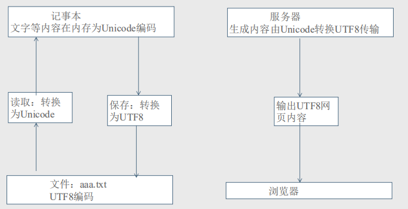

## 8 案例实战：图片和视频转字符动画

- 需求： 
  - 1.把一张图片，转化为字符画 
  - 2.把一个视频，转化成字符动画 
- 原理： 
  - 字符画是一系列字符的组合，我们可以把字符看作是比较大块的像 素，一个字符能表现一种颜色（为了简化可以这么理解），字符的种 类越多，可以表现的颜色也越多，图片也会更有层次感

### 8.1 名词介绍

#### 三原色

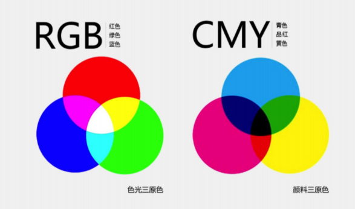

#### 颜色码对照表

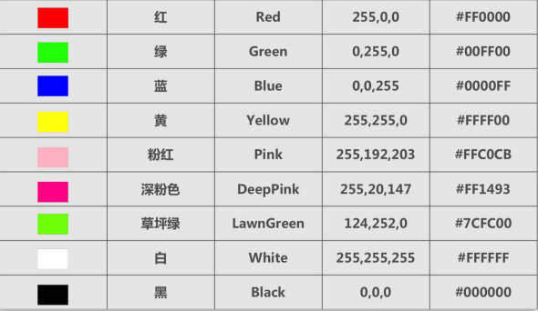

#### 灰度图

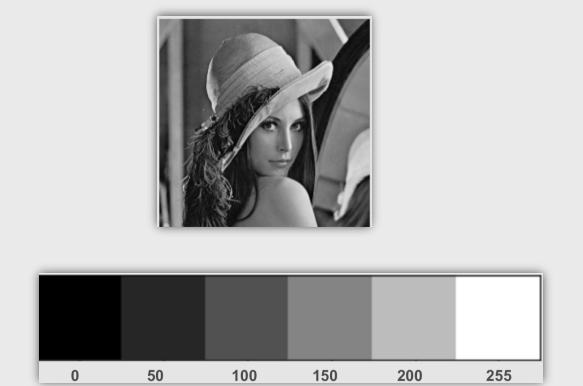

#### 点阵字

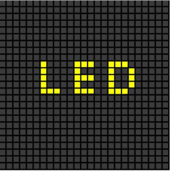

#### 分辨率

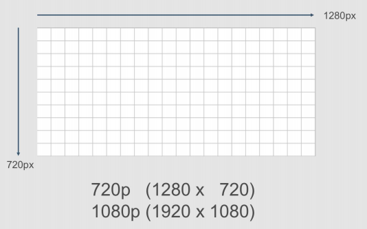

#### 灰度图

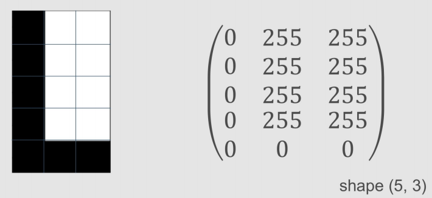

#### 彩色图

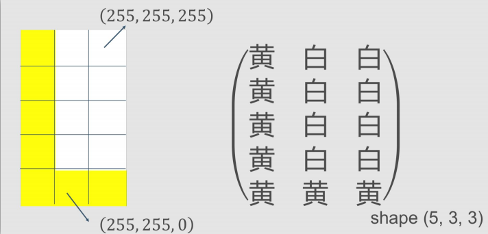

### 8.2 原理步骤

- 首先使用 PIL 的 Image.open 打开图片文件，获得对象 im 
- 使用 PIL 库的 im.resize() 调整图片大小对应到输出的字符画的宽 度和高度，注意这个函数第二个参数使用 Image.NEAREST，表示输出低质量的图片。 
- 遍历提取图片中每行的像素的 RGB 值，调用 getchar 转成对应的字符 
- 将所有的像素对应的字符拼接在一起成为一个字符串 txt 
- 打印输出字符串 txt 
- 如果执行时配置了输出文件，将打开文件将 txt 输出到文件，如果 没有，则默认输出到 output.txt 文件

### 8.3 第三方模块的引用

- pip3 install pillow 
- pip3 install pyprind 
- pip3 install numpy 
- pip3 install opencv-python

### 8.4 视频转动画实现设计思路

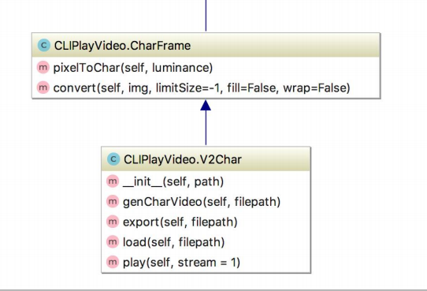

## 9  图形用户界面实战【扩展】

### 9.1 图形用户界面(GUI)

- 本节介绍如何创建Python程序的图形用户界面（GUI），也就是那些带有按钮和文本框的窗口。
- 目前支持Python的所谓"GUI工具包"有很多，但没有一个被认为是标准的，也好，选择空间大
- GUI工具包：

| 工具包名   | 介绍                               | URL地址                                         |
| ---------- | ---------------------------------- | ----------------------------------------------- |
| Tkinter    | 使用Tk平台。很容易得到。半标准     | http://wiki.python.org/moin/TkInter             |
| wxpython   | 基于wxWindows。跨平台越来越流行    | http://wxpython.org                             |
| PythonWin  | 只能在Windows上使用。              | http://starship.python.net/crew/mhammond        |
| Java Swing | 只能用于Python。使用本机的Java GUI | http://java.sun.com/docs/books/tutorial/uiswing |
| PyGTK      | 使用GTK平台，在Linux上很流行       | http://pygtk.org                                |
| PyQt       | 使用Qt平台，跨平台                 | http://wiki.python.org/moin/PyQt                |

### 9.2 安装：wxpython

```
 pip install -U wxpython
 --Installing collected packages: six, wxpython
 --Successfully installed six-1.11.0 wxpython-4.0.1
```

- 开发步骤：

```
1. 导入wx模块
2. 定义一个应用程序对象
3. 创建wx.Frame主窗口对象，设置窗口标题和大小
4. 创建组件、布局、添加事件处理等操作
5. 通过Frame的show()方法显示窗体
6. 进入应用程序事件主循环
```

### 9.3 创建并且显示一个框架

```python
# 导入wxPython模块
import wx
# 创建应用程序对象
app = wx.App()
win = wx.Frame(None)    #创建一个单独的窗口
btn=wx.Button(win)  #创建一个按钮组件
win.Show()          #设置可见
#进入应用程序事件主循环
app.MainLoop()
```

### 9.4 设置标题，添加按钮

```python
import wx
app = wx.App()
win = wx.Frame(None,title="我的记事本") #创建一个单独的窗口
loadButton = wx.Button(win,label="Open")
saveButton = wx.Button(win,label="Save")
win.Show()
app.MainLoop()  #进入应用程序事件主循环
```

### 9.5 设置标题，添加按钮,并简单布局

```python
import wx
app = wx.App()
win = wx.Frame(None,title="我的记事本",size=(410,335)) #创建一个单独的窗口

loadButton = wx.Button(win,label="Open",pos=(225,5),size=(80,25))
saveButton = wx.Button(win,label="Save",pos=(315,5),size=(80,25))

filename = wx.TextCtrl(win,pos=(5,5),size=(210,25))

contents = wx.TextCtrl(win,pos=(5,35),size=(390,260),style=wx.TE_MULTILINE | wx.HSCROLL)

win.Show()

app.MainLoop() #进入应用程序事件主循环
```

### 9.6 组件布局

```python
import wx
app = wx.App()
win = wx.Frame(None,title="我的记事本",size=(410,335)) #创建一个单独的窗口
bkg = wx.Panel(win)

#创建组件
loadButton = wx.Button(bkg,label="Open")
saveButton = wx.Button(bkg,label="Save")
filename = wx.TextCtrl(bkg)
contents = wx.TextCtrl(bkg,style=wx.TE_MULTILINE | wx.HSCROLL)

#布局容器
hbox=wx.BoxSizer() #默认水平布局
hbox.Add(filename,proportion=1,flag=wx.EXPAND)
hbox.Add(loadButton,proportion=0,flag=wx.LEFT,border=5)
hbox.Add(saveButton,proportion=0,flag=wx.LEFT,border=5)

#布局容器
vbox=wx.BoxSizer(wx.VERTICAL) #垂直布局
vbox.Add(hbox,proportion=0,flag=wx.EXPAND|wx.ALL,border=5)
vbox.Add(contents,proportion=1,flag=wx.EXPAND|wx.LEFT|wx.BOTTOM|wx.RIGHT,border=50)

bkg.SetSizer(vbox)

win.Show()
app.MainLoop() #进入应用程序事件主循环
```

### 9.7 为按钮添加事件并完成其事件处理操作

```python
import wx

#按钮事件处理函数
def load(event):
    '''加载文件内容'''
    file=open(filename.GetValue(),"r")
    contents.SetValue(file.read())
    file.close()

def save(event):
    '''保持文件内容'''
    file=open(filename.GetValue(),"w")
    file.write(contents.GetValue())
    file.close()

#
app = wx.App()
win = wx.Frame(None,title="我的记事本",size=(410,335)) #创建一个单独的窗口
win.Show()
loadButton = wx.Button(win,label="Open",pos=(225,5),size=(80,25))
saveButton = wx.Button(win,label="Save",pos=(315,5),size=(80,25))

loadButton.Bind(wx.EVT_BUTTON,load)
saveButton.Bind(wx.EVT_BUTTON,save)

filename = wx.TextCtrl(win,pos=(5,5),size=(210,25))

contents = wx.TextCtrl(win,pos=(5,35),size=(390,260),style=wx.TE_MULTILINE | wx.HSCROLL)

app.MainLoop() #进入应用程序事件主循环
```

## 10  飞机大战【扩展】

- 本次开发需要安装一个Python的游戏模块：pygame。   方式：`pip install pygame`
- 开发步骤如下：
  - 创建游戏主页面窗口，并添加滚动背景。
  - 添加键盘事件处理函数
  - 放置玩家英雄飞机，并绑定键盘事件，实现飞机移动
  - 添加玩家子弹，并实现发射
  - 随机显示敌机
  - 实现敌机与子弹的碰撞检测

```python
import pygame
from pygame.locals import *  #pygame使用的各种常量
import time,random

# 实现敌机与子弹的碰撞检测。

class HeroPlane:
    ''' 玩家飞机类（英雄） '''
    def __init__(self, screen_temp):
        self.x = 200
        self.y = 400
        self.screen = screen_temp
        self.image = pygame.image.load("./images/me.png")
        self.bullet_list = [] #存储发射出去的子弹对象引用

    def display(self):
        ''' 绘制玩家到窗口中 '''

        #遍历移动子弹
        for bullet in self.bullet_list:
            bullet.display()
            #移动子弹，并判断是否越界。
            if bullet.move():
                self.bullet_list.remove(bullet)

        self.screen.blit(self.image, (self.x, self.y))


    def move_left(self):
        ''' 左移动,并判断防止越界 '''
        self.x -= 5
        if self.x<0:
            self.x=0

    def move_right(self):
        ''' 右移动,并判断防止越界 '''
        self.x += 5
        if self.x > 406:
            self.x = 406
    def fire(self):
        self.bullet_list.append(Bullet(self.screen, self.x, self.y))
        print(len(self.bullet_list))

class Bullet:
    ''' 玩家子弹类 '''
    def __init__(self, screen_temp, x, y):
        self.x = x+51
        self.y = y
        self.screen = screen_temp
        self.image = pygame.image.load("./images/pd.png")

    def display(self):
        self.screen.blit(self.image, (self.x, self.y))

    def move(self):
        self.y-=10
        if self.y<-20:
            return True

class EnemyPlane:
    """敌机的类"""
    def __init__(self, screen_temp):
        self.x = random.choice(range(408))
        self.y = -75
        self.screen = screen_temp
        self.image = pygame.image.load("./images/e"+str(random.choice(range(3)))+".png")

    def display(self):
        self.screen.blit(self.image, (self.x, self.y))

    def move(self,hero):
        self.y += 4
        #遍历玩家的子弹，并做碰撞检测
        for bo in hero.bullet_list:
            if bo.x>self.x+12 and bo.x<self.x+92 and bo.y>self.y+20 and bo.y<self.y+60:
                hero.bullet_list.remove(bo)
                return True
        #判断敌机是否越界
        if self.y>512:
            return True;

def key_control(hero_temp):
    ''' 键盘控制函数 '''

    #获取事件，比如按键等
    for event in pygame.event.get():
        #判断是否是点击了退出按钮
        if event.type == QUIT:
            print("exit")
            exit()

    #获取按下的键(返回的是元组值)
    pressed_keys = pygame.key.get_pressed()
    #检测是否按下a或者left键
    if pressed_keys[K_LEFT] or pressed_keys[K_a]:
        print('left')
        hero_temp.move_left()

    #检测是否按下d或者right键
    elif pressed_keys[K_RIGHT] or pressed_keys[K_d]:
        print('right')
        hero_temp.move_right()

    #检查是否是空格键
    if pressed_keys[K_SPACE]:
        print('space')
        hero_temp.fire()

def main():
    '''游戏的主程序执行函数'''

    #1. 创建窗口:set_mode(分辨率=(0,0),标志=0,深度=0)
    screen = pygame.display.set_mode((512,568),0,0)

    #2. 创建一个游戏背景图片(512*1536)
    background = pygame.image.load("./images/bg2.jpg")
    m=-968 #初始化游戏背景图片标轴y的值

    #3. 创建一个玩家飞机对象
    hero = HeroPlane(screen)

    #4.定义用于存放敌机列表
    enemylist = []

    while True:
        #绘制位图
        screen.blit(background,(0,m))
        m+=2
        if m>=-200:
            m = -968

         #显示英雄玩家
        hero.display()
        # 键盘控制（负责移动玩家）
        key_control(hero)

        #随机输出敌机
        if random.choice(range(50))==10:
            enemylist.append(EnemyPlane(screen))

        #遍历所有敌机，显示敌机，移动敌机，并与玩家子弹碰撞检测
        for em in enemylist:
            em.display()
            if em.move(hero):
                enemylist.remove(em)

        #更新屏幕显示
        pygame.display.update()

        # 定时睡眠（时钟）
        time.sleep(0.04)

# 判断当前是否是主程序，若是就执行主程序。
if __name__ == "__main__":
    main()
```

#### 

## 11 附录：pip命令

```
------------------------------------------------------------
列出已安装的包：
    $ pip list
    $ pip freeze     # 查看自己安装的

安装软件（安装特定版本的package，通过使用==, &gt;=, &lt;=, &gt;, &lt;来指定一个版本号）**
    $ pip install SomePackage
    $ pip install 'Markdown<2.0'
    $ pip install 'Markdown>2.0,<2.0.3'

卸载软件pip uninstall SomePackage
    $ pip uninstall SomePackage

下载所需的软件包：
    $ pip download SomePackage -d directory 
    例如下载PyMySQL软件包
    $ pip download PyMySQL -d D:/pypackage

安装下载好的软件包文件
    $ pip install 目录/软件包文件名
    如安装PyMySQL软件包
    $ pip3.6 install D:/pypackage/PyMySQL-0.7.11-py2.py3-none-any.whl
```

##12 附录:	类的专有方法(魔术方法)

类的专有方法：

- `__init__`: 构造函数，在生成对象时调用
- `__del__`: 析构函数，释放对象时使用
- `__repr__`: 打印，转换
- `__setitem__` : 按照索引赋值
- `__getitem__`: 按照索引获取值
- `__len__`: 获得长度
- `__cmp__`: 比较运算
- `__call__`: 函数调用
- `__add__`: 加运算
- `__sub__`: 减运算
- `__mul__`: 乘运算
- `__div__`: 除运算
- `__mod__`: 求余运算
- `__pow__`: 乘方

- Python同样支持运算符重写，我们可以对类的专有方法进行重写，实例如下：

```python
#!/usr/bin/python3

class Vector:
   def __init__(self, a, b):
      self.a = a
      self.b = b

   def __str__(self):
      return 'Vector (%d, %d)' % (self.a, self.b)

   def __add__(self,other):
      return Vector(self.a + other.a, self.b + other.b)

v1 = Vector(2,10)
v2 = Vector(5,-2)
print (v1 + v2)

# 以上代码执行结果如下所示:
# Vector(7,8)
```

## 


