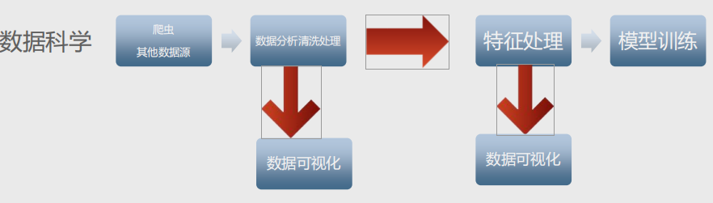
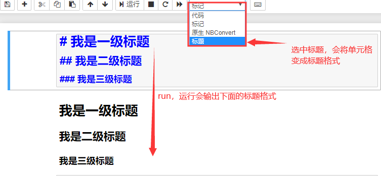

# 数据科学原理与数据处理

## 1 Python行业分析

通过Stack OverFlow专业网站的大数据统计，Python相关技术模块访问量最大的簇是数据科学相关，然后才是后台开发。 


### 1.1 数据处理流程



### 1.2 数据科学岗位分析


## 2  数据分析好助手Jupyter notebook

Jupyter Notebook是基于网页的用于交互计算的应用程序。其可被应用于全过程计算：开发、文档编写、运行代码和展示结果。

### 2.1 Jupyter notebook的安装

##### ① 使用Anaconda安装

Anaconda一个封装多种工具，库的解释器，它已经自动为你安装了Jupter Notebook及其他工具。

##### ② 使用pip 安装

```undefined
pip3 install jupyter
```

**注意：在安装Jupyter Notebook过程中可能面临无法安装的问题（提示你要升级pip），输入下面的命令即可**

```undefined
pip install --upgrade pip
```

### 2.2 Jupyter notebook 基本使用

- 在命令行处，先cd到源代码文件目录 
- 然后输入 jupyter notebook 会自动打开一个jupyter web管理界面
- 点击右上角的new 下边的python3 创建一个脚本


- 点击 run进行运行会在运行完成后自动生成下一格
- 在notebook的脚本中 想将变量打印出来,不需要加print,直接输入变量名即可 


- 在notebook中的单元格内添加注释，直接#+注释就可以


- 标题  



- 快捷键 
  - shift+enter 直接运行并在下一行插入一个单元格 
  - ctrl+enter 直接运行但不插入单元格 
  - alt+enter 插入一个新的单元格

#### 2.3 Jupyter notebook 内置的魔法命令

- %run + 运行python文件路径

```python 
%run D:\hello.py
```

- %load 将文件中的内容读出来【load回来的代码不会自动执行 ,需要手动执行一遍 】

```python 
%load D:\hello.py
```

- %timeit 测试代码的执行时间 【%timeit后边只能跟一行代码】

```python
%timeit lis = [x for x in range(10000)]
```

- %%timeit 测试代码块的执行时间 

```python
%%timrit
lis = []
for i in range(10000):
    lis.append(1)
```

- %time 测试单次运行所需要的时间 【%time和%timeit都是测试时间，但是%time没有%timeit准确】

```python
%time lis = [x for x in range(10000)]
```

- %%time 测试代码块的执行时间

```python 
%%time
lis = []
for i in range(10000):
	lis.append(i)
```

- %%html 用于在notebook中显示页面代码

```python
%%html
<a href = 'www.baidu.com'>百度一下</a>
```

- %%js 用于在notebook中运行js文件的

```Python
%%html
<div class='mytest' style='color:red'>html content</div>

# 写在不同的单元格中
%%js
document.querySelector('.mytest').innerHTML='js content'
```

- %%writefile 将内容编写成文件

```Python
%%writefile  haha.py
    lis = [x for x in ramge(1000)]
```

## 3  数据科学模块Numpy

### 3.1 Numpy基本介绍

Numpy：提供了一个在Python中做科学计算的基础库，主要用于数值计算、多维数组（矩阵）的处理。本身是由C语言开发，是个很基础的扩展，Python其余的科学计算扩展大部分都是以此为基础。

NumPy是使用Python进行科学计算的基本软件包。它包含以下内容：

- 强大的N维数组对象
- 复杂的（广播）功能
- 集成C / C ++和Fortran代码的工具
- 有用的线性代数，傅立叶变换和随机数功能
- Nmupy本质就是ndarray 
- 多维矩阵 
  - 1维数组看做向量vector--点和直线 
  - 2维数组看做2维矩阵--表和平面 
  - 3维数组看做3维矩阵--空间

除了其明显的科学用途外，NumPy还可以用作通用数据的高效多维容器。可以定义任意数据类型。这使NumPy可以无缝，快速地与各种数据库集成。官方学习资料https://numpy.org/。

### 3.2 numpy的安装与导入

```
安装  pip install numpy
导入 import numpy as np
```

### 3.3 numpy的基本使用

```Python
'''
numpy是一个科学计算库，核心——多维数组【ndarray（数组）】
ndarray 数据存储方式和list不一样，它是一块整体的内存来存储数据
存储风格有2种
C按行存储 ，F按列存储

数组属性
ndim --维度
shape -- 形状
size -- 元素个数
dtype -- 数据类型
itemsize -- 数组中每个元素的大小
'''
import numpy


arr = numpy.array([[[1,2,3],[4,5,6],[7,8,9]],[[2,3,4],[9,8,7],[5,6,4]]])

print('数组的维度 : ',arr.ndim)
print('数组的形状 : ',arr.shape) # 2块 3行3列
print('数组的元素个数 : ',arr.size)
print('数组的数据类型 : ',arr.dtype)
print('数组的每个元素的大小 : ',arr.itemsize)
```


## 3  统计与分析模块Pandas


## 4  数据可视化Matplotlib


## 5 项目实战 — 服务器日志分析