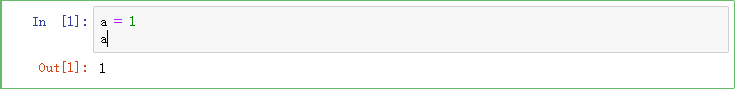

# 数据科学原理与数据处理

## 1 Python行业分析

通过Stack OverFlow专业网站的大数据统计，Python相关技术模块访问量最大的簇是数据科学相关，然后才是后台开发。 


### 1.1 数据处理流程


### 1.2 数据科学岗位分析


## 2  数据分析好助手Jupyter notebook

Jupyter Notebook（此前被称为 IPython notebook）是一个交互式笔记本，支持运行 40 多种编程语言。本质是一个 Web 应用程序，便于创建和共享文学化程序文档，支持实时代码，数学方程，可视化和 markdown。

### 2.1 Jupyter notebook的安装

##### ① 使用Anaconda安装 

Anaconda一个封装多种工具，库的解释器，它已经自动为你安装了Jupter Notebook及其他工具。


##### ② 使用pip 安装

```undefined
pip3 install jupyter
```

**注意：在安装Jupyter Notebook过程中可能面临无法安装的问题(提示你要升级pip)，输入下面的命令即可**

```undefined
pip install --upgrade pip   升级pip
pip install juputer   安装Jupyter
```

### 2.2 Jupyter notebook 基本使用

- 在命令行处，先cd到源代码文件目录 
- 然后输入 jupyter notebook 会自动打开一个jupyter web管理界面
- 点击右上角的new 下边的python3 创建一个脚本


- 点击 run进行运行会在运行完成后自动生成下一格
- 在notebook的脚本中 想将变量打印出来,不需要加print,直接输入变量名即可 



- **注释：**在notebook中的单元格内添加注释，直接#+注释就可以


- **标题**  


- **代码单元**：用于编写代码，通过按 `Shift + Enter` 运行代码，其结果显示在本单元下方。代码单元左边有`In [1]`: 这样的序列标记，方便人们查看代码的执行次序。
  - shift+enter 直接运行并在下一行插入一个单元格 
  - ctrl+enter 直接运行但不插入单元格 
  - alt+enter 插入一个新的单元格

- **编辑模式与命令行模式：**

  - 编辑模式用来编写代码，执行文件，鼠标选中单元格，此单元格就会变为编辑模式

  

  - 命令模式用来执行快捷命令，可以通过鼠标点击两侧的空白处或者键盘上的Esc键，来使编辑模式转化命令模式。

  

  - 快捷键，只有在命令模式操作才可以修改文档，
    - Y：单元转入代码状态
    - M：单元转入markdown状态
    - A ：在上方插入新单元
    - B：在下方插入新单元
    - X：剪切选中的单元
    - Shift +V：在上方粘贴单元

- **Markdown单元**：用于编辑文本，采用 `markdown` 的语法规范，可以设置文本格式、插入链接、图片甚至数学公式。同样使用 `Shift + Enter` 运行 `markdown` 单元来显示格式化的文本(可以用来快速的生成标题)。

#### 2.3 Jupyter notebook 内置的魔法命令

- %run + 运行python文件路径

```python 
%run D:\hello.py
```

- %load 将文件中的内容读出来【load回来的代码不会自动执行 ,需要手动执行一遍 】

```python 
%load D:\hello.py
```

- %timeit 测试代码的执行时间 【%timeit后边只能跟一行代码】

```python
%timeit lis = [x for x in range(10000)]
```

- %%timeit 测试代码块的执行时间 

```python
%%timrit
lis = []
for i in range(10000):
    lis.append(1)
```

- %time 测试单次运行所需要的时间 【%time和%timeit都是测试时间，但是%time没有%timeit准确】

```python
%time lis = [x for x in range(10000)]
```

- %%time 测试代码块的执行时间

```python 
%%time
lis = []
for i in range(10000):
	lis.append(i)
```

- %%html 用于在notebook中显示页面代码

```python
%%html
<a href = 'www.baidu.com'>百度一下</a>
```

- %%js 用于在notebook中运行js文件的

```Python
%%html
<div class='mytest' style='color:red'>html content</div>

# 写在不同的单元格中
%%js
document.querySelector('.mytest').innerHTML='js content'
```

- %%writefile 将内容编写成文件

```Python
%%writefile  haha.py
    lis = [x for x in ramge(1000)]
```

## 3  数据科学模块NumPy

### 3.1 初级NumPy

#### 3.1.1 NumPy基本介绍

Numpy：提供了一个在Python中做科学计算的基础库，主要用于数值计算、多维数组（矩阵）的处理。本身是由C语言开发，是个很基础的扩展，Python其余的科学计算扩展大部分都是以此为基础。[numpy源代码](./numpy.html)

NumPy是使用Python进行科学计算的基本软件包。它包含以下内容：

- 强大的N维数组对象
- 复杂的（广播）功能
- 集成C / C ++和Fortran代码的工具
- 有用的线性代数，傅立叶变换和随机数功能
- Nmupy本质就是ndarray 
- 多维矩阵 
  - 1维数组看做向量vector--点和直线 
  - 2维数组看做2维矩阵--表和平面 
  - 3维数组看做3维矩阵--空间

除了其明显的科学用途外，NumPy还可以用作通用数据的高效多维容器。可以定义任意数据类型。这使NumPy可以无缝，快速地与各种数据库集成。官方学习资料https://numpy.org/。

#### 3.1.2 NumPy的安装与导入

```
安装  pip install numpy
导入 import numpy as np
```

#### 3.1.3 NumPy中的数组创建

NumPy提供的最重要的数据结构是一个称为NumPy数组的强大对象。NumPy数组是通常的Python数组的扩展。NumPy数组配备了大量的函数和运算符，可以帮助我们快速编写各种类型计算的高性能代码。

| arange             | 生成遍历得到的数的数组           |
| ------------------ | -------------------------------- |
| **array**          | 生成列表元素的数组               |
| **linspace**       | 生成元素之间’等差关系‘的数组     |
| **logspace**       | 生成元素之间’等比关系‘的数组     |
| **ones**           | 生成所有元素都为 1 的数组        |
| **zeros**          | 生成所有元素都为 0 的数组        |
| **eye**            | 生成一种类似单位矩阵的数组       |
| **diag**           | 生成一个对角矩阵数组             |
| **random.random**  | 生成 (0,1)的随机数据的随机数组   |
| **random.rand**    | 生成随机数据的均匀分布的数组     |
| **random.randn**   | 生成一个符合正态分布的数组       |
| **random.randint** | 生成固定范围内的，固定形状的数组 |

```Python
import numpy as np


# 使用arange创建数组
arr = np.arange(0, 6, 2) # 一维数组
arr = np.arange(0, 6, 2).reshape(1, 3) # 二维数组
print(arr)

print('--------------------------------------------------------------------')
# 使用linspace创建数组——元素之间’等差‘
# 参数1 开始位置
# 参数2 结束位置
# 参数3 创建数组元素的个数
arr= np.linspace(0, 6, 7)
print(arr)

print('------------------------------------------------------------------')
# 使用logspace创建函数--元素之间’等比‘
# 参数1 开始位置 10^0
# 参数2 结束位置 10^2
# 参数3 创建数组元素的个数
arr = np.logspace(0, 2, 5)
print(arr)

print('------------------------------------------------------------------')
# ones --生成所有元素都为 1 的数组
arr = np.ones(shape = (2, 3))
print(arr)

print('------------------------------------------------------------------')
# zeros --生成所有元素都为 0 的数组
arr = np.zeros(shape=(2, 3))
print(arr)

print('------------------------------------------------------------------')
# eye--生成一种类似单位矩阵的数组
# 参数k 决定对角线的位置
# 参数k<0 ,对角线上移k个位置
# 参数k>0 ,对角线下移k个位置
# 参数k超出范围，是个（3,3）都为0的数组
arr = np.eye(3, 3, k = 0)
print(arr)

print('------------------------------------------------------------------')
# diag 生成一个对角矩阵数组，参数为对角线上的值
# k 上移，下移 和eye 一样
arr = np.diag([1, 3, 5, 7], k = 0)
arr1 = np.diag([[1, 3, 5, 7], [2, 4, 6, 8]])
print(arr, '\n', arr1)

print('------------------------------------------------------------------')
# 生成 (0,1)的随机数据的随机数组
arr = np.random.random(5)
arr1 = np.random.random((2, 3))
print(arr, '\n', arr1)

print('------------------------------------------------------------------')
# 生成随机数据的均匀分布的数组【需要数据量比较大】
arr = np.random.rand(5)
arr1 = np.random.rand(2, 3)
print(arr,'\n',arr1)

print('------------------------------------------------------------------')
# 生成一个符合正态分布的数组
# 参数为 元素个数 或者 行列数
arr = np.random.randn(2, 3)
print(arr)

print('------------------------------------------------------------------')
# 生成固定范围内的，固定形状的数组
#如果不传size ，那么生成一个随机整数
arr = n.random.randint(0, 5, size = [2, 3])
arr1 = np.random.randint(0, 5)
print(arr, '\n', arr1)

print('------------------------------------------------------------------')
# 获得一个均值为0 标准差为1 的矩阵数组
# 第一个参数是均值 第二个参数是标准差,第三个参数是元素的个数
arr = np.random.normal(0, 1, size = 1000000)
print(arr)
```

#### 3.1.4  NumPy的数组属性

| ndim         | 输出数组的维度     |
| ------------ | ------------------ |
| **shape**    | 输出数组的形状     |
| **size**     | 输出数组的元素个数 |
| **dtype**    | 输出数组的数据类型 |
| **itemsize** | 输出数组的大小     |

```Python
import numpy as np
arr = np.array([[[1,2,3],[4,5,6],[7,8,9]],[[2,3,4],[9,8,7],[5,6,4]]])

print('数组的维度 : ',arr.ndim)
print('数组的形状 : ',arr.shape) # 2块 3行3列
print('数组的元素个数 : ',arr.size)
print('数组的数据类型 : ',arr.dtype)
print('数组的大小 : ',arr.itemsize)
print('数组转置 : ',arr.T)
```

#### 3.1.5  数组的索引

```Python
# # 普通取值
# 一维数组

import numpy as np 
my_array = np.array([1, 2, 3, 4, 5]) 

print(my_array[0])  # 取一维数组的第一个
print(my_array[-1]) # 取一维数组的最后一个

# 二维数组
import numpy as np 
my_array = np.arange(15).reshape(3, 5)

print(my_array[0])  # 取二维数组的第一行
print(my_array[-1])  # 取二维数组的最后一行


# # 切片取值
# 一维数组
import numpy as np 
my_array = np.array([0, 1, 2, 3, 4, 5, 6, 7, 8, 9]) 

print(my_array[0: 5])
print(my_array[: 5])
print(my_array[0: 8: 2])
print(my_array[::-1])


# 二维数组
import numpy as np 
my_array = np.arange(15).reshape(3, 5)

print(my_array[0:5])
print(my_array[:5])
# 注:python生成的普通数组中,切片切出来的值和原来的数据没有任何关系,一个改变 ,另一个不发生改变
# 注:numpy生成的数组,切片切出来的值和原来的数据有引用关系,一个改变,另一个也发生改变


# bool取值
import numpy as np

a = np.array([[1,2], [3, 4], [5, 6]])
bool_idx = (a > 2)              
print(bool_idx)                          
print(a[bool_idx])  

# 或者
print(a[a > 2])   
```

#### 3.1.6  ndarray 中的合并与分割

| concatenate | 进行数组的合并 参数：axis = 0与vstack一致，axis = 1与hstack一致 |
| ----------- | ------------------------------------------------------------ |
| **vstack**  | 垂直【行】方向上进行拼接                                     |
| **hstack**  | 水平【列】方向上进行拼接                                     |
| **split**   | 进行数组的分割 参数：axis = 0与vstack一致，axis = 1与hstack一致 |
| **vsplit**  | 垂直【行】方向上进行分割                                     |
| **hsplit**  | 水平【列】方向上进行分割                                     |

```Python
iport numpy as np
# # 合并

# 一维数组的合并
arr_1 = np.array([1, 2, 3])
arr_2 = np.array([4, 5, 6])
arr = np.concatenate([arr1, arr2])

print(arr)

# 二维数组的合并
import numpy as np

arr_1 = np.arange(4).reshape((2, 2))
arr_2 = np.arange(4, 8).reshape((2, 2))

#数组组合
# 按行的方向【垂直】，进行拼接,参数是一个对象
new_arr = np.vstack((arr_1, arr_2))
print(new_arr)

# 按列的方向【水平】，进行拼接,参数是一个对象
new_arr = np.hstack((arr_1, arr_2))
print(new_arr)

# 和vstack一样
new_arr = np.concatenate((arr_1, arr_2), axis=0)
print(new_arr)

# 和hstack一样
new_arr = np.concatenate((arr_1, arr_2), axis=1)
print(new_arr)

# # 分割
# 一维数组
arr = np.arange(10)
print(arr.split(arr, 2))
print(arr.split(arr, 5))
# 第二个参数是指分割成几份 ,要传入正确的分割值,因为平均拆分，必须可以被数组位数整除

# 二维数组
arr = np.arange(16).reshape(4, 4)

# 在列的方向上进行分割数组
new_arr = np.hsplit(arr, 4)
new_arr1 = np.split(arr, 4, axis = 1)
print(new_arr)
print('-----------------------------------------------')
print(new_arr1)
print('-----------------------------------------------')

# 在行的方向上进行分割数组
new_arr = np.vsplit(arr, 4)
new_arr1 = np.split(arr, 4, axis = 0)
print(new_arr)
print('-----------------------------------------------')
print(new_arr1)
```

#### 3.1.7 NumPy中的矩阵创建

| mat      | 创建矩阵                                                     |
| -------- | ------------------------------------------------------------ |
| matrix   | 创建矩阵，会占用更多的内存                                   |
| asmatrix | 创建矩阵，三个都是矩阵的创建，创建方式上并没差别，但是推荐使用mat，asmatrix |
| bmat     | 进行堆积组合矩阵                                             |

```Python
import numpy as np

# 创建矩阵，---【必须是二维的】

## mat
m11 = np.mat('1 2 3;4 5 6;7 8 9')
print(m11)
print('--------------------------mat1-----------------------')
#可以将列表转化为矩阵
m12 = np.mat([[1,2,3],[4,5,6],[7,8,9]])
print(m12)
print('--------------------------mat2-----------------------')
# 可以将数组转化为矩阵
m13 = np.mat(numpy.array([[1,2,3],[4,5,6],[7,8,9]]))
print(m13)
print('--------------------------mat3-----------------------')


## matrix
#m11 = numpy.matrix('1 2 3;4 5 6;7 8 9')
m11 = np.asmatrix('1 2 3;4 5 6;7 8 9')
print(m11)
print('--------------------------matrix1-----------------------')
#m12 = numpy.matrix([[1,2,3],[4,5,6],[7,8,9]])
m12 = np.asmatrix([[1,2,3],[4,5,6],[7,8,9]])
print(m12)
print('--------------------------matrix2-----------------------')
#m13 = numpy.matrix(numpy.array([[1,2,3],[4,5,6],[7,8,9]]))
m13 = np.asmatrix(numpy.array([[1,2,3],[4,5,6],[7,8,9]]))
print(m13)
print('--------------------------matrix3-----------------------')

# 推荐使用mat 或者 asmatrix【matrix，会复制一份，占用更多的内存空间】

## bmat 进行堆积组合矩阵

arr1 = list(np.arange(4).reshape(2,2))
arr2 = list(np.arange(4,8).reshape(2,2))
print(arr1,type(arr1))
new_arr = np.bmat([[arr1,arr2],[arr2,arr1]])
print(new_arr)
print('--------------------------bmat1-------------------------')
# 数组组合矩阵
arr1 = np.arange(4).reshape(2,2)
arr2 = np.arange(4,8).reshape(2,2)
print(arr1,type(arr1))

new_arr = np.bmat([[arr1,arr2],[arr2,arr1]])
print(new_arr)
print('--------------------------bmat2-------------------------')
#列表组合矩阵
arr1 = [[1,2,3],[4,5,6]]
arr2 = [[5,6,7],[7,8,9]]
print(arr1,type(arr1))

new_arr = np.bmat([[arr1,arr2],[arr2,arr1]])
print(new_arr)
print('--------------------------bmat3-------------------------')
# 矩阵组合矩阵
arr1 = np.mat('1 2;3 4')
arr2 = np.mat('5 6;7 8')
print(arr1,type(arr1))

new_arr = np.bmat([[arr1,arr2],[arr2,arr1]])
print(new_arr)
print('--------------------------bmat4-------------------------')
```

#### 3.1.8 NumPy数组中矩阵的运算

```Python
# Basic Operators
a = np.arange(25).reshape((5, 5))

b = np.array([10, 62, 1, 14, 2, 56, 79, 2, 1, 45,
              4, 92, 5, 55, 63, 43, 35, 6, 53, 24,
              56, 3, 56, 44, 78]).reshape((5,5))

print(a + b)
print(a - b)
print(a * b)
print(a / b)
print(a ** 2)
print(a < b) print(a > b)
# 这些操作符都是对数组进行逐元素运算。比如 (a, b, c) + (d, e, f) 的结果就是 (a+d, b+e, c+f)。它将分别对每一个元素进行配对，然后对它们进行运算。它返回的结果是一个数组。

print(a.dot(b))
# dot() 函数计算两个数组的点积。它返回的是一个标量（只有大小没有方向的一个值）而不是数组。


import numpy as np

jz1 = np.mat(numpy.arange(9).reshape(3,3))
jz2 = np.mat(numpy.arange(9,18).reshape(3,3))
jz3 = np.mat(numpy.arange(6).reshape(2,3))
jz4 = np.mat(numpy.arange(9,15).reshape(2,3))

#矩阵与数相乘
result = 3*jz1
print(result)
print('---------------------矩阵运算 1----------------------')

#矩阵与同形矩阵相加
result = jz1+jz2
print(result)
print('---------------------矩阵运算 2----------------------')

#矩阵与同形矩阵相减
result = jz1-jz2
print(result)
print('---------------------矩阵运算 3----------------------')

#矩阵与矩阵相乘【左矩阵列数 == 右矩阵行数(必须满足!)】
# result = jz3*jz1
# result = numpy.matmul(jz3,jz1) #在某些情况下 matmul 会比dot严格一点
result = numpy.dot(jz3,jz1) #
print(result)
print('---------------------矩阵运算 4----------------------')

#矩阵对应元素相乘 ---需要满足广播机制 ---数组的广播机制
result = numpy.multiply(jz1,jz2) #【必须同形】
print(result)
print('---------------------矩阵运算 5----------------------')

print(jz1,'\n',type(jz1))
print('矩阵的转置 : \n',jz1.T)
print('矩阵的逆矩阵 : \n',jz4.I) ## A * A.I = E
print('矩阵的共轭转置 : \n',jz1.H)
print('矩阵的视图 : \n',jz1.A)
print('矩阵的视图类型 : \n',type(jz1.A))

print(numpy.matmul(jz4,jz4.I)) # 等于单位矩阵
```

#### 3.1.9 Numpy的聚合操作

| **sum**     | 计算数组的和           |
| ----------- | ---------------------- |
| **mean**    | 计算数组均值           |
| **std**     | 计算数组标准差         |
| **var**     | 计算数组方差           |
| **min**     | 计算数组最小值         |
| **max**     | 计算数组最大值         |
| **argmin**  | 返回数组最小元素的索引 |
| **argmax**  | 返回数组最小元素的索引 |
| **cumsum**  | 计算所有元素的累计和   |
| **cumprod** | 计算所有元素的累计积   |

```Python
import numpy as np
# sum 求和 
arr = np.arange(16).reshape(4, 4)
print(np.sum(arr, axis = 0)) # axis=0 是竖着求和 axis=1 是横着求和

# min,max最小值和最大值
print(np.min(arr))  # 最小值
print(np.max(arr))  # 最大值

# prod 乘积
print(np.prod(arr))  # 乘积
print(np.prod(arr+1))  # 将全部的元素+1 然后每行进行相乘

# mean 平均值
print(np.mean(arr))  # 平均值
print(np.mean(arr, axis = 0))  # axis=0 求得的是每一列的平均值

# median() 中位数
print(np.median(arr, axis = 0))  # axis=0 求得的是每一列的中位数

# percentile 求矩阵的百分位数
print(np.mean(arr, q = 50))  # q=50 中位数  q=100 最大值

# var()计算矩阵的方差
print(np.var(arr))  # 方差

# std() 求矩阵的标准差
print(np.std(arr))  # 相当于方差开根
```

#### 3.1.10 NumPy的arg操作

| **seed**        | 确定随机数生成器的种子。                         |
| --------------- | ------------------------------------------------ |
| **permutation** | 返回一个序列的随机排列或返回一个随机排列的范围。 |
| **shuffle**     | 对一个序列进行随机排序。                         |
| **binomial**    | 产生二项分布的随机数。                           |
| **normal**      | 产生正态（高斯）分布的随机数。                   |
| **beta**        | 产生beta分布的随机数。                           |
| **chisquare**   | 产生卡方分布的随机数。                           |
| **gamma**       | 产生gamma分布的随机数。                          |
| **uniform**     | 产生在[0,1)中均匀分布的随机数。                  |

```Python
import numpy as np

np.random.seed(40)
arr = np.random.random(50)

# 为了使代码在每次调用的时候能得到相同的值, 使用seed()来固定，值可随意
# argmin()获取最小值在矩阵中的索引
print(np.argmin(arr))

# argmax()获取最大值在矩阵中的索引
print(np.argmax(arr))

# argwhere() 在矩阵中寻找符合条件的数据 
print(np.argwhere(arr > 0.5))

# shuffle()打乱矩阵中的数据的顺序
print(np.random.shuffle(arr))

# argsort() 对矩阵的索引进行排序
print(np.argsort(arr))

# partition() 和 argpartition() 找到一个标准点 小于这个点的放在左 侧 大于这个点的放在右侧
print(np.partition(arr, 4)) # 参数一是要操作的矩阵数组,参数二是进行分割的标准点,返回值是数据
print(np.argpartition(arr, 4)) # 参数一是要操作的矩阵数组,参数二是进行分割的标准点,返回值是索引

# sort
arr = np.random.random(40，size = (5, 8))
print(np.sort(arr, axis = 0)) # sort默认对行进行排序,axis=0是对列进行排序.
```

#### 3.1.11 NumPy的比较运算与逻辑运算

```Python
import numpy as np


arr1 = np.arange(4).reshape(2, 2)
arr2 = np.array([1, 1, 3, 4]).reshape(2, 2)

#比较运算 ----返回同形的bool数组【同形数组 一一比较】
# <
result = arr1<arr2
print(result)
print('---------------比较运算 - 小于 - ---------------')
# <=
result = arr1<=arr2
print(result)
print('---------------比较运算 - 小于等于 - ---------------')
# >
result = arr1>arr2
print(result)
print('---------------比较运算 - 大于 - ---------------')
# >=
result = arr1>=arr2
print(result)
print('---------------比较运算 - 大于等于 - ---------------')
# =
result = arr1==arr2
print(result)
print('---------------比较运算 - 等于 - ---------------')
# ！=
result = arr1!=arr2
print(result)
print('---------------比较运算 - 不等于 - ---------------')

#逻辑运算

# any == or 【只要有一个条件满足T】
result = np.any(arr1 == arr2) #T
result1 = np.any(arr1 != arr2) #T
print(result, result1)
print('---------------逻辑运算 - any - ---------------')


# all == and 【所有条件满足为T】
result = np.all(arr1 == arr2) #F
result1 = np.all(arr1 != arr2) #F
print(result, result1)
print('---------------逻辑运算 - all - ---------------')

```

### 3.2 NumPy的进阶

#### 3.2.1 数组的展开

ndarray 数据存储方式和list不一样，它是一块整体的内存来存储数据存储风格有2种C按行存储 ，F按列存储

```Python
import numpy

arr = numpy.arange(16).reshape(4, 4)

# 进行数组展开

# ravel() --将高维度数组展开为一维，按行展开
print(arr.ravel())

# C按行存储 ，F按列存储
# flatten() --将高维度数组展开为一维，默认按行展开--C风格
print(arr.flatten())
print(arr.flatten(order= 'C'))

# 将高维度数组展开为一维，按列展开--F风格
print(arr.flatten(order= 'F'))
```

#### 3.2.2 数组的去重与重复

```Python
import numpy


arr1 = numpy.array([1, 2, 3, 4, 5, 3, 2 , 2, 2, 1, 1, 1, 1, 3])
arr = numpy.arange(4).reshape((2, 2))

# 对数组去重
# unique 去重+排序
res = numpy.unique(arr1)
print(res)

# 重复数据 -- tile作为整体进行重复N次
res = numpy.tile(arr, 2)
print(res)

# 按列进行重复n次
res = numpy.repeat(arr, 2, axis = 0)
# res = numpy.repeat(arr, 2, axis = 1)
print(res)
```

#### 3.2.3 数组的保存与读取

| save           | 以二进制形式保存数据，后缀 .npy               |
| :------------- | --------------------------------------------- |
| **savez**      | 保存多个数组，以二进制形式保存数据，后缀 .npy |
| **load**       | 读取数据                                      |
| **savetxt**    | 保存为文本格式                                |
| **loadtxt**    | 读取文本格式                                  |
| **genfromtxt** | 读取文本格式，可以对缺失值进行填充            |

```Python
import numpy

arr1 = numpy.arange(16).reshape((4, 4))
arr2 = numpy.array([1, 2, 3, 4])


# save 以二进制形式保存数据，以 .npy为后缀的二进制文件
#参数1 保存文件的路径 + 文件名称，可以省略后缀
#参数2 要保存的数组
numpy.save('./arr1', arr1)

# 读取 -- 必须制定后缀名
data = numpy.load('./arr1.npy')
print(data)

# savez 来保存多个数组,以 .npz为后缀的二进制文件
#参数1 保存文件的路径 + 文件名称，可以省略后缀
#参数2 要保存的数组
numpy.savez('./arrz', arr1, arr2)

# 读取文件
data = numpy.load('./arrz.npz') #以键值对的形式存储
for tmp in data:
    print(tmp) #键
    print(data[tmp]) #键值

#文本形式的保存
# fmt 格式化  delimiter 字符间隔
numpy.savetxt('./arr.txt', arr1, fmt= '%d', delimiter= ' ')

# 读取文本形式的数组
data = numpy.loadtxt('./arr.txt', dtype= int, delimiter= ' ')
print(data)

# 可以读取结构化数组和缺失数据 
data = numpy.genfromtxt('./arr.txt',dtype= int, delimiter= ' ', filling_values= 3)
print(data)
```

#### 3.2.4 广播机制

广播描述了在算术运算期间NumPy如何处理具有不同形状的数组。受某些约束条件的限制，较小的数组会在较大的数组中“广播”，以便它们具有兼容的形状。广播提供了一种向量化数组操作的方法，因此循环是在C而不是Python中进行的。

- 特性
  - 让所有输入数组都向其中shape最长的数组看齐，shape中不足的部分都通过在前面加1补齐。
  - 输出数组的shape是输入数组shape的各个轴上的最大值。
  - 如果各个输入数组的对应轴【维度】的长度相同或者其长度为1时，这样的数组之间能够用来计算，否则
  - 出错。当输入数组的某个轴的长度为1时，沿着此轴运算时都用此轴上的第一组值
- 一维数组的广播机制

```Python
import numpy as np
x=np.array([[1, 3, 5], [1, 1, 1], [2, 2, 2], [3, 3, 3]])
y=np.array([2, 4, 3])
print(x + y)
```


- 二维数组的广播机制

```python
import numpy as np
x=np.array([[1, 3, 5], [1, 1, 1], [2, 2, 2], [3, 3, 3]])
y=np.array([1, 2, 3, 4]).reshape((4, 1))
print(x + y)
```


#### 3.2.5 NumPy实战

- 如何在不影响原始数组的情况下替换满足条件的元素项？

```Python
# 将arr中的所有奇数替换为-1，而不改变arr。
import numpy as np
arr = np.arange(10)
out = np.where(arr % 2 == 1, -1, arr)
print(arr)
print(out)
```

- 如何获取两个numpy数组之间的公共项？

```Python
import numpy as np
a = np.array([1,2,3,2,3,4,3,4,5,6])
b = np.array([7,2,10,2,7,4,9,4,9,8])
print(np.intersect1d(a,b))
```

-  如何填写不规则系列的numpy日期中的缺失日期？

```python 
import numpy as np

dates = np.arange(np.datetime64('2018-02-01'), np.datetime64('2018-02-25'), 3)
print(dates)
# 思路： 计算出时间之间的差异，也就是两个时间之间差的天数，
# 当前数组中的时间，每次加上相差的天数-1，直到，相差天数为0


# 方法一
filled_in = np.array([np.arange(date, (date+d)) for date, d in zip(dates, np.diff(dates))]).reshape(-1)
print(filled_in)

# 添加最后一天
output = np.hstack([filled_in, dates[-1]])
print(output)
print('=====================')


#方法二
out = []
for date, d in zip(dates, np.diff(dates)):
    out.append(np.arange(date, (date+d)))

filled_in = np.array(out).reshape(-1)

# 添加最后一天
output = np.hstack([filled_in, dates[-1]])
print(output)
```

- 将图像转化为numpy数组

```Python
#因为矩阵里的每个位置都对应图像上的位置和数据，简单的rbg格式来说，返回一个蓝色、绿色、红色值数组，所以每张图片都是一个多维矩阵组成，转化为nunpy数组就是方便通过矩阵运算来对图像进行修改 
import PIL
import numpy as np
from PIL import Image
from io import BytesIO

def image_numpy(image):
    # 读取图像
    I = Image.open(BytesIO(image))

    # 转化为numpy数组
    arr = np.asarray(I)
    print(arr)

    # 重新将数组转化为图像
    im = PIL.Image.fromarray(np.uint8(arr))

    # 展示图像
    Image.Image.show(im)
with open('1.jpg','rb') as fp:
   response =  fp.read()

image_numpy(response)
```

## 4  统计与分析模块Pandas

### 4.1 Pandas基础

#### 4.1.1 Pandas简介

**Pandas** 是Python的核心数据分析支持库，提供了快速、灵活、明确的数据结构，旨在简单、直观地处理关系型、标记型数据。Pandas 的目标是成为 Python 数据分析实践与实战的必备高级工具，其长远目标是成为**最强大、最灵活、可以支持任何语言的开源数据分析工具**。[pandas源代码](./pandas.html)

Pandas 适用于处理以下类型的数据：

- 与 SQL 或 Excel 表类似的，含异构列的表格数据。
- 有序和无序（即非固定频率）的时间序列数据。
- 带行列标签的矩阵数据，包括同构或异构型数据。
- 任意其它形式的观测、统计数据集。 数据转入 Pandas 数据结构时不必事先标记。

Pandas 的主要数据结构是 Series(一维数据)与DataFrame(二维数据）。功能十分强大，下面仅列出了它的部分优势 ：

- 处理浮点与非浮点数据里的缺失数据，表示为 `NaN`；
- 大小可变：插入或删除 DataFrame 等多维对象的列；
- 自动、显式数据对齐：显式地将对象与一组标签对齐，也可以忽略标签，在 Series、DataFrame 计算时自动与数据对齐；
- 强大、灵活的分组（group by）功能：拆分-应用-组合数据集，聚合、转换数据；
- 把 Python 和 NumPy 数据结构里不规则、不同索引的数据轻松地转换为 DataFrame 对象；
- 基于智能标签，对大型数据集进行切片、花式索引、子集分解等操作；
- 直观地合并（merge）、连接（join）数据集；
- 灵活地重塑（reshape）**、**透视（pivot）数据集；
- 用于读取文本文件（CSV 等支持分隔符的文件）、Excel 文件、数据库等来源的数据，利用超快的 HDF5 格式保存 / 加载数据；
- 时间序列：支持日期范围生成、频率转换、移动窗口统计、移动窗口线性回归、日期位移等时间序列功能。

**Pandas的数据结构**

- Pandas 数据结构就像是低维数据的容器。比如，DataFrame 是 Series 的容器，而 Series 则是标量的容器。使用这种方式，可以在容器中以字典的形式插入或删除对象。
- Pandas 所有数据结构的值都是可变的，但数据结构的大小并非都是可变的，比如，Series 的长度不可改变，但 DataFrame 里就可以插入列。
- Pandas 里，绝大多数方法都不改变原始的输入数据，而是复制数据，生成新的对象。 一般来说，原始输入数据不变更稳妥。
- 处理 DataFrame 等表格数据时，**index**（行）或 **columns**（列）比 **axis 0** 和 **axis 1** 更直观。用这种方式迭代 DataFrame 的列，代码更易读易懂，

#### 4.1.2 Pandas的安装与导入

```
pip install pandas   安装
import pandas as pd  导入
```

#### 4.1.3 Series 一维数组

Seriess是一维标记的数组，能够保存任何数据类型（整数，字符串，浮点数，Python对象等）。

| values      | 元素                 |
| ----------- | -------------------- |
| **index**   | 索引【行名称】       |
| **columns** | 列名称               |
| **dtypes**  | 数据类型             |
| **size**    | 元素个数             |
| **ndim**    | 维度                 |
| **shape**   | 数据形状（行列数目） |

- **创建Series对象**

```python 
import pandas as pd
ser = pd.Series(['张三', '李四', '王五'], lis(range(1, 4)))
print(ser)
ser = pd.Series(['张三', '李四', '王五'], index = lis(range(1, 4)))
print(ser)
```

- **Series与NumPy的关系**

```python 
import pandas as pd
ser = pd.Series(['张三', '李四', '王五'], lis(range(1, 4)))
print(ser)
print(type(ser))
print(ser.values)
print(type(ser.values))
# 在serise内部 数据就是以numpy的形式来存储的
```

- **Series与Python数据类型的相互转换**

```Python
import pandas as pd

# 字典转化Series
data = {'北京': 9240, '深圳': 8923, '广州': 7800}
ser = pd.Series(data)
print(ser)

# Series转化为字典
print(ser.to_dict())

# Series转化为列表
print(ser.to_list())

# Series转化为json格式的字符串
print(ser.to_json())
```

#### 4.1.4 DataFrame 二维数组

- **DataFrame的创建**

```Python
import pandas as pd
import numpy as np

# 使用二维数组创建
data = np.arange(100).reshape(25, 4)
df = pa.DataFrame(data)
print(df)

# 使用字典
data = {
    'name': ['jack', 'mary', 'lily'],
    'age': [18, 21, 24],
    'height': [1.70, 1.68, 1.69]
}
print(df.DataFrame(data))
```

- **创建不同数据类型的DataFrame**

```python
import pandas as pd
import numpy as np
df = pd.DataFrame({'A': 1.,
                    'B': pd.Timestamp('20130102'),
                    'C': pd.Series(1, index=list(range(4)), dtype='float32'),
                    'D': np.array([3] * 4, dtype='int32'),
                    'E': pd.Categorical(["test", "train", "test", "train"]),
                    'F': 'foo'})
print(df) 
print(df.dtypes)  # 查看每一列的数据类型
```

- **DataFrame 属性**

```Python
import pandas as pd

# 创建一个dataframe【二维结构的表】

df = pd.DataFrame({
                        'col1':[0,1,2],
                        'col2':["zs",'li','zl'],
                        'col3':[3.14,5.20,6.78]
                      },
                      index=['index0','index1','index2']
                      )
print(type(df))

# 查看dataframe 属性
print("df 的values:\n",df.values) # 获取df的数组
print("df 的index:\n",df.index) # 获取行索引名称
print("df 的columns:\n",df.columns) # 获取列索引名称
print("df 的size:\n",df.size) #  获取元素个数
# print("df 的itemsize:\n",df.itemsize) # df 没有这个属性
print("df 的dtypes:\n",df.dtypes) #  每一列的数据类型
print("df 的shape:\n",df.shape) # 获取df形状，以元组显示
print("df 的ndim:\n",df.ndim) # 获取df维度----df  是2维的 没有别的维度
```

#### 4.1.5 数据提取

```Python
import pandas as pd
data = {
    'name': ['jack', 'mary', 'lily'],
    'age': [19, 19, 17],
    'height': [1.68, 1.37, 1.62]
}
df = pd.DataFrame(data)

# # 按列进行提取
print(df['name'])
print(df.age)

# 将提取到的只，转化为列表
print(df[['name', 'age']])

#通过索引改变数据的值之后,会直接作用到原数据上,使用copy来解决这个问题
name = df.name.copy()
name[0] = '小明'
print(name)
print(df)

# 切片取值
print(df.columns[1:3])


# #按行提取

print(df.index[-2:])

print(df.loc[df.index[-2:]])

print(df.loc[df.index[-2:], ['name', 'age']])

```

#### 4.1.6 Pandas数据的增加、修改、删除

| loc               | 查看数据，通过行名称                                       |
| ----------------- | ---------------------------------------------------------- |
| **iloc**          | **查看数据，通过行下标**                                   |
| **ix**            | **混合索引既可以使用名称也可以使用下标的索引方式**，效率低 |
| **drop**          | **删除数据**                                               |
| labels[drop参数]  | 接收string或array。代表删除的行或列的标签。无默认。        |
| axis [drop参数]   | 接收0或1。代表操作的轴向。默认为0。                        |
| levels [drop参数] | 接收int或者索引名。代表标签所在级别。默认为None。          |
| inplace[drop参数] | 接收boolean。代表操作是否对原数据生效。默认为False。       |

```Python
import pandas as pd

# 加载数据
data = {
    'name': ['jack', 'mary', 'lily'],
    'age': [19, 19, 17],
    'height': [1.68, 1.37, 1.62]
}
df = pd.DataFrame(data)

# 给数据data 增加一个 new_age列 【此列的值为age列的值+1】
df.loc[:, 'new_age'] = df.loc[:, 'age'] + 1
print(data)

print('------------------------ 修改 ------------------------')
# 更改所有年龄大于18的
# 定位到age这一列数据，并进行判断 age >= 18的为True，否则为False
res = data.loc[:, 'age'] >= 18
print(res)


# 使用上面确定好的bool列，获取所有age >= 18的数据
data_sex_man = data.loc[res, 'age']
print(data_sex_man)


# 重写赋值【age >= 18的数据 改为 age = 17】
df.loc[res,'age'] = 17
print(df)


print('------------------------ 删除 ------------------------')
# inplace = True 对原df 产生影响，返回一个None
# inplace = False 对原df 不产生影响，返回删除之后的结果
res = df.drop(labels = ['sex', 'age'], axis = 1, inplace = False)# 删除列
print(res)

res = df.drop(labels = [0, 1, 2, 3, 4, 5] , axis=0 , inplace = False)# 删除行
print(res)

# # 删除age为偶数的行【小练习】
# 确定age为偶数的行
bool_age = df.loc[:, 'age']%2 == 0

# 获取age为偶数的行名称
age_name = df.loc[bool_age, :].index

# 删除
res = df.drop(labels = age_name, axis = 0, inplace = False)
print(res)

```

#### 4.1.7 Pandas数据加载

|              | read_table和read_csv常用参数及其说明                         |
| ------------ | ------------------------------------------------------------ |
| filepath     | 接收string。代表文件路径。无默认。                           |
| sep          | 接收string。代表分隔符。read_csv默认为“,”，read_table默认为制表符“[Tab]”。 |
| header       | 接收int或sequence。表示将某行数据作为列名。默认为infer，表示自动识别。 |
| names        | 接收array。表示列名。默认为None。                            |
| index_col    | 接收int、sequence或False。表示索引列的位置，取值为sequence则代表多重索引。默认为None. |
| dtype        | 接收dict。代表写入的数据类型（列名为key，数据格式为values）。默认为None。 |
| engine       | 接收c或者python。代表数据解析引擎。默认为c。                 |
| nrows        | 接收int。表示读取前n行。默认为None。                         |
|              | **to_csv常用参数及其说明**                                   |
| path_or_buf  | 接收string。代表文件路径。无默认。                           |
| index        | 接收boolean，代表是否将行名（索引）写出。 默认为True。       |
| sep          | 接收string。代表分隔符。默认为“,”。                          |
| index_labels | 接收sequence。表示索引名。默认为None。                       |
| na_rep       | na_rep 接收string。代表缺失值。默认为“”。                    |
| columns      | columns 接收list。代表写出的列名。默认为None。               |
| encoding     | 接收特定string。代表存储文件的编码格式。默 认为None。        |
| mode         | 接收特定string。代表数据写入模式。默认为w。                  |
| header       | 接收boolean，代表是否将列名写出。默认为True。                |
|              | **read_excel常用参数及其说明**                               |
| io           | 接收string。表示**文件路径**。无默认。                       |
| names        | 接收int、sequence或者False。表示索引列的位置，取值为sequence则代表多重索引。默认为None。 |
| index_col    | 接收int、sequence或者False。表示索引列的位置，取值为sequence则代表多重索引。默认为None。 |
| dtype        | 接收dict。代表写入的数据类型（列名为key，数据格式为values）。默认为None。 |
| sheetname    | 接收string、int。代表excel表内数据的分表位置。默认为0。      |
| header       | 接收int或sequence。表示将某行数据作为列名。默认为infer，表示自动识别。 |

```Python
import pandas as pd 

# 加载文本数据
# read_table 默认 \t 分隔符
#若需要分割这种特殊的文本,则需要手工指定分隔符 加一个sep的属性,若第 一行也是数据,没有header的话,则再加一个header=None的属性
data = pd.read_table('data_file/meal_order_info.csv', encoding = 'ansi'，sep = ',')
print(data)

data = pd.read_csv('data_file/meal_order_info.csv', encoding = 'ansi')
print(data)

# 保存csv格式数据
data = {
    'name': ['jack', 'mary', 'lily'],
    'age': [19, 19, 17],
    'height': [1.68, 1.37, 1.62]
}
pd.DataFrame.to_csv(data, './ssss.csv')


# excel文件读取与保存【xlsx为后缀的文件】
# 文件1
data = pd.read_excel('data_file/meal_order_detail.xlsx', sheet_name = 0)
# 文件2
data1 = pd.read_excel('data_file/users.xlsx', sheet_name = 0)

# 需要保存的文件，--绝对路径
file = pd.ExcelWriter('D:\项目\DataAnalysis\day4_pandas数据处理\hh.xlsx')

# 保存到不同的sheet
data.to_excel(file,sheet_name = 'sheet1')
data1.to_excel(file,sheet_name = 'sheet2')
# 保存文件【不保存会没有数据】
file.save()
```

#### 4.1.8 数据排序与合并

- **数据排序**

| sort_index     |                                                          |
| -------------- | -------------------------------------------------------- |
| axis           | 0按照行名排序；1按照列名排序b                            |
| ascending      | 默认True升序排列；False降序排列                          |
| inplace        | 默认False，否则排序之后的数据直接替换原来的数据框        |
| inplace        | 默认False，否则排序之后的数据直接替换原来的数据框        |
| kind           | 默认quicksort，排序的方法                                |
| level          | 默认None，否则按照给定的level顺序排列---貌似并不是，文档 |
| na_position    | 缺失值默认排在最后                                       |
| by             | 按照那一列数据进行排序，但是by参数貌似不建议使用         |
| **sort_value** |                                                          |
| axis           | 0按照行名排序；1按照列名排序b                            |
| ascending      | 默认True升序排列；False降序排列                          |
| kind           | 默认quicksort，排序的方法                                |
| na_position    | 缺失值默认排在最后                                       |

```Python
import pandas as pd

# 对一维数组进行排序
ser = pd.Series(list('cab'), index = [2, 1, 3])
print(ser)
print(ser.sort_index())# 默认情况下使用的时升序的排列,如果使用降序排列则使用ascending=False

# 对二位数组进行排序
arr = [[1, 2, 3],
       [4, 5, 6],
       [7, 8, 9]]
df = pd.DataFrame(arr, index = [0, 2, 1], columns = list('asd'))
print(df.sort_index())

# 在列的方向上进行排序
print(df.sort_values(by = 'a'))
```

- rank排序

```Python
# rank排序是先对数据进行排序，获得每个数据对应的索引的平均值，返回这个平均值

import pandas as pd

obj = pd.Series([8, -5, 7, 4, 2, 0, 4])
print(obj.rank())

# 排序过程，先对数据排序
[-5, 0, 2, 4, 4, 7, 8]
  |  |  |  |  |  |  |
  1  2  3  4  5  6  7

#计算出，相同数据，对应的索引的平均值
[-5,   0,   2,   4,   4,   7,   8]
  |    |    |    |    |    |    |
 1.0  2.0  3.0  4.5  4.5  6.0  7.0

# 按照数据的顺序对索引进行排序
0    7.0
1    1.0 
2    6.0
3    4.5
4    3.0
5    2.0
6    4.5

print(obj.rank(method='first')) # 按照数据顺序，对索引进行排序，对于相同的值按照出现的顺序排名
print(obj.rank(method='max')) # 按照数据顺序，对索引进行排序，对于相同的值都取大的排名
print(obj.rank(method='min')) # 按照数据顺序，对索引进行排序，对于相同的值都取小的排名
```

- **数据的合并**

| concat      |                                                              |
| ----------- | ------------------------------------------------------------ |
| objs:       | series，dataframe或者是panel构成的序列lsit                   |
| axis        | 需要合并链接的轴，0是行，1是列                               |
| join        | 连接的方式 inner，或者outer                                  |
| join_axes   | 根据那个指定轴来对齐数据【list类型】                         |
| **Merge**   |                                                              |
| left /right | 左表数据 / 右表数据                                          |
| how:        | 数据融合的方法                                               |
| on:         | 列名，用到这个参数的时候一定要保证坐表和右表用来对齐的那一列都有相同的列名。 |

```python
import pandas as pd
import numpy as np

# 直接拼接【concat】
# 加载数据
data_1 = pd.DataFrame({'stu_no': ['s1', 's2', 's1', 's3', 's1', 's1', 's2', 's4'],
                    'score': np.random.randint(50, 100, size = 8)
                      })
data_2 = pd.DataFrame({'stu_no': ['s1', 's2', 's3', 's5'],
                    'name': ['张三', '李四', '王五', '赵六']
					 })

# 利用concat 进行拼接
# 【行的方向拼接 axis = 0】
# outer 代表外连接,在行的方向上直接拼接，列的方向上求列的并集
res = pd.concat((data_1, data_2), axis = 0, join = 'outer')
print(res)
# inner 代表内连接,在行的方向上直接拼接，列的方向上求列的交集
res = pd.concat((data_1, data_2), axis = 0, join = 'inner')
print(res)

# 【列的方向拼接 axis = 1】
# outer 代表外连接,在列的方向上直接拼接，行的方向上求列的并集
res = pd.concat((data_1, data_2), axis = 1, join = 'outer')
print(res)
# inner 代表内连接,在列的方向上直接拼接，行的方向上求列的交集
res = pd.concat((data_1, data_2), axis = 1, join = 'inner')
print(res)


# 主键拼接 【merge】 --- 没有行的方向上的拼接
# 拼接方式
# how = {'left', 'right', 'outer', 'inner'}
# on 就是 值一样的列

#  left  ---left outer 左外连接  key 列只关系 左表，右表不关心
res = pd.merge(left = data_1, right = data_2, how = 'left', on = 'key')
print(res)
# right  right outer 右外连接，  key 列只关系 右表，左表不关心
res = pd.merge(left = data_1, right = data_2, how = 'right', on = 'key')
print(res)
# outer -  外连接  key值的列 求并集
res = pd.merge(left = data_1, right = data_2, how = 'outer', on = 'key')
print(res)
# inner -  内连接  key值的列 求交集
res = pd.merge(left = data_1, right = data_2, how = 'inner', on = 'key')
print(res)
```

#### 4.1.9 数据统计

| head     | 显示前五行，可传int参数(显示的条数) |
| -------- | ----------------------------------- |
| tail     | 显示后五行，可传int参数(显示的条数) |
| info     | 显示数据类型相关的内容              |
| describe | 显示数据汇总信息                    |
| count    | 统计一共有多少条数据                |
| quantilr | 求数组的四分位数                    |
| cumsum   | 累加求和                            |
| max      | 最小值                              |
| min      | 最大值                              |
| mean     | 均值                                |
| ptp      | 极差                                |
| median   | 中位数                              |
| std      | 标准差                              |
| var      | 方差                                |
| cov      | 协方差                              |

```Python
import pandas as pd
data = [
    [1, None],
    [4, 5],
    [None, None],
    [8, 9],
    [3, 4]]
df = pd.DataFrame(data, columns = ['a', 'b'])

print(df.head()) #默认显示前五行
print(df.tail()) #默认显示后五行
print(df.info()) #显示数据类型相关的内容
print(df.describe()) #显示数据汇总信息
print(df.count()) #统计一共有多少条数据
print(df.mean()) #获得平均数
print(df.sum()) #对数据进行求和
print(df.cumsum()) #累加求和
print(df.std()) #数组的标准差
print(df.var()) #求数组的方差
print(df.max()) # 求数组的最大值
print(df.min()) # 求数组的最小值
print(df.quantilr()) #求数组的四分位数
```

#### 4.1.10 数据分组与透视表

- **分组聚合**

| by             | 接收list，string，mapping或generator。用于确定进行分组的依据。无默认。 |
| -------------- | ------------------------------------------------------------ |
| **axis**       | 接收int。表示操作的轴向，默认对列进行操作。默认为0。         |
| **level**      | 接收int或者索引名。代表标签所在级别。默认为None。            |
| **as_index**   | 接收boolearn。表示聚合后的聚合标签是否以DataFrame索引形式输出。默认为True。 |
| **sort**       | 接收boolearn。表示是否对分组依据分组标签进行排序。默认为True。 |
| **group_keys** | 接收boolearn。表示是否显示分组标签的名称。默认为True。       |
| **squeeze**    | 接收boolearn。表示是否在允许的情况下对返回数据进行降维。默认为False。 |

```Python
import pandas as pd

import numpy as np

# 加载数据
data = [
    ['python', 0, 'zs', 18, '男', '北京'],
    ['java', 1, 'ls', 18, '男', '山东'],
    ['php', 2, 'ws', 28, '女', '山西'],
    ['html', 3, 'qs', 19, '男', '北京'],
    ['c++n', 4, 'rs', 23, '男', '北京']  
]
data = pd.DataFrame(data, columns = ['ORGANIZE_NAME', 'USER_ID', 'name', 'age', 'sex', 'p'])

# 根据班级分组、统计学员的班级的平均年龄
# groupby  分组
#  by  ---指定分组的列，可以是单列 也可以是多列
res = data.groupby(by = 'ORGANIZE_NAME')['age'].mean()
print(res)
# 按照单列分组，获取多列的
res = data.groupby(by = 'ORGANIZE_NAME')[['age', 'USER_ID']].mean()
# 按照多列分组，获取单列
res1 = data.groupby(by = ['ORGANIZE_NAME', 'p', 'sex'])['age'].mean()
print(res,'\n',res1)

print('-*'*50)
# 利用agg同时对age 求平均值、对userid 求最大值
res1 = data.agg({'age': np.mean, 'USER_ID': np.max})
print(res1)

#  对age 和 USER_ID 同时分别求 和 和均值
res = data[['age', 'USER_ID']].agg([np.sum, np.mean])
print(res)

# 对age  USER_ID 求取不同个数的统计指标
res = data.agg({'age': np.min, 'USER_ID': [np.mean, np.sum]})
print(res)


# 自定义函数进行计算 *
def hh(x):
    return  x+1

res = data['age'].apply(hh)
print(res)

res = data[['age', 'USER_ID']].apply(lambda x: x+1)
print(res)

res = data['age'].transform(lambda x: x+1)
print(res)
```

- **透视表**

| index        | 接收string或list。表示行索引键。                   |
| ------------ | -------------------------------------------------- |
| **columns**  | 接收string或list。表示列索引键。                   |
| **values**   | 接收array。表示聚合数据。默认为None。              |
| **aggfunc**  | 接收function。表示聚合函数。默认为None。           |
| **rownames** | 表示行分组键名。无默认                             |
| **colnames** | 表示列分组键名。无默认。                           |
| **dropna**   | 接收boolearn。表示是否删掉全为NaN的。默认为False。 |

```Python
import pandas as pd
import numpy as np
data = [
    ['2018-07-01', '商品A', '服饰', 18, '2', '740'],
	['2018-07-02', '商品s', '食品', 18, '2', '140'],
    ['2018-07-03', '商品A', '服饰', 18, '3', '840'],
    ['2018-07-04', '商品s', '食品', 18, '2', '640'],
    ['2018-07-05', '商品A', '服饰', 18, '5', '440'],
    ['2018-07-06', '商品s', '食品', 18, '6', '405'],
    ['2018-07-07', '商品A', '服饰', 18, '9', '4550']
]
df = pd.DataFrame(data, columns = ['日期', '名称', '类别', '单价', '数量', '金额'])
df.pivot_table(index = ['类别', '名称'], values = ['单价', '数量'])
df. pivot_ _table (index = ['类别', '名称'], values = ['数量', '金额'], aggfunc = np.sum)

# 指定aggfunc可以指定 数组的处理方,默认是 np.mean 
# index指定的是索引 
# values指定的是需要显示的值
```

#### 4.1.11 时间序列

| Timestamp           | 最基础的时间类。表示某个时间点。在绝大多数的场景中的时间数据都是 Timestamp形式的时间。 |
| ------------------- | ------------------------------------------------------------ |
| **Period**          | 表示单个时间跨度，或者某个时间段，                           |
| **Timedelta**       | 表示不同单位的时间                                           |
| **DatetimeIndex**   | 一组Timestamp构成的Index，可以用来作为Series或者DataFrame的索引。 |
| **PeriodtimeIndex** | 一组Period构成的Index，可以用来作为Series或者DataFrame的索引。 |
| **TimedeltaIndex**  | 组Timedelta构成的Index，可以用来作为Series或者DataFrame的索引。 |

```Python
#  datetime64[ns] ---numpy 里面的时间点类型
#  Timestamp ---pandas 默认的时间点类型----封装了datetime64[ns]
#  DatetimeIndex   ---pandas 默认支持的时间序列结构

import pandas
# 可以通过 pd.to_datetime 将时间点数据转化为pandas默认支持的时间点数据
res = pandas.to_datetime('2019-9-12')
print(res, type(res))

# 可以通过pd.to_datetime 或者pd.DatetimeIndex将时间序列转化为pandas默认支持的时间序列结构
res = pandas.to_datetime(['2019-9-11', '2019-9-12', '2019-9-13', '2019-9-14', '2019-9-15'])
res1 = pandas.DatetimeIndex(['2019-9-11', '2019-9-12', '2019-9-13', '2019-9-14', '2019-9-15'])
print(res, '\n', res1)


print('-*'*50)
# 加载数据
data = pandas.DataFrame(res, columns = ['time'])
print(data.loc[:, 'time'])

print('-*'*50)

# 转化为pandas默认支持的时间序列结构
pandas_time = pandas.to_datetime(data.loc[:, 'time'])
print(type(pandas_time))


# 获取该时间序列的属性---可以通过列表推导式来获取时间点的属性
year = [i.year for i in pandas_time]
print("年：\n", year)

month = [i.month for i in pandas_time]
print("月：\n", month)

day = [i.day for i in pandas_time]
print("日：\n", day)

quarter = [i.quarter for i in pandas_time]
print("季度：\n", quarter)

# 返回对象
weekday = [i.weekday for i in pandas_time]
print("周几：\n", weekday)

weekday_name = [i.weekday_name for i in pandas_time]
print("周几：\n", weekday_name)

is_leap_year = [i.is_leap_year for i in pandas_time]
print("是否闰年：\n", is_leap_year)

print('-*'*50)


# 时间的相加减
res = pandas.to_datetime("2016-01-01")

print("时间推后一天：\n", res + pandas.Timedelta(days = 1))
print("时间推后一小时：\n", res + pandas.Timedelta(hours = 1))


print('-*'*50)

data.loc[:, 'place_over_time'] = data.loc[:, 'place_order_time'] + pandas.Timedelta(days = 1)
print(data)

print('-*'*50)

# 时间差距计算
res = pandas.to_datetime('2019-09-12') - pandas.to_datetime('1994-04-08')
print(res)

# 获取本机可以使用的最初时间  和最后使用的时间节点
print(pandas.Timestamp.min)
print(pandas.Timestamp.max)

#resample 重新取样

print(data.resample('90s').mean())# 指定时间间隔,生成一个以平均值为值的新的时间序列
```

## 4.2 Pandas进阶(1) —— 绘图

```python

import pandas as pd
from matplotlib import pyplot as plt

# 加载数据
data = [
[1,	'北京',	9240],
[2,	'上海',	8962],
[3,	'深圳',	8315],
[4,	'广州',	7409],
[5,	'杭州',	7330],
[6,	'宁波',	7000],
[7,	'佛山',	6889],
[8,	'东莞',	6809]]
# 添加列名
data = pd.DataFrame(data, columns = ['排名', '城市', '月均工资'])
print(data)

# 设置X坐标对应显示
data = data.set_index('城市')
data.head()

# 折线图
data[['月均工资']].plot()

# 中文乱码问题
plt.rcParams['font.sans-serif'] = 'SimHei' #雅黑字体
plt.rcParams['axes.unicode_minus'] = False
plt.show()


# 柱状图-kind 是指指定图的类型
data['月均工资'][:10].plot(kind = 'bar')
# 也可以解决中文乱码
plt.rc('font', **{'family' : 'Microsoft YaHei, SimHei'})
plt.show()


# 箱线图
data[['月均工资']].boxplot()
plt.rc('font', **{'family' : 'Microsoft YaHei, SimHei'})
plt.show()

# 直方图
data[['月均工资']].hist()
plt.rc('font', **{'family' : 'Microsoft YaHei, SimHei'})
plt.show()

# 绘制实例
import numpy as np
data = pd.DataFrame(np.random.rand(10, 4), columns= list('ABCD'))

# bar 是指垂直方向绘图,
# barh是指水平方向绘图
# stacked=True 将数据堆叠起来
data.plot(kind= 'bar')
plt.show()

data.plot(kind= 'barh')
plt.show()

data.plot(kind= 'barh', stacked= True)
plt.show()
```

### 4.3 Pandas进阶(2) —— 数据质量分析

#### 4.3.1 缺失值处理

```python 
import numpy as np
import pandas as pd

# 删除，，填充，，，插值，这是我们处理缺失值常用的方法

# 加载数据
data = [
    [25698744, 5145, 444],
	[ np.nan,  np.nan, 445],
    [25698746, 5156,  np.nan],
    [25698747,  np.nan, 447],
    [ np.nan, 5145, 448],
    [25698749,  np.nan, *],
    [25698743, 5454, 450]
]
data = pd.DataFrame(data, columns = ['商品id', '类别id', '门店编号'])


# 检测缺失值
print(data.isnull()) #True表示缺失值
print(data.notnull()) #Flase表示缺失值


# 统计缺失值
# sum 统计的是true 所以建议使用isnull
print(data.isnull().sum())
print(data.notnull().sum())


# 缺失值的处理
# 删除 ----会对数据产生很大的影响，造成数据缺失，所以在数据大部分为缺失值，才使用删除法
#axis=【行0列1】
# how=【删除方式，any=只要有缺失值，就删除[整行或者整列]，all=只有整列或者整行都是缺失值，才删除】
# inplace=【是否影响原数据】
data.dropna(axis = 1, how = 'any', inplace = True)
print(data)


# 填充  --- 填充之后对结果影响不大的情况，可以使用
# 为了对整体的数据不产生影响，，一般使用 --- 均值，中位数，众数【类别型数据】来进行填充
# 众数
mode = data.loc[:, '商品ID'].mode()[0]
data.loc[:, '商品ID'].fillna(value = mode, inplace = True)
mode = data.loc[:, '类别ID'].mode()[0]
data.loc[:, '类别ID'].fillna(value = mode, inplace = True)
mode = data.loc[:, '门店编号'].mode()[0]
data.loc[:, '门店编号'].fillna(value = mode, inplace = True)
print(data)

print('-*'*40)
# 对于一些非空值的特殊符号的处理
# 先将其转化为缺失值，在进行处理
data.replace(to_replace = '*', value = np.nan, inplace = True)
mode = data.loc[:, '门店编号'].mode()[0]
data.loc[:, '门店编号'].fillna(value = mode, inplace = True)
print(data)


# 插值
x = np.array([1, 2, 3, 4, 5, 8, 9])
y = np.array([3, 5, 7, 9, 11, 17, 19])
z = np.array([2, 8, 18, 32, 50, 128, 162])

# 线性插值，多项式插值，样条插值
# 线性插值 -- 拟合线性关系进行插值
from scipy.interpolate import interp1d
line1 = interp1d(x, y, kind = 'linear')
line2 = interp1d(x, z, kind = 'linear')
print(line1([6, 7])) # [13. 15.]
print(line2([6, 7])) # [ 76. 102.]


# 多项式插值 -- 牛顿插值法，拉格朗日插值法
# 拟合牛顿多项式 与 拉格朗日多项式
from scipy.interpolate import lagrange
la1 = lagrange(x, y)
la2 = lagrange(x, z)
print(la1([6, 7])) # [13. 15.]
print(la2([6, 7])) # [72. 98.]


# 样条插值 -- 拟合曲线关系进行插值
from scipy.interpolate import spline
print(spline(xk = x, yk = y, xnew  =np.array([6, 7]))) # [ 13.  15.]
print(spline(xk = x, yk = z, xnew = np.array([6, 7]))) # [ 72.  98.]

# 对于线性关系的数据 ---线性插值比较准确，多项式插值与 样条插值都不错，
# 如果是线性关系的数据----都可以使用

# 对于非线性数据---线性插值效果较差，多项式插值与样条插值效果较好，
# 如果是非线性关系的数据，---推荐使用多项式插值与样条插值
```

#### 4.3.2 异常值处理

```Python
import numpy as np
import pandas as pd


# 3sigma原则
# 根据正太分布得出 99.73%的数据都在[u-3sigma ,u+3sigma ]之间，
# 那么我们人为超出这个区间的数据为异常值
# 剔除异常值----保留数据在[u-3sigma ,u+3sigma ]之间
def three_sigma(data):
    # sigma 异常值删除
    # :param data: 传入数据
    # :return: 剔除之后的数据，或者剔除异常值之后的行索引名称

    bool_id_1 = (data.mean() - 3 * data.std()) <= data
    bool_id_2 = (data.mean() + 3 * data.std()) >= data

    bool_num = bool_id_1 & bool_id_2

    return bool_num


# # 以 detail 为例 展示以amounts 进行异常值剔除，查看detail结果
# 加载数据
data = [
    [25698744, 5145, 444],
	[ np.nan,  np.nan, 445],
    [25698746, 5156,  446],
    [25698747,  np.nan, 447],
    [ np.nan, 5145, 448],
    [25698749,  np.nan, 9744000000],
    [25698743, 5454, 490],
    [25698743, 5454, 451],
    [25698743, 5454, 454],
    [25698743, 5454, 455],
    [25698743, 5454, 456],
    [25698743, 5454, 453],
    [25698743, 5454, 453],
    [25698743, 5454, 457],
    [25698743, 5454, 457],
    [25698743, 5454, 458]
]

data = pd.DataFrame(data, columns = ['商品id', '类别id', '门店编号'])
print(data.shape)


# 调用函数 进行detail中amount的异常值剔除
bool_num = three_sigma(data.loc[:, '门店编号'])

# 获取正常的detail
detail = data.loc[bool_num, :]
print(detail.shape)


# 箱线图分析

# qu %75的数
# ql %25的数
# 1.5 可以稍微调整，，一般使用1.5
# iqr = qu - ql
# 上限：qu + 1.5*iqr
# 下限 ：ql - 1.5*iqr

def box_analysis(data):
    '''
    进行箱线图分析，剔除异常值
    :param data: series
    :return: bool数组
    '''

    qu = data.quantile(0.75)
    ql = data.quantile(0.25)

    iqr = qu - ql

    # 上限
    up = qu + 1.5 * iqr
    # 下限
    low = ql - 1.5 * iqr

    # 进行比较运算
    bool_id_1 = data <= up
    bool_id_2 = data >= low

    bool_num = bool_id_1 & bool_id_2

    return bool_num

bool_num = box_analysis(data.loc[:, '门店编号'])
detail = detail.loc[bool_num, :]
print(detail.shape)
```

#### 4.3.3 标准化数据

```python
import numpy as np
import pandas as pd

#  标准化数据的目的：将数据转化为同一量级，避免量级对结果产生不利的影响
# 数据转化的三种方式


# 1， 离差标准化 --- （x-min）/ (max-min)
# 将数据转化为【0,1】之间
# 容易受到异常点的影响
def deviation(data):
    '''
    离差标准化
    :param data: 传入数据
    :return: 标准化之后的数据
    '''
    data = (data-data.min()) / (data.max()-data.min())
    return data


# 2，标准差标准化  --- （x-mean)/std
# 转化完成的数据 - 将数据转化到标准差为1，均值为0的一种状态
# 容易受到异常值的影响
def stand_sca(data):
    '''
    标准差标准化
    :param data: 传入数据
    :return: 标准化之后传出的数据
    '''
    data = (data-data.mean()) / data.std()
    return data


# 3, 小数定标标准化 --- x/10^k
# k -- lg(|x|.max())在向上取整【lg是以10为低的对数函数】
# 通过移动小数点来使得数据转化到【-1,1】之间
def desc_sca(data):
    '''
    小数定标标准化
    :param data: 传入的数据
    :return: 标准化之后的数据
    '''
    data = data / (10**np.ceil(np.log10(data.abs().max())))
    return data


# 加载数据 验证标准化
data = [
    [25698744, 5145, 444],
	[ np.nan,  np.nan, 445],
    [25698746, 5156,  446],
    [25698747,  np.nan, 447],
    [ np.nan, 5145, 448],
    [25698749,  np.nan, 9744000000],
    [25698743, 5454, 490],
    [25698743, 5454, 451],
    [25698743, 5454, 454],
    [25698743, 5454, 455],
    [25698743, 5454, 456],
    [25698743, 5454, 453],
    [25698743, 5454, 453],
    [25698743, 5454, 457],
    [25698743, 5454, 457],
    [25698743, 5454, 458]
]

data = pd.DataFrame(data, columns = ['商品id', '类别id', '门店编号'])

# 离查标准化
res = deviation(data.loc[:, '门店编号'])
print(res)
print('*-'*40)
# 标准差标准化
res = stand_sca(data.loc[:, '门店编号'])
print(res)
print('*-'*40)
# 小数定标标准化
res = desc_sca(data.loc[:, '门店编号'])
print(res)

# 方法总结：
# 离差标准化方法简单,便于理解,标准化后的数据限定在[0, 1]区间内。
# 标准差标准化受到数据分布的影响较小。
# 小数定标标准化方法的适用范围广,并且受到数据分布的影响较小,相比较于前两种方法而言该方法适用程度适中。
```

## 5  数据可视化Matplotlib与Seaborn

### 5.1 Matplotlib 基础

Matplotlib是一个Python 2D绘图库，它以多种硬拷贝格式和跨平台的交互式环境生成出版物质量的图形。Matplotlib 尝试使容易的事情变得更容易，使困难的事情变得可能。你只需几行代码就可以生成图表、直方图、功率谱、条形图、误差图、散点图等。

- **rc参数**

pyplot 使用 rc 配置文件来自定义图形的各种默认属性，被称为 rc 配置或 rc 参数

| **lines.inewidth**   | 线条宽度       | 取0-10之间的数值，默认为1.5。  |
| -------------------- | -------------- | ------------------------------ |
| **lines. linestyle** | 线条样式       | 可取  _    __    _.    :四种。 |
| **lines.marker**     | 线条上点的形状 | 可取o  D   h  .   ,  等        |
| **lines.markersize** | 点的大小       | 取0-10之间的数值               |

#### **5.1.1 散点图**

**散点图是指在数据分析中，数据点在直角坐标系平面上的分布图，参数：**

| **x，y**   | **表示x轴和y轴对应的数据**        |
| ---------- | --------------------------------- |
| **s**      | **指定点的大小**                  |
| **c**      | **指定点的颜色**                  |
| **marker** | **表示绘制的点的类型**            |
| **alpha**  | **接收0-1的小数。表示点的透明度** |

```python
import numpy as np
from matplotlib import pyplot as plt

# 创建画布
plt.figure()

# 绘图

# 构建 x 与 y 坐标
x = np.arange(1, 6)

y = np.random.randn(5)

# 绘制散点图---比折线图严格，x,y维数必须一致
# s  点的大小，可以传一个，也可以传一个数组，会从前往后依次使用大小
# c  点的颜色 ，可以传一个，也可以传一个array，会从前往后依次使用大小
# marker  点的形状---，只能传一个字符串"*"
# alpha  --透明度

plt.scatter(x, y, s = [20, 30, 40, 50, 60, 70], c = ['r', 'g', 'pink', 'y', 'r'], marker = '*',alpha = 1)

plt.show()
```

#### **5.1.2 折线图**

**是一种将数据点按照顺序连接起来的图形**，参数

| x，y      | 接收array。表示x轴和y轴对应的数据。无默认。      |
| --------- | ------------------------------------------------ |
| color     | 接收特定string。指定线条的颜色。默认为None。     |
| linestyle | 接收特定string。指定线条类型。默认为“-”。        |
| marker    | 接收特定string。表示绘制的点的类型。默认为None。 |
| alpha     | 接收0-1的小数。表示点的透明度。默认为None。      |

```python
import numpy as np
from matplotlib import pyplot as plt


# # 创建画布
plt.figure(figsize = (10, 6), dpi = 80)


#支持中文，支持负号：
plt.rcParams['font.sans-serif'] = 'SimHei' #雅黑字体
plt.rcParams['axes.unicode_minus'] = False
# 更多线性、颜色参考网址：
# https://www.cnblogs.com/darkknightzh/p/6117528.html


#准备坐标
x = np.arange(-2 * numpy.pi, 2 * numpy.pi, 0.1)

y1 = np.sin(x)
y2 = np.cos(x)

# 获取坐标轴对象
ax = plt.gca()

# 去除上边 和 右边的坐标边框
ax.spines['right'].set_color('none')
ax.spines['top'].set_color('none')

# 指定的x轴绑定到y轴的某个点上
ax.spines['bottom'].set_position(('data', 0))
ax.spines['left'].set_position(('data', 0))


#绘图
#常用RC参数设置：
#color 线的颜色
#linestyle  线性
#linewidth 线宽
#marker  点的形状
#markersize  点的大小
#markerfacecolor 点的填充颜色
#markeredgecolor 点的边缘颜色

plt.plot(x, y1, color = 'r', linestyle = ':', linewidth = 1.2, marker = "*", markersize = 4, markerfacecolor = 'r', markeredgecolor = 'b')
plt.plot(x, y2)

#修饰图片【建议全部放在绘图之后】
#增加标题
plt.title('sin/cos曲线图')

# 添加纵，横轴标题
plt.xlabel('X')

plt.ylabel('Y', rotation = 0,horizontalalignment = 'right',verticalalignment = 'top')

# 增加图例
# loc 图例位置
plt.legend(['sinx', 'cosx'],loc = 1)


# 设置纵横坐标的刻度
yticks = np.arange(-1.1, 1.1, 0.5) 
xticks= np.arange(-6.6, 6.6, 1)

plt.xticks(xticks)
plt.yticks(yticks)

# 保存图片
plt.savefig('sinx,cosx曲线图.png')

# # 图片显示
plt.show()
```

#### 5.1.3 柱状图

是一种以长方形的长度为变量的统计图表

| left   | 表示x轴数据。                           |
| :----- | :-------------------------------------- |
| height | 表示x轴所代表数据的数量。               |
| width  | 接收0-1之间的float。指定图宽度          |
| color  | 接收特定string或者包含颜色字符串的array |

```python
from matplotlib import pyplot as plt

x = ['Q1', 'Q2', 'Q3', 'Q4']
y = [10, 30, 20, 60]

# # 创建画布
plt.figure(figsize = (10, 6), dpi = 80)

#支持中文，支持负号：
plt.rcParams['font.sans-serif'] = 'SimHei' #雅黑字体
plt.rcParams['axes.unicode_minus'] = False

# rect 是用来接收4个矩阵的变量,里边包含了4个矩阵的值
rect = plt.bar(x, y, color = 'g', width = 0.3)

# ind 是指各个矩阵对应的y轴上的值
# get_X可以取出柱子在x上的位置
# get_height() 可以取出柱子的高度
# text()传入x轴 y轴坐标 在对应的位置写入相应的ind的值若位置稍微有点偏移,
# 那么可以相应的对_X _Y加0-1 任何一个数值
for ind, item in enumerate(rect):
    _x = item.get_x() + 0.1
    _y = item.get_height() + 0.1
    plt.text(_x, _y, y[ind])

#增加标题
plt.title('柱状图')

# 增加网格
plt.grid(True)

# 展示图片
plt.show()
```

#### **5.1.4 饼图**

饼图显示一个数据系列中各项的大小与各项总和的比例。

| x             | 接收array。表示用于绘制图的数据。     |
| ------------- | ------------------------------------- |
| autopct       | 指定数值的显示方式                    |
| explode       | 指定项离饼图圆心为n个半径             |
| pctdistance   | 指定每一项的比例和距离饼图圆心n个半径 |
| labels        | 指定每一项的名称。默认                |
| labeldistance | 指定每一项的名称和距离饼图n个半径     |
| color         | 表示饼图颜色                          |
| radius        | 表示饼图的半径                        |

```python
from matplotlib import pyplot as plt

x = ['Q1', 'Q2', 'Q3', 'Q4']
y = [10, 30, 20, 60]
# 基础图
plt.pie(y, labels = x)
plt.show()
# 增加比例
plt.axes(aspect = 1)
plt.pie(y, labels = x, autopct = '%2.f%%')
plt.show()
# 突出其中的一块
plt.axes(aspect = 1)
plt.pie(y, labels = x, autopct = '%2.f%%', explode = [0.2, 0, 0, 0], shadow=True)
plt.show()
```

#### **5.1.5 直方图**

一种统计报告图，由一系列高度不等的纵向条纹或线段表示数据分布的情况。

| rwidth | 接收0-1之间的float。指定图宽度          |
| ------ | --------------------------------------- |
| color  | 接收特定string或者包含颜色字符串的array |
| alpha  | 透明度                                  |
| bins   | 柱子个数                                |

```python
import numpy as np
from matplotlib import pyplot as plt


np.random.seed(100)
data = np.random.normal(9000, 3000, size = 300)
data = data[data>=5000]
len(data)

plt.hist(data)
plt.show()
# color 指定的是条形的颜色 rwidth 是指 条形的宽度, 默认为1 alpha 是指透明度
plt.hist(data, color = 'g', rwidth = 0.6 , alpha = 0.6)
plt.show()
# bins代表柱子个数
plt.hist(data, color = 'g', rwidth = 0.6 , alpha = 0.6, bins = 20)
plt.show()

"""
直方图 与柱状图 区别
直方图：---数据的分布情况，横轴是数据范围，纵轴是落在范围内的频数，适用于大数据
柱状图：---统计类别数据的数量，横轴是数据的类别，纵轴是类别的频数，适用于少量数据，而且类别不宜过多
"""
```

#### **5.1.6 箱线图**

一种用作显示一组数据分散情况资料的统计图。

| x         | 表示用于绘制箱线图的数据 |
| --------- | ------------------------ |
| positions | 表示图形位置             |
| notch     | 表示中间箱体是否有缺口   |
| widths    | 表示每个箱体的宽度       |
| sym       | 指定异常点形状。         |
| labels    | 指定每一个箱线图的标签   |
| vert      | 表示图形是横向纵向       |
| meanline  | 表示是否显示均值线       |

```python
import numpy as np
from matplotlib import pyplot as plt


data = np.arange(1, 10)


# 绘制简单的箱线图
plt.boxplot(data)
plt.show()

# whis: 指定上下边界 四分位距离， 默认1.5倍四分位差
# 黄线代表的 是中位数
# 黄线上边的这条线 是上4分位数,下边的是下四分位数
# 异常值,即上 图的圆圈
plt.boxplot(data, whis = 3)
plt.show()

# showmeans=True 将均值显示出来
# meanline=True将均值所在的那条线显示出来
# showbox=False 盒子消失,默认为True
plt.boxplot(data , showmeans = True, meanline = True)
plt.show()
```

#### **5.1.7 子图**

```python

from matplotlib import pyplot as plt
##  子图

# 注意：其中各个参数也可以用逗号,分隔开。
# 第一个参数代表子图的行数；第二个参数代表该行图像的列数； 第三个参数代表每行的第几个图像。
# 另外：fig, ax = plt.subplots(2,2),其中参数分别代表子图的行数和列数，
# 一共有 2x2 个图像。函数返回一个figure图像和一个子图ax的array列表。
plt.subplot(2, 1, 1)
plt.subplot(2, 1, 2)
plt.show()

plt.subplot(3, 1, 1)
plt.subplot(3, 1, 2)
plt.subplot(3, 1, 3)
plt.show()

plt.subplot(2, 2, 1)
plt.subplot(2, 2, 2)
plt.subplot(2, 2, 3)
plt.subplot(2, 2, 4)

plt.subplot(2, 2, 1)
plt.subplot(2, 2, 2)
plt.subplot(2, 1, 2)

# 子图应用，需要在哪个表格中添加数据 就在哪个表格下边写
import pandas as pd
data = [
[1,	'北京',	9240],
[2,	'上海',	8962],
[3,	'深圳',	8315],
[4,	'广州',	7409],
[5,	'杭州',	7330],
[6,	'宁波',	7000],
[7,	'佛山',	6889],
[8,	'东莞',	6809]]

data = pd.DataFrame(data, columns = ['排名', '城市', '月均工资'])

# 中文乱码问题
plt.rc('font', **{'family' : 'Microsoft YaHei, SimHei'})

plt.subplot(2, 2, 1)

plt.subplot(2, 2, 1)
plt.plot(data['城市'], data['月均工资'])
plt.show()


#城市与月工资关系图
data.index = data['城市']
data = data.set_index('城市')
# 第一行第二块
plt.subplot(2, 2, 2)
plt.bar(data.index, data['月均工资'])
plt.show()


# 月工资
data[['月均工资']].hist()

# 子图一
plt.subplot(2, 2, 1)
plt.plot(data.index, data['月均工资'])

# 子图二
plt.subplot(2, 2, 2)
plt.bar(data.index, data['月均工资'])

# 子图三
plt.subplot(2, 1, 2)
plt.bar(data.index, data['月均工资'])
plt.show()
```

#### 5.1.8 matplotlib颜色 —— cmap

cmap也就是colormap，可以理解为接受一个数值，输出一个指定的颜色的字典。我们可以很方便的给多组数据自动分配色彩，下面是一些cmap的参数。


在代码中使用cmap。

```python
import matplotlib.pyplot as plt
import numpy as np

n = 1024  # data size
X = np.random.normal(0, 1, n)  # 每一个点的X值,平均数是0，方差是1
Y = np.random.normal(0, 1, n)  # 每一个点的Y值

# 这里我们每个点的颜色和该点的X值+Y值的和相关
color = X + Y

# 使用我们上面说的灰度图 【我们在使用时，直接copy下面的代码就可以了，只要改变你需要参数】
cmap = plt.get_cmap('brg')
# cmap = plt.cm.Greys #也可以这么写
# 利用normlize来标准化颜色的值
norm = plt.Normalize(vmin=-3, vmax=3)

# 散点图
plt.scatter(X, Y, s=75, alpha=0.5, c=color, cmap=cmap, norm=norm)

plt.xlim(-1.5, 1.5)
plt.xticks(())  # ignore xticks
plt.ylim(-1.5, 1.5)
plt.yticks(())  # ignore yticks

plt.show()
```

#### 5.1.9 总结

主要是二维图像的绘图，也可以绘制少量的三维图像[matplotlib源代码1](./Matplotlib.html)      [matplotlib源代码2](./Matplotlib2.html)
	1.折线图，在时间间隔相等的情况下，查看数据的变化与趋势
	2.柱状图，有条形不等的柱子表示数据的分布情况，在不同时间和不同条件下查看两个或者两个以上的值
	4.分箱图，表示数据的分布和堆叠情况，或者使用颜色的深浅表示数据的大小
	5.散点图，数据点在直角坐标系中的分布情况，因变量随自变量的变化趋势，分类算法中对不同数据进行区分
	6.并状图，每一项大小和总和中的比例，对比分析中使用
	7.直方图，表示数据的分布情况，x数据类型，y分布情况
	8.箱线图，用于数据清理，对于上下边界以外的值标记成异常

### 5.2 Matplotlib 进阶 —— Seaborn

**Seaborn其实是在matplotlib的基础上进行了更高级的封装，从而使得作图更加容易，在大多数情况下使用seaborn就能做出很具有吸引力的图。所以说Seaborn是matplotlib的补充，而不是替代物。**

**Seaborn 框架旨在以数据可视化为中心来挖掘与理解数据。它提供的面向数据集制图函数，主要是对行列索引和数组的操作，包含对整个数据集进行内部的语义映射与统计整合，以此生成富于信息的图表。**版本【0.9.0】

#### **5.2.1  安装SeaBorn与绘图**

```
pip install seaborn
```

**Seaborn 要求原始数据的输入类型为 pandas 的 Dataframe 或 Numpy 数组，画图函数有以下几种形式:**

```
sns.图名(x='X轴 列名', y='Y轴 列名', data=原始数据df对象)
sns.图名(x='X轴 列名', y='Y轴 列名', hue='分组绘图参数', data=原始数据df对象)
sns.图名(x=np.array, y=np.array[, ...])
```

#### **5.2.2  主题风格与显示格式**

- **seaborn的五种主题风格**
  - **darkgrid（灰色网格）**
  - **whitegrid（白色网格）**
  - **dark（黑色）**
  - **white（白色）**
  - **ticks（十字叉）**

```
sns.set_style("dark")   通过此方式来修改格
```

- **子图风格**

**当需要画子图，但是想让子图有不同风格时，可以用with域**

```
s = pd.Series(np.random.randn(1000))
with sns.axes_style('darkgrid'):
    plt.subplot(211)
    plt.hist(s)
with sns.axes_style('white'):
    plt.subplot(212)
    plt.hist(s)
```

- **图形大小**

  - **paper-图形相对较大【精度较大】，默认，**
  - **talk-次之**
  - **poster - 最小**

```
sns.set_context('paper')
```

#### **5.2.3 绘图**

- **直方图，折线图与密度图**

```python
# 我们在分析一组数据时，首先要看的就是变量的分布规律，而直方图则提供了简单快速的方式，在 Seaborn 中可以用 distplot() 实现。

import numpy as np  
import pandas as pd
import seaborn as sns  
import matplotlib.pyplot as plt 
# 如果Jupyter显示不出图像加上
%matplotlib inline

# 生成1000个点的符合正态分布的随机数
s1 = pd.Series(np.random.randn(1000))

# hist直方图，kde折线图,均默认为True，rug是在最下方显示出频率情况[密度图]，默认为False
sns.distplot(s1, hist= True, kde= True, rug= True)

# 表示等分为20份的效果，同样有label等等参数
bins=20

# shade表示线下颜色为阴影,color表示颜色是红色
sns.kdeplot(s1, shade= True, color= 'r')
```

- **柱状图**

```python
#利用矩阵条的高度反映数值变量的集中趋势，使用 barplot() 实现。
import numpy as np  
import pandas as pd
import seaborn as sns  
import matplotlib.pyplot as plt 
# 如果Jupyter显示不出图像加上
%matplotlib inline

y = pd.Series(np.arange(12, 22, 2))
x = pd.Series(np.arange(5))

#x，y标识轴坐标，orde显示顺序，color颜色
sns.barplot(x, y, order= [3, 1, 4, 2, 0], color= 'r')
```

- **计数图**

```python
# 显示每个类别中的具体观察数量时，countplot 很容易实现，比较类似我们在 Excel 等软件中应用的条形图。
import numpy as np  
import pandas as pd
import seaborn as sns  
import matplotlib.pyplot as plt 
# 如果Jupyter显示不出图像加上
%matplotlib inline

data = [
    [25698744, 5145, 446],
    [454445,  54, 445],
    [25698746, 5156,  446],
    [25698747,  44, 447],
    [44, 5145, 448],
    [25698749,  4554, 940],
    [25698743, 5454, 490],
    [25698743, 5454, 454],
    [25698743, 5454, 454],
    [25698743, 5454, 455],
    [25698743, 5454, 456],
    [25698743, 5454, 454],
    [25698743, 5454, 453],
    [25698743, 5454, 457],
    [25698743, 5454, 457],
    [25698743, 5454, 457]
]

data = pd.DataFrame(data, columns = ['商品id', '类别id', '店铺编号'])
print(data.shape)

titanic=data['店铺编号']

sns.countplot(titanic)
```

- **散点图**

```python
# 散点图可以显示观察数据的分布，描述数据的相关性，
import numpy as np  
import pandas as pd
import seaborn as sns  
import matplotlib.pyplot as plt 
# 如果Jupyter显示不出图像加上
%matplotlib inline

# 构造数据
ar=np.random.randn(20, 4)

# 添加列名
df=pd.DataFrame(ar, columns= ['a', 'b', 'c', 'd'])
print(df)
# 以a，b列的数据绘图，
# hue:对输入数据进行分组的序列，使用不同颜色对各组的数据加以区分
# style 点的形状
# 分组的序列的数据量必须与绘图的数据量相同，否则，绘图不完整【缺少数据】
df['e']=pd.Series(['one','one','one','one','one','one','two','two','two','two','two','two','two','two','three','three','three','three','three','three'])
sns.scatterplot(df['a'], df['b'], hue= df['e'], style= df['e'])
```

- **箱线图**

```python
# boxplot（箱线图）是一种用作显示一组数据分散情况的统计图。它能显示出一组数据的最大值、最小值、中位数、上下四分位数以及异常值。

import numpy as np  
import pandas as pd
import seaborn as sns  
import matplotlib.pyplot as plt 
# 如果Jupyter显示不出图像加上
%matplotlib inline


# 构造数据
ar=np.random.randn(20,4)
df=pd.DataFrame(ar,columns=['a','b','c','d'])


# 设置图片大小
plt.figure(figsize=(12,8))

# 子图一
with sns.axes_style('dark'):
    plt.subplot(221)
    sns.boxplot(data = df['c'])
# 子图二
with sns.axes_style('darkgrid'):
    plt.subplot(222)
    sns.boxplot(data = df['b'])
```

- **小提琴图**

```python
# 小提琴图其实是箱线图与核密度图的结合，箱线图展示了分位数的位置，小提琴图则展示了任意位置的密度，通过小提琴图可以知道哪些位置的密度较高

import numpy as np  
import pandas as pd
import seaborn as sns  
import matplotlib.pyplot as plt 
# 如果Jupyter显示不出图像加上
%matplotlib inline

# 构造数据
ar=np.random.randn(20,4)
df=pd.DataFrame(ar,columns=['a','b','c','d'])

# 设置图片大小
plt.figure(figsize=(12,8)) 
# 子图一
with sns.axes_style('darkgrid'):
    plt.subplot(221)
    sns.violinplot(data= df['b'], inner= None) # 不显示中间的线
    # 将点的分布显示到图中
    sns.swarmplot(data= df['b'], color= 'white') # 散点是白色
# 子图二
with sns.axes_style('dark'):
    plt.subplot(222)
    sns.violinplot(data= df['c'], color= 'white') # 图的底色为白色
```

- **回归图**

```python
#Seaborn 中利用 regplot() 来进行回归，确定线性关系，
import numpy as np  
import pandas as pd
import seaborn as sns  
import matplotlib.pyplot as plt 
# 如果Jupyter显示不出图像加上
%matplotlib inline

# 构造图形
plt.figure(figsize=(12, 8)) 
#加载数据 tips为内置数据
tips = sns.load_dataset("tips")

# x为总花费，y为小费，data为数据集
sns.regplot(x= "total_bill",y="tip", data= tips)
```

- **热力图**

```python
import numpy as np  
import pandas as pd
import seaborn as sns  
import matplotlib.pyplot as plt 
# 如果Jupyter显示不出图像加上
%matplotlib inline

# 构造数据，
data = np.random.rand(100, 100)
# 绘图  center可以改变色值
sns.heatmap(data, center= 1)


# 载入内置数据集
flights = sns.load_dataset('flights')
flights.head()

# pivot() 可以将dataframe转换为行列式矩阵 并指定每个元素的存储值
flights = flights.pivot(index= 'month', columns= 'year',  values= 'passengers')
# 图片大小
plt.figure(figsize=(10, 6))

# fmt设置字体模式  linewidth设置每个小方格的间距 线宽，cmap修改颜色模式
sns.heatmap(flights, fmt= 'd', linewidths= .5, cmap= 'YlGnBu')
```

#### 5.2.4 总结

数据可视化一般是通过较底层的 **Matplotlib** 库和较高层的 **Seaborn** 库实现的，seaborn封装了matplotlib，所以seaborn通过更少的代码，实现更加使用的图。[seaborn源代码](./seaborn.html)

## 6 项目实战 — 服务器日志分析

[日志分析源代码](./项目_日志分析.html)

```python
import pandas as pd
import matplotlib.pyplot as plt
import numpy as np

# 加载数据
df = pd.read_csv('./log.txt', header = None, sep = '\t')
df.head()

# 列名添加
df.columns = ['id', 'api', 'count', 'res_time_sum', 'res_time_min', 'res_time_max', 'res_time_avg', 'interval', 'created_at']

# 随机采样，多次执行，数据不一样，看大概
df.sample(5) 

# 查看内存占用空间
df.info() 

# 优化内存， 指定axis，指定删除一列
df['api'].describe()
df = df.drop('api', axis = 1) 


df['created_at'].describe()


df[(df.created_at >= '2019-05-01') & (df.created_at < '2019-05-02')]
# 当前索引
df.index

# 设置索引
df.index = df['created_at']

#转化为pd时间序列
df.index = pd.to_datetime(df.created_at)

#筛选绘图数据
df.interval.unique()
df = df.drop(['id', 'interval'], axis = 1)
df.head()

df['count'].hist()  # 初步分析count，直方图
plt.show()

# 表示接口调用分布情况，大部分都在10次以内  ，反映出每分钟调用的次数分布情况
df['count'].hist(bins = 30)
plt.show()

# 切出一天的数据，绘制一天时段的接口调用情况
df['2019-5-1']['count'].plot()
plt.show()

# 凌晨时间无人访问， 下午2，3点第一个访问高峰，晚上，8，9点，第二个访问高峰
# 用count重采样，用一个小时进行采样，没那么多数据点了，图像比较平滑
df2 = df['2019-5-1']
df2 = df2[['count']].resample('1H').mean()
df2['count'].plot()
plt.show()


## 折线图和直方图， 可以看到业务的高峰时段在什么地方， 分不清具体时间，绘制柱状图
plt.figure(figsize = (10, 3))  # 单位是英寸
df2['count'].plot(kind = 'bar')
plt.xticks(rotation = 60)  # 文字旋转角度
plt.show()


# 分析有没有异常时段，访问接口过于频繁，可能就是黑客潮水攻击
df['2019-5-1'][['count']].boxplot(showmeans = True, meanline = True)
plt.show()

df[df['count'] > 20]

# 某一天的响应时间，平均响应时间
df['2019-5-1']['res_time_avg'].plot()
df['2019-5-1'][['res_time_avg']].boxplot()
df2 = df['2019-5-1']
df2[df['res_time_avg'] > 1000] 
# 2019-05-01 00:34:48	1	1694.47	1694.47	1694.47	1694.0	2019-05-01 00:34:48 定义为异常值
df['2019-5-1'][['res_time_sum',	'res_time_min',	'res_time_max',	'res_time_avg']].plot()
plt.show()

# 业务高峰时段 下午2-3点，晚上7-8点，响应时间都是上升的
data = df['2019-5-1'].resample('20T').mean()
data[['res_time_sum',	'res_time_min',	'res_time_max',	'res_time_avg']].plot()
plt.show()

## 每天的情况都差不多，下面看看周末和平常是不是一样的
df['2019-5-1' : '2019-5-10']['count'].plot()
plt.show()

 # 0 代表星期一，  1 代表星期二 ，  5，6分别代表周六和周日 查看数据
df['2019-5-2'].index.weekday 
df['weekday'] = df.index.weekday
df.head(2)

# 判断是否是周末 ，是不是5，6
df['weekend'] = df['weekday'].isin({5, 6})
df.head(5)
# 对weekend 进行分组， 对count列 求平均值
df.groupby('weekend')['count'].mean()


# 周末调用平均次数多，7.57，  
# 周末哪个时段调用次数比较高
df.groupby(['weekend', df.index.hour])['count'].mean()

# 周末和非周末，具体时间对比， 绘制成图形，否则不直观
df.groupby(['weekend', df.index.hour])['count'].mean().plot()
plt.show()

# 周末和非周末数据叠加
df.groupby(['weekend', df.index.hour])['count'].mean().unstack(level = 0)
df.groupby(['weekend', df.index.hour])['count'].mean().unstack(level = 0).plot()
plt.show()
```


