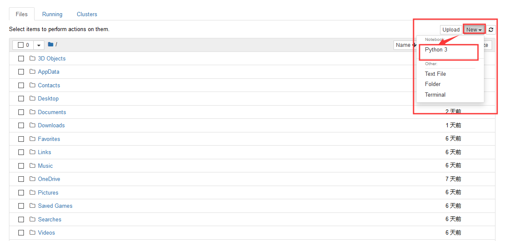

# 数据科学原理与数据处理

## 1 Python行业分析

通过Stack OverFlow专业网站的大数据统计，Python相关技术模块访问量最大的簇是数据科学相关，然后才是后台开发。 


### 1.1 数据处理流程


### 1.2 数据科学岗位分析


## 2  数据分析好助手Jupyter notebook

Jupyter Notebook是基于网页的用于交互计算的应用程序。其可被应用于全过程计算：开发、文档编写、运行代码和展示结果。

### 2.1 Jupyter notebook的安装

##### ① 使用Anaconda安装

Anaconda一个封装多种工具，库的解释器，它已经自动为你安装了Jupter Notebook及其他工具。

##### ② 使用pip 安装

```undefined
pip3 install jupyter
```

**注意：在安装Jupyter Notebook过程中可能面临无法安装的问题（提示你要升级pip），输入下面的命令即可**

```undefined
pip install --upgrade pip
```

### 2.2 Jupyter notebook 基本使用

- 在命令行处，先cd到源代码文件目录 
- 然后输入 jupyter notebook 会自动打开一个jupyter web管理界面
- 点击右上角的new 下边的python3 创建一个脚本



- 点击 run进行运行会在运行完成后自动生成下一格
- 在notebook的脚本中 想将变量打印出来,不需要加print,直接输入变量名即可 


- 在notebook中的单元格内添加注释，直接#+注释就可以


- 标题  


- 快捷键 
  - shift+enter 直接运行并在下一行插入一个单元格 
  - ctrl+enter 直接运行但不插入单元格 
  - alt+enter 插入一个新的单元格

#### 2.3 Jupyter notebook 内置的魔法命令

- %run + 运行python文件路径

```python 
%run D:\hello.py
```

- %load 将文件中的内容读出来【load回来的代码不会自动执行 ,需要手动执行一遍 】

```python 
%load D:\hello.py
```

- %timeit 测试代码的执行时间 【%timeit后边只能跟一行代码】

```python
%timeit lis = [x for x in range(10000)]
```

- %%timeit 测试代码块的执行时间 

```python
%%timrit
lis = []
for i in range(10000):
    lis.append(1)
```

- %time 测试单次运行所需要的时间 【%time和%timeit都是测试时间，但是%time没有%timeit准确】

```python
%time lis = [x for x in range(10000)]
```

- %%time 测试代码块的执行时间

```python 
%%time
lis = []
for i in range(10000):
	lis.append(i)
```

- %%html 用于在notebook中显示页面代码

```python
%%html
<a href = 'www.baidu.com'>百度一下</a>
```

- %%js 用于在notebook中运行js文件的

```Python
%%html
<div class='mytest' style='color:red'>html content</div>

# 写在不同的单元格中
%%js
document.querySelector('.mytest').innerHTML='js content'
```

- %%writefile 将内容编写成文件

```Python
%%writefile  haha.py
    lis = [x for x in ramge(1000)]
```

## 3  数据科学模块NumPy

### 3.1 初级NumPy

#### 3.1.1 NumPy基本介绍

Numpy：提供了一个在Python中做科学计算的基础库，主要用于数值计算、多维数组（矩阵）的处理。本身是由C语言开发，是个很基础的扩展，Python其余的科学计算扩展大部分都是以此为基础。

NumPy是使用Python进行科学计算的基本软件包。它包含以下内容：

- 强大的N维数组对象
- 复杂的（广播）功能
- 集成C / C ++和Fortran代码的工具
- 有用的线性代数，傅立叶变换和随机数功能
- Nmupy本质就是ndarray 
- 多维矩阵 
  - 1维数组看做向量vector--点和直线 
  - 2维数组看做2维矩阵--表和平面 
  - 3维数组看做3维矩阵--空间

除了其明显的科学用途外，NumPy还可以用作通用数据的高效多维容器。可以定义任意数据类型。这使NumPy可以无缝，快速地与各种数据库集成。官方学习资料https://numpy.org/。

#### 3.1.2 NumPy的安装与导入

```
安装  pip install numpy
导入 import numpy as np
```

#### 3.1.3 NumPy中的数组创建

NumPy提供的最重要的数据结构是一个称为NumPy数组的强大对象。NumPy数组是通常的Python数组的扩展。NumPy数组配备了大量的函数和运算符，可以帮助我们快速编写各种类型计算的高性能代码。

```Python
import numpy


# 使用arange创建数组
arr = numpy.arange(0, 6, 2) # 一维数组
arr = numpy.arange(0, 6, 2).reshape(1, 3) # 二维数组
print(arr)

print('--------------------------------------------------------------------')
# 使用linspace创建数组——元素之间’等差‘
# 参数1 开始位置
# 参数2 结束位置
# 参数3 创建数组元素的个数
arr= numpy.linspace(0, 6, 7)
print(arr)

print('------------------------------------------------------------------')
# 使用logspace创建函数--元素之间’等比‘
# 参数1 开始位置 10^0
# 参数2 结束位置 10^2
# 参数3 创建数组元素的个数
arr = numpy.logspace(0, 2, 5)
print(arr)

print('------------------------------------------------------------------')
# ones --生成所有元素都为 1 的数组
arr = numpy.ones(shape = (2, 3))
print(arr)

print('------------------------------------------------------------------')
# zeros --生成所有元素都为 0 的数组
arr = numpy.zeros(shape=(2, 3))
print(arr)

print('------------------------------------------------------------------')
# eye--生成一种类似单位矩阵的数组
# 参数k 决定对角线的位置
# 参数k<0 ,对角线上移k个位置
# 参数k>0 ,对角线下移k个位置
# 参数k超出范围，是个（3,3）都为0的数组
arr = numpy.eye(3, 3, k = 0)
print(arr)

print('------------------------------------------------------------------')
# diag 生成一个对角矩阵数组，参数为对角线上的值
# k 上移，下移 和eye 一样
arr = numpy.diag([1, 3, 5, 7], k = 0)
arr1 = numpy.diag([[1, 3, 5, 7], [2, 4, 6, 8]])
print(arr, '\n', arr1)

print('------------------------------------------------------------------')
# 生成 (0,1)的随机数据的随机数组
arr = numpy.random.random(5)
arr1 = numpy.random.random((2, 3))
print(arr, '\n', arr1)

print('------------------------------------------------------------------')
# 生成随机数据的均匀分布的数组【需要数据量比较大】
arr = numpy.random.rand(5)
arr1 = numpy.random.rand(2, 3)
print(arr,'\n',arr1)

print('------------------------------------------------------------------')
# 生成一个符合正态分布的数组
# 参数为 元素个数 或者 行列数
arr = numpy.random.randn(2, 3)
print(arr)

print('------------------------------------------------------------------')
# 生成固定范围内的，固定形状的数组
#如果不传size ，那么生成一个随机整数
arr = numpy.random.randint(0, 5, size = [2, 3])
arr1 = numpy.random.randint(0, 5)
print(arr, '\n', arr1)

print('------------------------------------------------------------------')
# 获得一个均值为0 标准差为1 的矩阵数组
# 第一个参数是均值 第二个参数是标准差,第三个参数是元素的个数
arr = numpy.random.normal(0, 1, size = 1000000)
print(arr)
```

#### 3.1.4  NumPy的数组属性

```Python
import numpy
arr = numpy.array([[[1,2,3],[4,5,6],[7,8,9]],[[2,3,4],[9,8,7],[5,6,4]]])

print('数组的维度 : ',arr.ndim)
print('数组的形状 : ',arr.shape) # 2块 3行3列
print('数组的元素个数 : ',arr.size)
print('数组的数据类型 : ',arr.dtype)
print('数组的每个元素的大小 : ',arr.itemsize)
```

#### 3.1.5 NumPy数组操作

```Python
# Basic Operators
a = np.arange(25).reshape((5, 5))

b = np.array([10, 62, 1, 14, 2, 56, 79, 2, 1, 45,
              4, 92, 5, 55, 63, 43, 35, 6, 53, 24,
              56, 3, 56, 44, 78]).reshape((5,5))

print(a + b)
print(a - b)
print(a * b)
print(a / b)
print(a ** 2)
print(a < b) print(a > b)
# 这些操作符都是对数组进行逐元素运算。比如 (a, b, c) + (d, e, f) 的结果就是 (a+d, b+e, c+f)。它将分别对每一个元素进行配对，然后对它们进行运算。它返回的结果是一个数组。

print(a.dot(b))
# dot() 函数计算两个数组的点积。它返回的是一个标量（只有大小没有方向的一个值）而不是数组。
```

#### 3.1.6  数组的索引

```Python
# # 普通取值
# 一维数组

import numpy as np 
my_array = np.array([1, 2, 3, 4, 5]) 

print(my_array[0])  # 取一维数组的第一个
print(my_array[-1]) # 取一维数组的最后一个

# 二维数组
import numpy as np 
my_array = np.arange(15).reshape(3, 5)

print(my_array[0])  # 取二维数组的第一行
print(my_array[-1])  # 取二维数组的最后一行


# # 切片取值
# 一维数组
import numpy as np 
my_array = np.array([0, 1, 2, 3, 4, 5, 6, 7, 8, 9]) 

print(my_array[0: 5])
print(my_array[: 5])
print(my_array[0: 8: 2])
print(my_array[::-1])


# 二维数组
import numpy as np 
my_array = np.arange(15).reshape(3, 5)

print(my_array[0:5])
print(my_array[:5])
# 注:python生成的普通数组中,切片切出来的值和原来的数据没有任何关系,一个改变 ,另一个不发生改变
# 注:numpy生成的数组,切片切出来的值和原来的数据有引用关系,一个改变,另一个也发生改变


# bool取值
import numpy as np

a = np.array([[1,2], [3, 4], [5, 6]])
bool_idx = (a > 2)              
print(bool_idx)                          
print(a[bool_idx])  

# 或者
print(a[a > 2])   
```

#### 3.1.7  ndarray 中的合并与分割

```Python
import numpy as np
# # 合并

# 一维数组的合并
arr_1 = np.array([1, 2, 3])
arr_2 = np.array([4, 5, 6])
arr = np.concatenate([arr1, arr2])

print(arr)

# 二维数组的合并
import numpy

arr_1 = numpy.arange(4).reshape((2, 2))
arr_2 = numpy.arange(4, 8).reshape((2, 2))

#数组组合
# 按行的方向【垂直】，进行拼接,参数是一个对象
new_arr = numpy.vstack((arr_1, arr_2))
print(new_arr)

# 按列的方向【水平】，进行拼接,参数是一个对象
new_arr = numpy.hstack((arr_1, arr_2))
print(new_arr)

# 和vstack一样
new_arr = numpy.concatenate((arr_1, arr_2), axis=0)
print(new_arr)

# 和hstack一样
new_arr = numpy.concatenate((arr_1, arr_2), axis=1)
print(new_arr)

# # 分割
# 一维数组
arr = np.arange(10)
print(arr.split(arr, 2))
print(arr.split(arr, 5))
# 第二个参数是指分割成几份 ,要传入正确的分割值,因为平均拆分，必须可以被数组位数整除

# 二维数组
arr = np.arange(16).reshape(4, 4)

# 在列的方向上进行分割数组
new_arr = numpy.hsplit(arr, 4)
new_arr1 = numpy.split(arr, 4, axis = 1)
print(new_arr)
print('-----------------------------------------------')
print(new_arr1)
print('-----------------------------------------------')

# 在行的方向上进行分割数组
new_arr = numpy.vsplit(arr, 4)
new_arr1 = numpy.split(arr, 4, axis = 0)
print(new_arr)
print('-----------------------------------------------')
print(new_arr1)
```

#### 3.1.8 NumPy中的矩阵创建

```Python
import numpy

# 创建矩阵，---【必须是二维的】

## mat
m11 = numpy.mat('1 2 3;4 5 6;7 8 9')
print(m11)
print('--------------------------mat1-----------------------')
#可以将列表转化为矩阵
m12 = numpy.mat([[1,2,3],[4,5,6],[7,8,9]])
print(m12)
print('--------------------------mat2-----------------------')
# 可以将数组转化为矩阵
m13 = numpy.mat(numpy.array([[1,2,3],[4,5,6],[7,8,9]]))
print(m13)
print('--------------------------mat3-----------------------')


## matrix
#m11 = numpy.matrix('1 2 3;4 5 6;7 8 9')
m11 = numpy.asmatrix('1 2 3;4 5 6;7 8 9')
print(m11)
print('--------------------------matrix1-----------------------')
#m12 = numpy.matrix([[1,2,3],[4,5,6],[7,8,9]])
m12 = numpy.asmatrix([[1,2,3],[4,5,6],[7,8,9]])
print(m12)
print('--------------------------matrix2-----------------------')
#m13 = numpy.matrix(numpy.array([[1,2,3],[4,5,6],[7,8,9]]))
m13 = numpy.asmatrix(numpy.array([[1,2,3],[4,5,6],[7,8,9]]))
print(m13)
print('--------------------------matrix3-----------------------')

# 推荐使用mat 或者 asmatrix【matrix，会复制一份，占用更多的内存空间】

## bmat 进行堆积组合矩阵

arr1 = list(numpy.arange(4).reshape(2,2))
arr2 = list(numpy.arange(4,8).reshape(2,2))
print(arr1,type(arr1))
new_arr = numpy.bmat([[arr1,arr2],[arr2,arr1]])
print(new_arr)
print('--------------------------bmat1-------------------------')
# 数组组合矩阵
arr1 = numpy.arange(4).reshape(2,2)
arr2 = numpy.arange(4,8).reshape(2,2)
print(arr1,type(arr1))

new_arr = numpy.bmat([[arr1,arr2],[arr2,arr1]])
print(new_arr)
print('--------------------------bmat2-------------------------')
#列表组合矩阵
arr1 = [[1,2,3],[4,5,6]]
arr2 = [[5,6,7],[7,8,9]]
print(arr1,type(arr1))

new_arr = numpy.bmat([[arr1,arr2],[arr2,arr1]])
print(new_arr)
print('--------------------------bmat3-------------------------')
# 矩阵组合矩阵
arr1 = numpy.mat('1 2;3 4')
arr2 = numpy.mat('5 6;7 8')
print(arr1,type(arr1))

new_arr = numpy.bmat([[arr1,arr2],[arr2,arr1]])
print(new_arr)
print('--------------------------bmat4-------------------------')
```

#### 3.1.9 NumPy数组中矩阵的运算

```Python
import numpy

jz1 = numpy.mat(numpy.arange(9).reshape(3,3))
jz2 = numpy.mat(numpy.arange(9,18).reshape(3,3))
jz3 = numpy.mat(numpy.arange(6).reshape(2,3))
jz4 = numpy.mat(numpy.arange(9,15).reshape(2,3))

#矩阵与数相乘
result = 3*jz1
print(result)
print('---------------------矩阵运算 1----------------------')

#矩阵与同形矩阵相加
result = jz1+jz2
print(result)
print('---------------------矩阵运算 2----------------------')

#矩阵与同形矩阵相减
result = jz1-jz2
print(result)
print('---------------------矩阵运算 3----------------------')

#矩阵与矩阵相乘【左矩阵列数 == 右矩阵行数(必须满足!)】
# result = jz3*jz1
# result = numpy.matmul(jz3,jz1) #在某些情况下 matmul 会比dot严格一点
result = numpy.dot(jz3,jz1) #
print(result)
print('---------------------矩阵运算 4----------------------')

#矩阵对应元素相乘 ---需要满足广播机制 ---数组的广播机制
result = numpy.multiply(jz1,jz2) #【必须同形】
print(result)
print('---------------------矩阵运算 5----------------------')

print(jz1,'\n',type(jz1))
print('矩阵的转置 : \n',jz1.T)
print('矩阵的逆矩阵 : \n',jz4.I) ## A * A.I = E
print('矩阵的共轭转置 : \n',jz1.H)
print('矩阵的视图 : \n',jz1.A)
print('矩阵的视图类型 : \n',type(jz1.A))

print(numpy.matmul(jz4,jz4.I)) # 等于单位矩阵
```

#### 3.1.10 Numpy的聚合操作

```Python
import numpy as np
# sum 求和 
arr = np.arange(16).reshape(4, 4)
print(np.sum(arr, axis = 0)) # axis=0 是竖着求和 axis=1 是横着求和

# min,max最小值和最大值
print(np.min(arr))  # 最小值
print(np.max(arr))  # 最大值

# prod 乘积
print(np.prod(arr))  # 乘积
print(np.prod(arr+1))  # 将全部的元素+1 然后每行进行相乘

# mean 平均值
print(np.mean(arr))  # 平均值
print(np.mean(arr, axis = 0))  # axis=0 求得的是每一列的平均值

# median() 中位数
print(np.median(arr, axis = 0))  # axis=0 求得的是每一列的中位数

# percentile 求矩阵的百分位数
print(np.mean(arr, q = 50))  # q=50 中位数  q=100 最大值

# var()计算矩阵的方差
print(np.var(arr))  # 方差

# std() 求矩阵的标准差
print(np.std(arr))  # 相当于方差开根
```

#### 3.1.11 NumPy的arg操作

```Python
import numpy as np

np.random.seed(40)
arr = np.random.random(50)

# 为了使代码在每次调用的时候能得到相同的值, 使用seed()来固定，值可随意
# argmin()获取最小值在矩阵中的索引
print(np.argmin(arr))

# argmax()获取最大值在矩阵中的索引
print(np.argmax(arr))

# argwhere() 在矩阵中寻找符合条件的数据 
print(np.argwhere(arr > 0.5))

# shuffle()打乱矩阵中的数据的顺序
print(np.random.shuffle(arr))

# argsort() 对矩阵的索引进行排序
print(np.argsort(arr))

# partition() 和 argpartition() 找到一个标准点 小于这个点的放在左 侧 大于这个点的放在右侧
print(np.partition(arr, 4)) # 参数一是要操作的矩阵数组,参数二是进行分割的标准点,返回值是数据
print(np.argpartition(arr, 4)) # 参数一是要操作的矩阵数组,参数二是进行分割的标准点,返回值是索引

# sort
arr = np.random.random(40，size = (5, 8))
print(np.sort(arr, axis = 0)) # sort默认对行进行排序,axis=0是对列进行排序.
```

#### 3.1.12 NumPy的比较运算与逻辑运算

```Python
import numpy as np


arr1 = np.arange(4).reshape(2, 2)
arr2 = np.array([1, 1, 3, 4]).reshape(2, 2)

#比较运算 ----返回同形的bool数组【同形数组 一一比较】
# <
result = arr1<arr2
print(result)
print('---------------比较运算 - 小于 - ---------------')
# <=
result = arr1<=arr2
print(result)
print('---------------比较运算 - 小于等于 - ---------------')
# >
result = arr1>arr2
print(result)
print('---------------比较运算 - 大于 - ---------------')
# >=
result = arr1>=arr2
print(result)
print('---------------比较运算 - 大于等于 - ---------------')
# =
result = arr1==arr2
print(result)
print('---------------比较运算 - 等于 - ---------------')
# ！=
result = arr1!=arr2
print(result)
print('---------------比较运算 - 不等于 - ---------------')

#逻辑运算

# any == or 【只要有一个条件满足T】
result = np.any(arr1 == arr2) #T
result1 = np.any(arr1 != arr2) #T
print(result, result1)
print('---------------逻辑运算 - any - ---------------')


# all == and 【所有条件满足为T】
result = np.all(arr1 == arr2) #F
result1 = np.all(arr1 != arr2) #F
print(result, result1)
print('---------------逻辑运算 - all - ---------------')

```

### 3.2 NumPy的进阶

#### 3.2.1 数组的展开

```Python
import numpy

arr = numpy.arange(16).reshape(4, 4)

# 进行数组展开

# ravel() --将高维度数组展开为一维，按行展开
print(arr.ravel())

# C按行存储 ，F按列存储
# flatten() --将高维度数组展开为一维，默认按行展开--C风格
print(arr.flatten())
print(arr.flatten(order= 'C'))

# 将高维度数组展开为一维，按列展开--F风格
print(arr.flatten(order= 'F'))
```

#### 3.2.2 数组的去重与重复

```Python
import numpy


arr1 = numpy.array([1, 2, 3, 4, 5, 3, 2 , 2, 2, 1, 1, 1, 1, 3])
arr = numpy.arange(4).reshape((2, 2))

# 对数组去重
# unique 去重+排序
res = numpy.unique(arr1)
print(res)

# 重复数据 -- tile作为整体进行重复N次

res = numpy.tile(arr, 2)
print(res)

# 按列进行重复n次
res = numpy.repeat(arr, 2, axis = 0)
# res = numpy.repeat(arr, 2, axis = 1)
print(res)
```

#### 3.2.3 数组的保存与读取

```Python
import numpy

arr1 = numpy.arange(16).reshape((4, 4))
arr2 = numpy.array([1, 2, 3, 4])


# save 以二进制形式保存数据，以 .npy为后缀的二进制文件
#参数1 保存文件的路径 + 文件名称，可以省略后缀
#参数2 要保存的数组
numpy.save('./arr1', arr1)

# 读取 -- 必须制定后缀名
data = numpy.load('./arr1.npy')
print(data)

# savez 来保存多个数组,以 .npz为后缀的二进制文件
#参数1 保存文件的路径 + 文件名称，可以省略后缀
#参数2 要保存的数组
numpy.savez('./arrz', arr1, arr2)

# 读取文件
data = numpy.load('./arrz.npz') #以键值对的形式存储
for tmp in data:
    print(tmp) #键
    print(data[tmp]) #键值

#文本形式的保存
# fmt 格式化  delimiter 字符间隔
numpy.savetxt('./arr.txt', arr1, fmt= '%d', delimiter= ' ')

# 读取文本形式的数组
data = numpy.loadtxt('./arr.txt', dtype= int, delimiter= ' ')
print(data)

# 可以读取结构化数组和缺失数据
data = numpy.genfromtxt('./arr.txt',dtype= int, delimiter= ' ', filling_values= 3)
print(data)
```

#### 3.2.4 广播机制

广播描述了在算术运算期间NumPy如何处理具有不同形状的数组。受某些约束条件的限制，较小的数组会在较大的数组中“广播”，以便它们具有兼容的形状。广播提供了一种向量化数组操作的方法，因此循环是在C而不是Python中进行的。

- 特性
  - 让所有输入数组都向其中shape最长的数组看齐，shape中不足的部分都通过在前面加1补齐。
  - 输出数组的shape是输入数组shape的各个轴上的最大值。
  - 如果各个输入数组的对应轴【维度】的长度相同或者其长度为1时，这样的数组之间能够用来计算，否则
  - 出错。当输入数组的某个轴的长度为1时，沿着此轴运算时都用此轴上的第一组值
- 一维数组的广播机制

```Python
import numpy as np
x=np.array([[1, 3, 5], [1, 1, 1], [2, 2, 2], [3, 3, 3]])
y=np.array([2, 4, 3])
print(x + y)
```


- 二维数组的广播机制

```python
import numpy as np
x=np.array([[1, 3, 5], [1, 1, 1], [2, 2, 2], [3, 3, 3]])
y=np.array([1, 2, 3, 4]).reshape((4, 1))
print(x + y)
```


#### 3.2.5 NumPy实战

- 如何在不影响原始数组的情况下替换满足条件的元素项？

```Python
# 将arr中的所有奇数替换为-1，而不改变arr。
import numpy as np
arr = np.arange(10)
out = np.where(arr % 2 == 1, -1, arr)
print(arr)
print(out)
```

- 如何获取两个numpy数组之间的公共项？

```Python
import numpy as np
a = np.array([1,2,3,2,3,4,3,4,5,6])
b = np.array([7,2,10,2,7,4,9,4,9,8])
print(np.intersect1d(a,b))
```

-  如何填写不规则系列的numpy日期中的缺失日期？

```python 
import numpy as np

dates = np.arange(np.datetime64('2018-02-01'), np.datetime64('2018-02-25'), 3)
print(dates)
# 思路： 计算出时间之间的差异，也就是两个时间之间差的天数，
# 当前数组中的时间，每次加上相差的天数-1，直到，相差天数为0


# 方法一
filled_in = np.array([np.arange(date, (date+d)) for date, d in zip(dates, np.diff(dates))]).reshape(-1)
print(filled_in)

# 添加最后一天
output = np.hstack([filled_in, dates[-1]])
print(output)
print('=====================')


#方法二
out = []
for date, d in zip(dates, np.diff(dates)):
    out.append(np.arange(date, (date+d)))

filled_in = np.array(out).reshape(-1)

# 添加最后一天
output = np.hstack([filled_in, dates[-1]])
print(output)
```

- 将图像转化为numpy数组

```Python
#因为矩阵里的每个位置都对应图像上的位置和数据，简单的rbg格式来说，返回一个蓝色、绿色、红色值数组，所以每张图片都是一个多维矩阵组成，转化为nunpy数组就是方便通过矩阵运算来对图像进行修改 
import PIL
import numpy as np
from PIL import Image
from io import BytesIO

def image_numpy(image):
    # 读取图像
    I = Image.open(BytesIO(image))

    # 转化为numpy数组
    arr = np.asarray(I)
    print(arr)

    # 重新将数组转化为图像
    im = PIL.Image.fromarray(np.uint8(arr))

    # 展示图像
    Image.Image.show(im)
with open('1.jpg','rb') as fp:
   response =  fp.read()

image_numpy(response)
```

## 4  统计与分析模块Pandas

### 4.1 Pandas基础

#### 4.1.1 Pandas简介

**Pandas** 是Python的核心数据分析支持库，提供了快速、灵活、明确的数据结构，旨在简单、直观地处理关系型、标记型数据。Pandas 的目标是成为 Python 数据分析实践与实战的必备高级工具，其长远目标是成为**最强大、最灵活、可以支持任何语言的开源数据分析工具**。

Pandas 适用于处理以下类型的数据：

- 与 SQL 或 Excel 表类似的，含异构列的表格数据。
- 有序和无序（即非固定频率）的时间序列数据。
- 带行列标签的矩阵数据，包括同构或异构型数据。
- 任意其它形式的观测、统计数据集。 数据转入 Pandas 数据结构时不必事先标记。

Pandas 的主要数据结构是 Series(一维数据)与DataFrame(二维数据）。功能十分强大，下面仅列出了它的部分优势 ：

- 处理浮点与非浮点数据里的缺失数据，表示为 `NaN`；
- 大小可变：插入或删除 DataFrame 等多维对象的列；
- 自动、显式数据对齐：显式地将对象与一组标签对齐，也可以忽略标签，在 Series、DataFrame 计算时自动与数据对齐；
- 强大、灵活的分组（group by）功能：拆分-应用-组合数据集，聚合、转换数据；
- 把 Python 和 NumPy 数据结构里不规则、不同索引的数据轻松地转换为 DataFrame 对象；
- 基于智能标签，对大型数据集进行切片、花式索引、子集分解等操作；
- 直观地合并（merge）、连接（join）数据集；
- 灵活地重塑（reshape）**、**透视（pivot）数据集；
- 用于读取文本文件（CSV 等支持分隔符的文件）、Excel 文件、数据库等来源的数据，利用超快的 HDF5 格式保存 / 加载数据；
- 时间序列：支持日期范围生成、频率转换、移动窗口统计、移动窗口线性回归、日期位移等时间序列功能。

**Pandas的数据结构**

- Pandas 数据结构就像是低维数据的容器。比如，DataFrame 是 Series 的容器，而 Series 则是标量的容器。使用这种方式，可以在容器中以字典的形式插入或删除对象。
- Pandas 所有数据结构的值都是可变的，但数据结构的大小并非都是可变的，比如，Series 的长度不可改变，但 DataFrame 里就可以插入列。
- Pandas 里，绝大多数方法都不改变原始的输入数据，而是复制数据，生成新的对象。 一般来说，原始输入数据不变更稳妥。
- 处理 DataFrame 等表格数据时，**index**（行）或 **columns**（列）比 **axis 0** 和 **axis 1** 更直观。用这种方式迭代 DataFrame 的列，代码更易读易懂，

#### 4.1.2 Pandas的安装与导入

```
pip install pandas   安装
import pandas as pd  导入
```

#### 4.1.3 Series 一维数组

Seriess是一维标记的数组，能够保存任何数据类型（整数，字符串，浮点数，Python对象等）。

- **创建Series对象**

```python 
import pandas as pd
ser = pd.Series(['张三', '李四', '王五'], lis(range(1, 4)))
print(ser)
ser = pd.Series(['张三', '李四', '王五'], index = lis(range(1, 4)))
print(ser)
```

- **Series与NumPy的关系**

```python 
import pandas as pd
ser = pd.Series(['张三', '李四', '王五'], lis(range(1, 4)))
print(ser)
print(type(ser))
print(ser.values)
print(type(ser.values))
# 在serise内部 数据就是以numpy的形式来存储的
```

- **Series与Python数据类型的相互转换**

```Python
import pandas as pd

# 字典转化Series
data = {'北京': 9240, '深圳': 8923, '广州': 7800}
ser = pd.Series(data)
print(ser)

# Series转化为字典
print(ser.to_dict())

# Series转化为列表
print(ser.to_list())

# Series转化为json格式的字符串
print(ser.to_json())
```

#### 4.1.4 DataFrame 二维数组

- **DataFrame的创建**

```Python
import pandas as pd
import numpy as np

# 使用二维数组创建
data = np.arange(100).reshape(25, 4)
df = pa.DataFrame(data)
print(df)

# 使用字典
data = {
    'name': ['jack', 'mary', 'lily'],
    'age': [18, 21, 24],
    'height': [1.70, 1.68, 1.69]
}
print(df.DataFrame(data))
```

- **创建不同数据类型的DataFrame**

```python
import pandas as pd
import numpy as np
df = pd.DataFrame({'A': 1.,
                    'B': pd.Timestamp('20130102'),
                    'C': pd.Series(1, index=list(range(4)), dtype='float32'),
                    'D': np.array([3] * 4, dtype='int32'),
                    'E': pd.Categorical(["test", "train", "test", "train"]),
                    'F': 'foo'})
print(df) 
print(df.dtypes)  # 查看每一列的数据类型
```

- **DataFrame 属性**

```Python
import pandas

# 创建一个dataframe【二维结构的表】

df = pandas.DataFrame({
                        'col1':[0,1,2],
                        'col2':["zs",'li','zl'],
                        'col3':[3.14,5.20,6.78]
                      },
                      index=['index0','index1','index2']
                      )
print(type(df))

# 查看dataframe 属性
print("df 的values:\n",df.values) # 获取df的数组
print("df 的index:\n",df.index) # 获取行索引名称
print("df 的columns:\n",df.columns) # 获取列索引名称
print("df 的size:\n",df.size) #  获取元素个数
# print("df 的itemsize:\n",df.itemsize) # df 没有这个属性
print("df 的dtypes:\n",df.dtypes) #  每一列的数据类型
print("df 的shape:\n",df.shape) # 获取df形状，以元组显示
print("df 的ndim:\n",df.ndim) # 获取df维度----df  是2维的 没有别的维度
```

#### 4.1.5 数据提取

```Python
import pandas as pd
data = {
    'name': ['jack', 'mary', 'lily'],
    'age': [19, 19, 17],
    'height': [1.68, 1.37, 1.62]
}
df = pd.DataFrame(data)

# # 按列进行提取
print(df['name'])
print(df.age)

# 将提取到的只，转化为列表
print(df[['name', 'age']])

#通过索引改变数据的值之后,会直接作用到原数据上,使用copy来解决这个问题
name = df.name.copy()
name[0] = '小明'
print(name)
print(df)

# 切片取值
print(df.columns[1:3])


# #按行提取

print(df.index[-2:])

print(df.loc[df.index[-2:]])

print(df.loc[df.index[-2:], ['name', 'age']])

```

#### 4.1.6 Pandas数据的增加、修改、删除

```Python
import pandas as pd

# 加载数据
data = {
    'name': ['jack', 'mary', 'lily'],
    'age': [19, 19, 17],
    'height': [1.68, 1.37, 1.62]
}
df = pd.DataFrame(data)

# 给数据data 增加一个 new_age列 【此列的值为age列的值+1】
df.loc[:, 'new_age'] = df.loc[:, 'age'] + 1
print(data)

print('------------------------ 修改 ------------------------')
# 更改所有年龄大于18的
# 定位到age这一列数据，并进行判断 age >= 18的为True，否则为False
res = data.loc[:, 'age'] >= 18
print(res)


# 使用上面确定好的bool列，获取所有age >= 18的数据
data_sex_man = data.loc[res, 'age']
print(data_sex_man)


# 重写赋值【age >= 18的数据 改为 age = 17】
df.loc[res,'age'] = 17
print(df)


print('------------------------ 删除 ------------------------')
# inplace = True 对原df 产生影响，返回一个None
# inplace = False 对原df 不产生影响，返回删除之后的结果
res = df.drop(labels = ['sex', 'age'], axis = 1, inplace = False)# 删除列
print(res)

res = df.drop(labels = [0, 1, 2, 3, 4, 5] , axis=0 , inplace = False)# 删除行
print(res)

# # 删除age为偶数的行【小练习】
# 确定age为偶数的行
bool_age = df.loc[:, 'age']%2 == 0

# 获取age为偶数的行名称
age_name = df.loc[bool_age, :].index

# 删除
res = df.drop(labels = age_name, axis = 0, inplace = False)
print(res)

```

#### 4.1.7 Pandas数据加载

```Python
import pandas as pd 


# 加载文本数据
# read_table 默认 \t 分隔符
#若需要分割这种特殊的文本,则需要手工指定分隔符 加一个sep的属性,若第 一行也是数据,没有header的话,则再加一个header=None的属性
data = pd.read_table('data_file/meal_order_info.csv', encoding = 'ansi'，sep = ',')
print(data)

data = pd.read_csv('data_file/meal_order_info.csv', encoding = 'ansi')
print(data)

# 保存csv格式数据
data = {
    'name': ['jack', 'mary', 'lily'],
    'age': [19, 19, 17],
    'height': [1.68, 1.37, 1.62]
}
pd.DataFrame.to_csv(data, './ssss.csv')


# excel文件读取与保存【xlsx为后缀的文件】

# 文件1
data = pd.read_excel('data_file/meal_order_detail.xlsx', sheet_name = 0)
# 文件2
data1 = pd.read_excel('data_file/users.xlsx', sheet_name = 0)

# 需要保存的文件，--绝对路径
file = pd.ExcelWriter('D:\项目\DataAnalysis\day4_pandas数据处理\hh.xlsx')

# 保存到不同的sheet
data.to_excel(file,sheet_name = 'sheet1')
data1.to_excel(file,sheet_name = 'sheet2')
# 保存文件【不保存会没有数据】
file.save()
```

#### 4.1.8 数据排序与合并

- **数据排序**

```Python
import pandas as pd

# 对一维数组进行排序
ser = pd.Series(list('cab'), index = [2, 1, 3])
print(ser)
print(ser.sort_index())# 默认情况下使用的时升序的排列,如果使用降序排列则使用ascending=False

# 对二位数组进行排序
arr = [[1, 2, 3],
       [4, 5, 6],
       [7, 8, 9]]
df = pd.DataFrame(arr, index = [0, 2, 1], columns = list('asd'))
print(df.sort_index())

# 在列的方向上进行排序
print(df.sort_values(by = 'a'))
```

- rank排序

```Python
# rank排序是先对数据进行排序，获得每个数据对应的索引的平均值，返回这个平均值

import pandas as pd

obj = pd.Series([8, -5, 7, 4, 2, 0, 4])
print(obj.rank())

# 排序过程，先对数据排序
[-5, 0, 2, 4, 4, 7, 8]
  |  |  |  |  |  |  |
  1  2  3  4  5  6  7

#计算出，相同数据，对应的索引的平均值
[-5,   0,   2,   4,   4,   7,   8]
  |    |    |    |    |    |    |
 1.0  2.0  3.0  4.5  4.5  6.0  7.0

# 按照数据的顺序对索引进行排序
0    7.0
1    1.0 
2    6.0
3    4.5
4    3.0
5    2.0
6    4.5

print(obj.rank(method='first')) # 按照数据顺序，对索引进行排序，对于相同的值按照出现的顺序排名
print(obj.rank(method='max')) # 按照数据顺序，对索引进行排序，对于相同的值都取大的排名
print(obj.rank(method='min')) # 按照数据顺序，对索引进行排序，对于相同的值都取小的排名
```

- **数据的合并**

```python
import pandas as pd
import numpy as np

# 直接拼接【concat】
# 加载数据
data_1 = pd.DataFrame({'stu_no': ['s1', 's2', 's1', 's3', 's1', 's1', 's2', 's4'],
                    'score': np.random.randint(50, 100, size = 8)
                      })
data_2 = pd.DataFrame({'stu_no': ['s1', 's2', 's3', 's5'],
                    'name': ['张三', '李四', '王五', '赵六']
					 })

# 利用concat 进行拼接
# 【行的方向拼接 axis = 0】
# outer 代表外连接,在行的方向上直接拼接，列的方向上求列的并集
res = pd.concat((data_1, data_2), axis = 0, join = 'outer')
print(res)
# inner 代表内连接,在行的方向上直接拼接，列的方向上求列的交集
res = pd.concat((data_1, data_2), axis = 0, join = 'inner')
print(res)

# 【列的方向拼接 axis = 1】
# outer 代表外连接,在列的方向上直接拼接，行的方向上求列的并集
res = pd.concat((data_1, data_2), axis = 1, join = 'outer')
print(res)
# inner 代表内连接,在列的方向上直接拼接，行的方向上求列的交集
res = pd.concat((data_1, data_2), axis = 1, join = 'inner')
print(res)


# 主键拼接 【merge】 --- 没有行的方向上的拼接
# 拼接方式
# how = {'left', 'right', 'outer', 'inner'}
# on 就是 值一样的列

#  left  ---left outer 左外连接  key 列只关系 左表，右表不关心
res = pd.merge(left = data_1, right = data_2, how = 'left', on = 'key')
print(res)
# right  right outer 右外连接，  key 列只关系 右表，左表不关心
res = pd.merge(left = data_1, right = data_2, how = 'right', on = 'key')
print(res)
# outer -  外连接  key值的列 求并集
res = pd.merge(left = data_1, right = data_2, how = 'outer', on = 'key')
print(res)
# inner -  内连接  key值的列 求交集
res = pd.merge(left = data_1, right = data_2, how = 'inner', on = 'key')
print(res)
```

#### 4.1.9 数据汇总

```Python
import pandas as pd
data = [
    [1, None],
    [4, 5],
    [None, None],
    [8, 9],
    [3, 4]]
df = pd.DataFrame(data, columns = ['a', 'b'])

print(df.head()) #默认显示前五行
print(df.tail()) #默认显示后五行
print(df.info()) #显示数据类型相关的内容
print(df.describe()) #显示数据汇总信息
print(df.count()) #统计一共有多少条数据
print(df.mean()) #获得平均数
print(df.sum()) #对数据进行求和
print(df.cumsum()) #累加求和
print(df.std()) #数组的标准差
print(df.var()) #求数组的方差
print(df.max()) # 求数组的最大值
print(df.min()) # 求数组的最小值
print(df.quantilr()) #求数组的四分位数
```

#### 4.1.10 数据分组与透视表

- **分组聚合**

```Python
import pandas as pd
import numpy as np

# 加载数据
data = [
    ['python', 0, 'zs', 18, '男', '北京'],
    ['java', 1, 'ls', 18, '男', '山东'],
    ['php', 2, 'ws', 28, '女', '山西'],
    ['html', 3, 'qs', 19, '男', '北京'],
    ['c++n', 4, 'rs', 23, '男', '北京']  
]
data = pd.DataFrame(data, columns = ['ORGANIZE_NAME', 'USER_ID', 'name', 'age', 'sex', 'p'])

# 根据班级分组、统计学员的班级的平均年龄
# groupby  分组
#  by  ---指定分组的列，可以是单列 也可以是多列
res = data.groupby(by = 'ORGANIZE_NAME')['age'].mean()
print(res)
# 按照单列分组，获取多列的
res = data.groupby(by = 'ORGANIZE_NAME')[['age', 'USER_ID']].mean()
# 按照多列分组，获取单列
res1 = data.groupby(by = ['ORGANIZE_NAME', 'p', 'sex'])['age'].mean()
print(res,'\n',res1)

print('-*'*50)
# 利用agg同时对age 求平均值、对userid 求最大值
res1 = data.agg({'age': np.mean, 'USER_ID': np.max})
print(res1)

#  对age 和 USER_ID 同时分别求 和 和均值
res = data[['age', 'USER_ID']].agg([np.sum, np.mean])
print(res)

# 对age  USER_ID 求取不同个数的统计指标
res = data.agg({'age': np.min, 'USER_ID': [np.mean, np.sum]})
print(res)


# 自定义函数进行计算 *
def hh(x):
    return  x+1

res = data['age'].apply(hh)
print(res)

res = data[['age', 'USER_ID']].apply(lambda x: x+1)
print(res)

res = data['age'].transform(lambda x: x+1)
print(res)
```

- **透视表**

```Python
import pandas as pd
import numpy as np
data = [
    ['2018-07-01', '商品A', '服饰', 18, '2', '740'],
	['2018-07-02', '商品s', '食品', 18, '2', '140'],
    ['2018-07-03', '商品A', '服饰', 18, '3', '840'],
    ['2018-07-04', '商品s', '食品', 18, '2', '640'],
    ['2018-07-05', '商品A', '服饰', 18, '5', '440'],
    ['2018-07-06', '商品s', '食品', 18, '6', '405'],
    ['2018-07-07', '商品A', '服饰', 18, '9', '4550']
]
df = pd.DataFrame(data, columns = ['日期', '名称', '类别', '单价', '数量', '金额'])
df.pivot_table(index = ['类别', '名称'], values = ['单价', '数量'])
df. pivot_ _table (index = ['类别', '名称'], values = ['数量', '金额'], aggfunc = np.sum)

# 指定aggfunc可以指定 数组的处理方,默认是 np.mean 
# index指定的是索引 
# values指定的是需要显示的值
```

#### 4.1.11 时间序列

```Python
#  datetime64[ns] ---numpy 里面的时间点类型
#  Timestamp ---pandas 默认的时间点类型----封装了datetime64[ns]
#  DatetimeIndex   ---pandas 默认支持的时间序列结构


import pandas
# 可以通过 pd.to_datetime 将时间点数据转化为pandas默认支持的时间点数据
res = pandas.to_datetime('2019-9-12')
print(res, type(res))

# 可以通过pd.to_datetime 或者pd.DatetimeIndex将时间序列转化为pandas默认支持的时间序列结构
res = pandas.to_datetime(['2019-9-11', '2019-9-12', '2019-9-13', '2019-9-14', '2019-9-15'])
res1 = pandas.DatetimeIndex(['2019-9-11', '2019-9-12', '2019-9-13', '2019-9-14', '2019-9-15'])
print(res, '\n', res1)


print('-*'*50)
# 加载数据
data = pandas.DataFrame(res, columns = ['time'])
print(data.loc[:, 'time'])

print('-*'*50)

# 转化为pandas默认支持的时间序列结构
pandas_time = pandas.to_datetime(data.loc[:, 'time'])
print(type(pandas_time))


# 获取该时间序列的属性---可以通过列表推导式来获取时间点的属性
year = [i.year for i in pandas_time]
print("年：\n", year)

month = [i.month for i in pandas_time]
print("月：\n", month)

day = [i.day for i in pandas_time]
print("日：\n", day)

quarter = [i.quarter for i in pandas_time]
print("季度：\n", quarter)

# 返回对象
weekday = [i.weekday for i in pandas_time]
print("周几：\n", weekday)

weekday_name = [i.weekday_name for i in pandas_time]
print("周几：\n", weekday_name)

is_leap_year = [i.is_leap_year for i in pandas_time]
print("是否闰年：\n", is_leap_year)

print('-*'*50)


# 时间的相加减
res = pandas.to_datetime("2016-01-01")

print("时间推后一天：\n", res + pandas.Timedelta(days = 1))
print("时间推后一小时：\n", res + pandas.Timedelta(hours = 1))


print('-*'*50)

data.loc[:, 'place_over_time'] = data.loc[:, 'place_order_time'] + pandas.Timedelta(days = 1)
print(data)

print('-*'*50)

# 时间差距计算
res = pandas.to_datetime('2019-09-12') - pandas.to_datetime('1994-04-08')
print(res)

# 获取本机可以使用的最初时间  和最后使用的时间节点
print(pandas.Timestamp.min)
print(pandas.Timestamp.max)

#resample 重新取样

print(data.resample('90s').mean())# 指定时间间隔,生成一个以平均值为值的新的时间序列
```

### 4.2 Pandas进阶

#### 4.2.1 缺失值处理

```python 


```

#### 4.2.2 异常值处理

```

```

#### 4.2.3 数据离散化

```

```

#### 4.2.4 标准化数据

```

```


## 5  数据可视化Matplotlib与Seaborn


## 6 项目实战 — 服务器日志分析