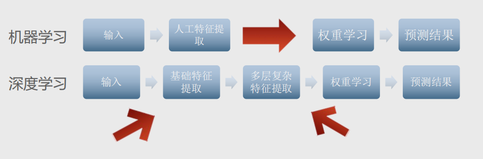
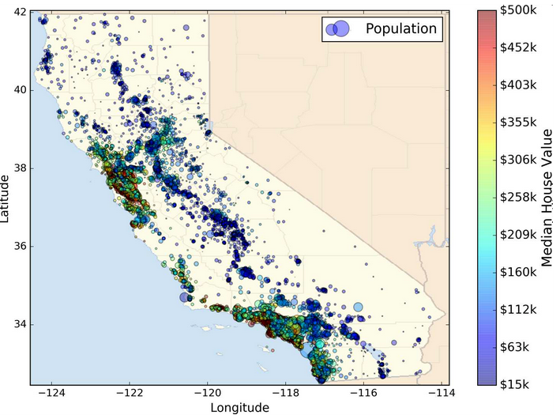
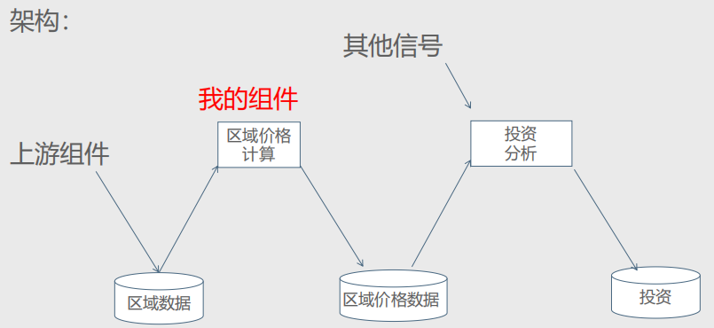

# 特征工程

## 1 机器学习

机器学习简单来说就是选择一种学习算法，从数据中学习并建立成模型来对新的数据进行预测的计算机科学 。

机器学习是人工智能的一个分支。人工智能的研究是从以“推理”为重点—以“知识”为重点—再到以“学习”为重点，一条自然、清晰的脉络。机器学习是实现人工智能的一个途径，即以机器学习为手段解决人工智能中的问题。机器学习算法是一类从数据中自动分析获得规律(模型)，并利用规律对未知数据进行预测的算法。

我们的数据量越来越多，硬件越来越强悍。急需要解放人的生产力，自动去寻找数据的规律。解决更多专业领域的问题。机器学习已广泛应用于数据挖掘、计算机视觉、自然语言处理、生物特征识别、搜索引擎、医学诊断、检测信用卡欺诈、证券市场分析、DNA序列测序、语音和手写识别、战略游戏和机器人等领域。

机器学习适用于以下等问题：

- 不存在已知算法解决方案的复杂问题 
-  需要大量手动调整或者规则列表超长的问题 
- 可以适应环境波动的系统 

### 1.1 基础概念

- #### 样本与标签

**标签**是提供给算法的包含所需解决方案的训练数据，是我们要预测的事物，即简单线性回归中的 y 变量。

**样本**每一条数据叫一个样本，即数据的特定实例：`x` 。

- #### 特征

属性加上其值 就是特征，也可以理解为输入变量，即简单线性回归中的 `x` 变量。

- #### 回归任务

关注预测值和真实值之间的差别，就是通过给定的特征来预测一个目标数值。

- #### 训练集

 用于训练模型的数据叫训练集 

- #### 测试集

用于测试模型精度的数据叫测试集

- #### 过拟合与欠拟合

从字面的意义上理解就是过度拟合的意思，常发生在线性分类器或者线性模型的训练和预测当中。过拟合的原理就是机器学习算法过度学习了训练集数据。反之欠拟合。

- #### 模型训练

是指创建或学习模型。也就是说，向模型展示有标签样本，让模型逐渐学习特征与标签之间的关系。通过训练数据找到算法最合适的参数。

### 1.2 机器学习执行流程



1. ##### 理解实际问题，抽象为机器学习能处理的数学问题

   理解实际业务场景问题是机器学习的第一步， 机器学习中特征工程和模型训练都是非常费时的，深入理解要处理的问题，能避免走很多弯路。理解问题，明确可以获得的数据。

2. ##### 获取数据

   获取数据包括获取原始数据，以及从原始数据中经过特征工程，从原始数据中提取训练、测试数据。数据数量不要有多个数量级的差距。不仅如此还要对评估数据的量级，样本数量、特征数量，估算训练模型对内存的消耗。

3. ##### 特征工程

   特征工程包括从原始数据中特征构建、特征提取、特征选择。特征工程做的好能发挥原始数据的最大效力，往往能够使得算法的效果和性能得到显著的提升，有时能使简单的模型的效果比复杂的模型效果好。

4. ##### 模型训练、诊断、调优

   对算法的理解、调节参数，使模型达到最优。模型诊断中至关重要的是判断过拟合、欠拟合，常见的方法是绘制学习曲线，交叉验证。通过增加训练的数据量、降低模型复杂度来降低过拟合的风险,提高特征的数量和质量、增加模型复杂来防止欠拟合。诊断后的模型需要进行进一步调优， 调优后的新模型需要重新诊断，这是一个反复迭代不断逼近的过程，需要不断的尝试，进而达到最优的状态。

5. ##### 模型预测，获得结果

   我们通过训练数据集得到模型，然后将想要预测的数据加入模型中进行测试，得到测试结果。

这就是我们大致的机器学习流程。

### 1.3 数据处理与特征工程

- ##### 数据处理

“数据决定了机器学习的上限，而算法只是尽可能逼近这个上限”，这句话很好的阐述了数据在机器学习中的重要性。大部分直接拿过来的数据都是特征不明显的、没有经过处理的或者说是存在很多无用的数据，那么需要进行一些特征处理，特征的缩放等等，满足训练数据的要求。

数据处理主要解决的问题是：

1. 数据量不足

2. 训练数据不具备代表性

3. 质量差的数据

4. 特征筛选

- ##### 特征工程

机器学习的关键是 提取出一组好的用来训练的特征集，这个过 程叫特征工程，包括： 

1. 特征选择 从现有特征中选择最有用的特征进行训练 

2. 特征提取 将现有特征进行整合，产生更有用的特征，比 如降维算法 

3. 通过收集 新数据创造新特征

#### 1.3.1 数据的来源与类型

- ##### 数据的来源

通过爬虫爬取、购买数据、网上的开放数据等。

- ##### 数据的类型

按照机器学习的数据分类我们可以将数据分成：

- 标称型：标称型目标变量的结果只在有限目标集中取值，如真与假
- 数值型：数值型目标变量则可以从无限的数值集合中取值，

按照数据的本身分布特性

- 离散型【无规律】
- 连续型【有规律】
  - 离散变量是指其数值只能用自然数或整数单位计算的则为离散变量。例如，班级人数
  - 连续型数据是指在指定区间内可以是任意一个数值。例如，票房数据、

#### 1.3.2 数据特征选择

特征选择主要有两个功能：

- 减少特征数量，降维，使模型泛化能力更强，减少过拟合
- 增强特征和特征值之间的理解

降维本质上是从一个维度空间映射到另一个维度空间，特征的多少类别没有减少，当然在映射的过程中特征值也会相应的变化。举个例子，现在的特征是1000维，我们想要把它降到500维。降维的过程就是找个一个从1000维映射到500维的映射关系。

#### 1.3.3 数据的特征抽取

现实世界中多数特征都不是连续变量，比如分类、文字、图像等，为了对非连续变量做特征表述，需要对这些特征做数学化表述，因此就用到了特征提取

#### 1.3.4 数据特征处理

- ##### 单个特征

  - 归一化【归一化首先在特征（维度）非常多的时候，可以防止某一维或某几维对数据影响过大，也是为了把不同来源的数据统一到一个参考区间下，这样比较起来才有意义，其次可以程序可以运行更快。】
  - 标准化【将数据转化为同一量级，避免量级对结果产生不利的影响①离差标准化②标准差标准化③小数定标标准化】

  - 缺失值【①删除 ----会对数据产生很大的影响，造成数据缺失，所以在数据大部分为缺失值，才使用删除法；②填充  --- 填充之后对结果影响不大的情况，可以使用(均值，中位数，众数)；③插值(线性插值；多项式插值；样条插值)】

- ##### 多个特征

  - 降维【保存数据集中对方差影响最大的那些特征，或者进行抽样】

## 2 机器学习流程实践

- 真实数据观察全局 
- 选择性能指标、检查假设 
- 获取数据 
  - 创建工作区，快速查看数据结构，创建测试集 
- 从可视化中探索数据 
  - 将数据可视化、寻找相关性、试验不同的属性组合 
- 机器学习前的数据准备 
  - 数据清理、自定义转换器、特征缩放、转换流水线 
- 选择训练模型 
  - 评估训练集、交叉验证、分析最佳模型及其错误、测试集评 
- 模型调优 
- 分析最佳模型和测试集评估 
- 系统维护和监控

### 2.1 观察数据、选择指标、检查假设

#### 2.1.1 观察数据

- 机器学习最好使用真实数据，而不仅仅是使用人工数据。可以选择开源数据集。
- 使用加州人口的普查的数据建立起加州的房价模型。数据中包含很多指标：每个街区人口的数量，收入中位数等，
- 加州房产价格数据集



#### 2.1.2 选择指标

- 了解建立模型的目的，盈利模式，从而选择相应的指标。因为模型不是最终目的，这些问题将决定你怎么设定问题，选择什么算法，使用什么测量方式来衡量模型的性能。
- 划定问题：监督或非监督，还是强化学习？这是个分类任务、回归任务，还是其它的？【本章特征工程主要是处理数据，具体的机器学习划分在下一模块‘机器学习’】
  - 这是一个典型的监督学习任务，因为你要使用的是有标签的训练样本（每个实例都有预定的产出，即分区的房价中位数）。并且，这是一个典型的回归任务，因为你要预测一个值。讲的更细些，这是一个多变量回归问题，因为系统要使用多个变量进行预测（要使用分区的人口，收入中位数等等）。
- 选择性能指标。回归问题的典型指标是均方根误差（RMSE）。均方根误差测量的是系统预测误差的标准差。

#### 2.1.3 检查假设



最好列出并核对迄今（你或其他人）作出的假设。，这样可以尽早发现严重的问题。例如，你的系统输出的分区房价，会传入到下游的机器学习系统，我们假设这些价格确实会被当做分区房价使用。但是如果下游系统实际上将价格转化成了分类（例如，便宜、中等、昂贵），然后使用这些分类，而不是使用价格。这样的话，获得准确的价格就不那么重要了，你只需要得到合适的分类。问题相应地就变成了一个分类问题，而不是回归任务。

### 2.2 获取数据

#### 2.2.1 创建工作区

推荐创建一个隔离环境，这样可以在库版本不冲突的情况下处理不同的项目

- 用pip安装`virtualenv`

```
pip install virtualenv
```

- 创建目录，并进入文件夹

```
mkdir myproject
cd myproject
```

- 创建一个独立的python环境，命名为venv【命令`virtualenv`就可以创建一个独立的Python运行环境，我们还加上了参数`--no-site-packages`，这样，已经安装到系统Python环境中的所有第三方包都不会复制过来，这样，我们就得到了一个不带任何第三方包的“干净”的Python运行环境。】

```
virtualenv --no-site-packages venv
```

- 激活环境

```
activate myproject
```

- 安装模块

```
pip install jupyter numpy pandas scipy matplotlib  scikit-learn
```

- 测试安装模块

```
python -c 'import jupyter, numpy, pandas, scipy, matplotlib, scikit-learn'
```

- 退出独立环境

```
deactivate 
```

#### 2.2.2 查看数据，创建测试集

- 数据获取

```python
## 获取数据
import os
import pandas as pd
def load_housing_data(housing_path = './'):
    csv_path = os.path.join(housing_path, 'housing.csv')
    return pd.read_csv(csv_path)
housing = load_housing_data() # 读取数据
housing.head() # 查看前五条数据
housing.shape  # 查看数据结构
housing.info() # 查看数据集的简单描述， 得到每个属性类型和非空值数据量

#  total_bedrooms  20433 有一部分空值
housing['ocean_proximity'].value_counts()  # 查看多少种分类，5 种分类，获得每种分类下有少区域

housing.describe()  # 显示数值属性摘要

# 使用直方图展示数据
import matplotlib.pyplot as plt
housing.hist(bins = 50, figsize = (20, 15))
plt.show()
```

- 创建测试集，训练集

```python
#训练集用于模型训练 占整个数据集的80% ，测试占20%
import numpy as np
def split_train_test(data, test_radio):
    np.random.seed(42)
    indices = np.random.permutation(len(data)) #对原来的数组进行重新洗牌，随机打乱原来的元素顺序
    test_set_size = int(len(data) * test_radio)
    test_indices = indices[:test_set_size]
    train_indices = indices[test_set_size:]
    return data.iloc[train_indices], data.iloc[test_indices]
train_set, test_set =  split_train_test(housing, 0.2)


#对样本设置唯一的标识符，对标识符取hash值， 去hash的最后一个字节， 值小于等于51 ，256*20%，放入测试集，hash值相同，对象不一定相同，hash不同，对象一定不同
import hashlib

def test_set_check(identifier, test_radio, hash = hashlib.md5):
     #返回摘要，作为二进制数据字符串
    return hash(np.int64(identifier)).digest()[-1] < 256 * test_radio 

def split_train_test_by_id(data, test_ratio, id_column):
    ids = data[id_column]
    in_test_set = ids.apply(lambda id_:test_set_check(id_, test_ratio))
    return data.loc[~in_test_set], data.loc[in_test_set]

housing_with_id = housing.reset_index()  # 使用行索引作为标识符 ID

housing_with_id.head() # 查看数据

train_set, test_set = split_train_test_by_id(housing_with_id, 0.2, 'index') # 返回测试集，训练集

# 基于行索引，不能删除和中间插入数据，只能末尾插入，否则行索引会变
# 寻找稳定特征来创建唯一标识符，
housing_with_id['id'] = housing['longitude'] * 1000 + housing['latitude']
housing_with_id.head()
train_set, test_set = split_train_test_by_id(housing_with_id, 0.2, 'id')


from sklearn.model_selection import train_test_split
train_set, test_set = train_test_split(housing, test_size = 0.2, random_state = 42)
train_set.head()

# 如果数据集一直更新，使用最后一种，数据集一直不变使用最基础就行，
```

### 2.3 从可视化中探索数据

#### 2.3.1 可视化数据

将数据可视化、寻找相关性、试验不同的属性组合，将数据进行可视化展示，可以帮助我们快速的了解数据类型。

- ##### 分层采样

分层抽样(保留类别比例的采样方式) :先将总体按照某种特征分为若干次级(层)，然后从每一层内进行单纯的随机抽样，组成一个样本群。

```
抽样偏差：调查公司给1000个人来调研几个问题，不会在电话簿中随机查找1000人，他们视图确保1000人代表全体人口，美国人，51.3女性，48.7男性，你的调查应该维持这一比例，513名女性，487男性，这就是分层采样，人口划分为均匀的子集，每个子集称为一层，然后从每层中抽取正确的实例数量
```

```python
# 希望测试集能够代表整个数据集中各种不同类型的收入
  #1. 创建一个收入类别属性 
  #2. 不应该数据分层太多，但每一层应该有足够的数据量
  #3. 将收入中位数除以1.5，限制收入类别数量，使用ceil取整，得到离散类别，将大于5的列别合并为类别5

#中位数除以1.5，限制收入类别数量，使用ceil取整
housing['income_cat'] = np.ceil(housing['median_income']/1.5)
housing['income_cat'].head(20) # 查看数据

#将大于5的列合并为类别5
housing['income_cat'].where(housing['income_cat'] < 5, 5.0, inplace = True )
housing['income_cat'].head(20)

housing['income_cat'] = pd.cut(housing['median_income'], bins=[0., 1.5, 3.0, 4.5, 6., np.inf], labels = [1,2, 3, 4, 5]) # 把连续值转换成类别标签  

housing['income_cat'].head(20)

# 收入类别直方图
housing['income_cat'].hist()

# 根据收入类别进行分层采样
from sklearn.model_selection import StratifiedShuffleSplit

# 获取训练集与测试集数据
split = StratifiedShuffleSplit(n_splits=1, test_size = 0.2, random_state = 42 )

for  train_index, test_index in split.split(housing, housing['income_cat']):
    strat_train_set = housing.loc[train_index]
    strat_test_set = housing.loc[test_index]
strat_train_set.shape
strat_train_set.head(20)


# 查看所有住房数据根据收入类别比例分布，收入占类别百分比
strat_test_set['income_cat'].value_counts()/len(strat_test_set)  # 分层抽样测试集合

housing['income_cat'].value_counts()/len(housing)  # 完整数据集合

def income_cat_proportions(data):
    return data["income_cat"].value_counts() / len(data)

train_set, test_set = train_test_split(housing, test_size=0.2, random_state=42)

compare_props = pd.DataFrame({
    "全部数据": income_cat_proportions(housing),
    "分层抽样": income_cat_proportions(strat_test_set),
    "随机抽样": income_cat_proportions(test_set),
}).sort_index()
compare_props["随机. %error"] = 100 * compare_props["随机抽样"] / compare_props["全部数据"] - 100
compare_props["分层. %error"] = 100 * compare_props["分层抽样"] / compare_props["全部数据"] - 100


# 把测试集已经处理完成，用分层抽样的训练集数据来进行分析，分层抽样的测试集的比例分布与完整数据集中的分布几乎-致。
```

- ##### 将地理数据可视化

```python
# 一般来说，我们的大脑非常善于从图片中发现模式，但是你需要玩转可视化参数,才能让这些模式凸显出来
# 建立一个各区域的分布图，以便于数据可视化
housing.plot(kind='scatter', x='longitude', y = 'latitude')

# 将alpha 设置为 0.1 ， 可以看出高密度数据点的位置
housing.plot(kind='scatter', x='longitude', y = 'latitude', alpha=0.1)

# 我们的大脑非常善于从图片中发现模式，但是需要玩转可视化参数才能让这些模式凸显出来
housing.plot(kind="scatter", x="longitude", y="latitude", alpha=0.4,
    s=housing["population"]/100, label="population", figsize=(10,7),
    c="median_house_value", cmap=plt.get_cmap("jet"), colorbar=True,
    sharex=False)

# 加载本地图片
import matplotlib.image as mpimg
california_img = mpimg.imread('./california.png')

# 设置参数，标题
housing.plot(kind="scatter", x="longitude", y="latitude", alpha=0.4,
    s=housing["population"]/100, label="population", figsize=(10,7),
    c="median_house_value", cmap=plt.get_cmap("jet"), colorbar=False,
    sharex=False)
# 展示图片，extent参数： x轴的起始点，y轴的起始点
plt.imshow(california_img, extent=[-124.55, -113.80, 32.45, 42.05], alpha=0.5,
           cmap=plt.get_cmap("jet"))
# x，y轴显示
plt.ylabel("Latitude", fontsize=14)
plt.xlabel("Longitude", fontsize=14)

# 房屋价格中位数
prices = housing["median_house_value"]

# 最大值 ，最小值之间11等分
tick_values = np.linspace(prices.min(), prices.max(), 11)
cbar = plt.colorbar()
# 转化可视化输出
cbar.ax.set_yticklabels(["$%dk"%(round(v/1000)) for v in tick_values], fontsize=14)
cbar.set_label('Median House Value', fontsize=16)

plt.legend(fontsize=16)

plt.show()

# 从图片中告诉我们，房屋价格与地理位置靠海，和人口密度息息相关
```

#### 2.3.2 寻找相关度

- ##### 统计方法

```python
# corr() 计算出每对特征之间的相关系数， 称为皮尔逊相关系数
corr_matrix =  housing.corr()
corr_matrix

corr_matrix['median_house_value'].sort_values(ascending = False)

# 相关系数范围 从 -1 变化到 1，越接近1 ，表示越强的正相关，，比如，当收入中位数上升时，房价中位数也趋于上升，
# 当系数接近-1 ，则表示有强烈的负相关，纬度和房价中位数之间出现轻微的负相关，越往北走，房价倾向于下降，
# 系数靠近0 ，说明二者之间没有线性相关性，
# 相关系数仅检测 线性相关性 ，如果x上升，y上升或者下降，可能会彻底遗漏非线性相关性，例如 如果x接近于0，y上升
```

- ##### 图示方法

```python
# 使用padans scatter_matrix 函数，可以绘制特征之间的相关性
from pandas.plotting import scatter_matrix

attributes = ['median_house_value', 'median_income', 'total_rooms', 'housing_median_age']
scatter_matrix(housing[attributes], figsize = (12, 8) )

housing.plot(kind = 'scatter', x='median_income', y = 'median_house_value', alpha = 0.1)
plt.axis([0, 16, 0, 550000])

# 50万美元是一条清晰的线，被设置上限了， 45w，35w，28w，也有虚线， 可能是异常值，我可以在后期把数据删除掉
```

- 在给机器学习算法输入数据之前，我们识别出了一些异常数据，需要提前清理掉，也发现了不同属性之间的某些联系，跟目标属性相关的联系
- 某些属性分布显示出了明显的“重尾”分布，对进行转换处理，计算其对数
- 在给机器学习算法输入数据之前，最后一件事儿，尝试各种属性的组合
- 每个项目历程都不一样，大致思路都相识

#### 2.3.3 试验不同的组合

在准备给机器学习算法输入数据之前，我们还需要做最后一件事,尝试各种属性的组合。

- 比如:如果不知道一个地区有多少家庭，那么知道一个地区的房间总数’也没有什么用。我们真正想知道的是，一个家庭的房间的数量。
- 或者，单看卧室总数这个属性本身，也没有什么意义。你可能是想拿它和“房间总数来对比，或者拿来同“每个家庭的人口数”这个属性结合着使用。

```python
## 试验不同特征的组合
housing.head()
housing['rooms_per_household'] = housing['total_rooms']/housing['households']
housing['bedrooms_per_room'] = housing['total_bedrooms']/housing['total_rooms']
housing['population_per_household'] = housing['population']/housing['households']

# 关联矩阵
corr_matrix = housing.corr()
corr_matrix['median_house_value'].sort_values(ascending = False)

# 新的属性较之“房间总数”、‘卧室总数等属性，与房价中位数的相关性要好很多。
```

## 3 机器学习数据准备

### 3.1 加载数据、分离测试集

```python
## 获取数据
import os
import pandas as pd
def load_housing_data(housing_path = './'):
    csv_path = os.path.join(housing_path, 'housing.csv')
    return pd.read_csv(csv_path)
housing = load_housing_data() # 读取数据
housing.head() # 查看前五条数据
housing.shape  # 查看数据结构
housing.info() # 查看数据集的简单描述， 得到每个属性类型和非空值数据量


#中位数除以1.5，限制收入类别数量，使用ceil取整
housing['income_cat'] = np.ceil(housing['median_income']/1.5)
housing['income_cat'].head(20) # 查看数据

#将大于5的列合并为类别5
housing['income_cat'].where(housing['income_cat'] < 5, 5.0, inplace = True )
housing['income_cat'].head(20)

housing['income_cat'] = pd.cut(housing['median_income'], bins=[0., 1.5, 3.0, 4.5, 6., np.inf], labels = [1,2, 3, 4, 5]) # 把连续值转换成类别标签  

housing['income_cat'].head(20)

# 收入类别直方图
housing['income_cat'].hist()

# 根据收入类别进行分层采样
from sklearn.model_selection import StratifiedShuffleSplit

# 获取训练集与测试集数据
split = StratifiedShuffleSplit(n_splits=1, test_size = 0.2, random_state = 42 )

for  train_index, test_index in split.split(housing, housing['income_cat']):
    strat_train_set = housing.loc[train_index]
    strat_test_set = housing.loc[test_index]
strat_train_set.shape
strat_train_set.head(20)


# 查看所有住房数据根据收入类别比例分布，收入占类别百分比
strat_test_set['income_cat'].value_counts()/len(strat_test_set)  # 分层抽样测试集合

housing['income_cat'].value_counts()/len(housing)  # 完整数据集合

def income_cat_proportions(data):
    return data["income_cat"].value_counts() / len(data)

train_set, test_set = train_test_split(housing, test_size=0.2, random_state=42)


# 分离测试集
# 得到一个分层抽样代表全局数据集的  训练集和测试集
strat_train_set.head()

# 将数据集的数据和标签分开 
housing_labels = strat_train_set['median_house_value'].copy()

housing = strat_train_set.drop('median_house_value', axis = 1)

housing.head()

housing.info()
```

### 3.2 数据清洗

大多数机器学算法无法在缺失的特征上工作，创建一些函数辅助，total_bedrooms有缺失，

- 放弃这些区域
- 放弃这个属性
- 将缺失值设置为某个值,（0，平均数或者中位数都可以）

```python 
# 创建一个imputer实例，指定你要用属性中的中位数值替换该属性的缺失值 
from sklearn.preprocessing import Imputer as SimpleImputer

imputer = SimpleImputer(strategy = 'median')

# 使用fit() 方法将 imputer实例适配到训练集
housing_num = housing.drop('ocean_proximity', axis =1)
imputer.fit(housing_num)

# 获得特征中位数【内置方法】
imputer.statistics_

#获得中位数
housing_num.median().values

# 每个特征的值
X = imputer.transform(housing_num)

# 再次检测一下，观察是否存在缺失值
housing_tr = pd.DataFrame(X, columns = housing_num.columns, index = housing_num.index)
housing_tr.head()
# info也可以查看
housing_tr.info()

#scikit-Learn【具体见下一章机器学习】
#* 一致性
#   1. 估算器
#       比如：各种机器学习算法
#       fit()执行估算器
#
#   2. 转换器  
#       比如：LabelBinarizer
#       transform()  执行转换数据集
#       fit_transform()  先估算，再转换
#   3. 预测器
#       predict()  对给定的新数据集进行预测
#       score()    评估测试集的预测质量
#* 检查
#    1. imputer.strategy_学习参数通过公共实例变量访问
```

### 3.3 处理文本和分类属性

大部分的机器学习算法，更容易更数值打交道，所以我们先将文本转化为数字。

```python
housing_cat = housing[['ocean_proximity']]
housing_cat.head(10)


housing['ocean_proximity'].value_counts()

# 将文本转化成对应的数字分类 ， 使用转换器
from sklearn.preprocessing import LabelEncoder
encoder = LabelEncoder()
housing_cat = housing['ocean_proximity']
housing_cat_encoder = encoder.fit_transform(housing_cat)
housing_cat_encoder

encoder.classes_

   1. 机器学习算法会以为两个相近的数字比远的数字更相似，比如0，4 比  0，1相似度更高，
   2. 创建独热编码，当 <1H ,第0个属性为1，其余都为0， 列别是InLand时候，另一个属性为1，其余为0，1为热，0为冷，独热编码
   3. OneHotEncoder编码器, fit_trans需要二维数组， 转换housing_cat


from sklearn.preprocessing import OneHotEncoder
encoder = OneHotEncoder()

housing_cat_encoder

housing_cat_encoder.reshape(-1, 1)

housing_cat_hot = encoder.fit_transform(housing_cat_encoder.reshape(-1, 1))
housing_cat_hot

# 从稀疏矩阵 转换成 numpy
housing_cat_hot.toarray()

# 一次完成两个转换 文本--整数类型--独热类型
housing_cat
from sklearn.preprocessing import LabelBinarizer
encoder = LabelBinarizer()
housing_cat_1hot = encoder.fit_transform(housing_cat)
housing_cat_1hot

# 输出稀疏矩阵
from sklearn.preprocessing import LabelBinarizer
encoder = LabelBinarizer(sparse_output = True)
housing_cat_1hot = encoder.fit_transform(housing_cat)
housing_cat_1hot
```


