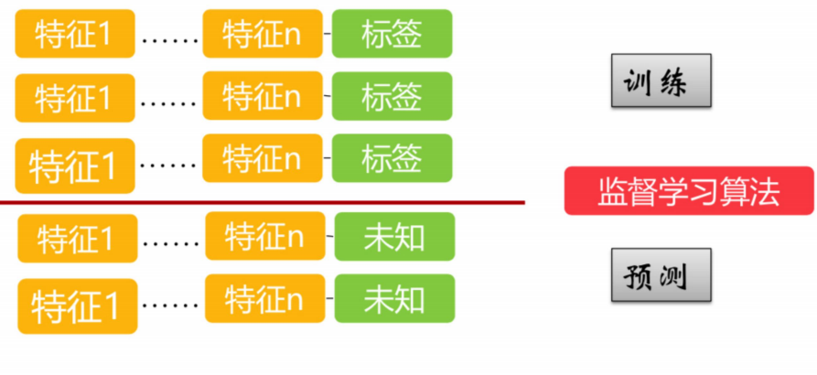
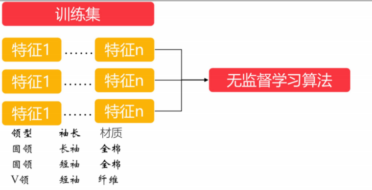

# 机器学习

## 1 机器学习体系介绍

### 1.1 机器学习与传统编程

- ##### 传统编程

在传统编程中，你需要对程序的行为进行硬编码。对于任何解决方案，第一个任务都是创建最合适的算法并编写代码。然后，必须设置输入参数，实际上，如果实现的算法是正确的，它将产生预期的结果。如下面流程图所示，在传统编程中，在对问题进行研究之后，对解决方案按照编写规则进行代码编写，之后对代码、算法进行评估。如果理想，正常运行从而产生预期的结果，如果不理想；分析错误重新对问题进行研究分析。


- ##### 机器学习

在机器学习中，你将大量内容留给机器去学习数据。机器学习的一个显著特征是不需要构建模型。这个复杂而有意义的任务是由机器学习算法执行的。如下图所示，与传统编程最大的区别在于机器学习把数据交给机器进行学习，而传统编程由程序员自己编写。


- ##### 升级机器学习

在我们进行机器学习时，数据是一般都会发生一些变化，比如说，产生一些新的数据，那我们就需要对数据进行一定的升级，然后对升级之后的数据重新进行训练。如果，我们按照之前的方法，需要的步骤就比较多，而且比较麻烦。我们可以对整个流程进行升级，让机器去适应这个流程，这样可以大大的减少我们工作。


- ##### 数据挖掘

应用机器学习技术来训练海量数据，可以帮助我们发 现那些此前并非立见端倪的模式，称为数据挖掘。


- ##### 传统编程与机器学习的区别
  - 解决方案需要规则列表超长问题，通过机器学习可以简化代码，提升执行表现 
  - 对于传统技术手段根本无法解决的复杂问题，通过机器学习可以找到方案 
  - 对于环境波动：机器学习系统可以适应新的数据 
  - 从复杂问题和海量数据中获得更多人类未曾意识到的关联性或者趋势

### 1.2 机器学习原理与学习方法

#### 1.2.1 机器学习原理

- 机器学习是指：让机器可以自主获得事物规律。要让机器可以 “学习”，必须将生活中的数据（包括但不限于图像、文字、语音）数值化，将不同事物的变化和关联转化为运算。
- 机器学习可以成立的原因是：概念和数值、关系和运算可以相互映射

- 机器学习三要素之数据、模型、算法
  - 数据：还未转换为机器可以识别的数据样本
  - 向量空间模型（VSM, Vector Space Model）：负责将格式（文字、图片、音频、视频）转化为一个个向量
  - 训练过程需要依据某种章法进行运算。这个章法，就是算法
  - 模型是机器学习的结果，而这个学习的过程称为训练(Train)


我们通过下面的例子来加深对机器学习原理的学习。


#### 1.2.2 学习方法

机器学习是一门多领域交叉学科，涉及概率论、统计学、逼近论、凸分析、算法复杂度理论等多门学科。


### 1.3 机器学习中的数学知识

下图是对知识掌握与前景发展的大体结构图。


#### 1.3.1 基础概念

- 微积分基础 
  - 泰勒公式 ：是一个用函数在某点的信息描述其附近取值的公式
  - 导数：导数是函数的局部性质。一个函数在某一点的导数描述了这个函数在这一点附近的变化率
  - 梯度：梯度的本意是一个向量（矢量），表示某一函数在该点处的方向导数沿着该方向取得最大值，即函数在该点处沿着该方向（此梯度的方向）变化最快，变化率最大（为该梯度的模）。
- 概率与统计基础 
  - 概率公式：概率，它是反映随机事件出现的可能性大小。
  - 常见分布：是指样本估计量的分布
  - 常见统计量：是统计理论中用来对数据进行分析、检验的变量
- 线性代数基础 
  - 矩阵乘法的几何意义：指的是一般矩阵乘积。一个m×n的矩阵就是m行n列的一个数阵。由于它把许多数据紧凑地集中到了一起，所以有时候可以简便地表示一些复杂的模型

#### 1.3.2 概率统计与机器学习的关系

- 统计本质是分布，机器学习训练出来的是模型，模型可能包含了很 多分布 
- 训练与预测过程的一个核心评价指标就是模型的误差 
- 误差本身就可以是概率的形式，与概率紧密相关
- 对误差的不同定义方式就演化成了不同损失函数的定义方式
- 机器学习是概率与统计和计算机编程的结合

#### 1.3.3 推荐书籍

- Christopher M. Bishop, Pattern Recognition and Machine Learning, Springer-Verlag, 2006 
- Kevin P. Murphy, Machine Learning:A Probabilistic Perspective, The MIT Press, 2012  
- 李航，统计学习方法，清华大学出版社，2012 
- 周志华， 机器学习，清华大学出版社，2016 
- Machine Learning，Andrew Ng，coursera 
- 机器学习基石/技术，林轩田，coursera

### 1.4 总结

- 机器学习模型本质就是一个函数，函数运算所有的特征，得到一个值 
- 数据挖掘基本等于机器学习，统计学是机器学习的子集，凹集，模式识别也是约等于数据挖掘，原始的模式识别更接近于匹配和规则，现在的机器学习更偏重于统计 
- 统计是取出一部分数据，得知分布情况，求全集的分布情况。统计是对全量 的一种关测，所以成本会很少，如果能用抽样解决的问题，尽量不要用机器 学习来做，机器学习成本比较高，一般用统计和概率弄一下就可以了 
- 数据挖掘建模之前需要对数据进行清洗处理 ，了解数据的关联性很重要， bat的数据挖掘组，需要在进入之前，在数据组轮值半年岗

## 2 机器学习分类

### 2.1 机器学习应用领域


- ##### 计算机视觉

　让机器像人一样看世界，看到图像，视频等媒体。会把图像进行识别，分类。

- ##### 语音识别

与机器进行语音交流，让机器明白你说什么

- ##### NLP自然语言处理

让机器像人一样理解语言，理解人写的文字等的含义。并作出一定的反应。

- ##### 统计-推荐系统

推荐系统主要解决信息过载的问题。它有两个目的：一是让用户找到感兴趣的物品；二是让物品出现在对它感兴趣的用户前。

- ##### 数据挖掘

数据挖掘主要是应用于大数据领域，利用机器学习的模型来挖掘数据中的潜在价值。发现数据之间的关系。

- ##### 模式识别

给机器各种特征描述，从而让机器对未知的事物进行判断

### 2.2 机器学习分类

机器学习分为四种，分别是监督学习、无监督学习、半监督学习和增强学习。使用比较多的的是监督学习与无监督学习。


在解决问题的时候，必须考虑下面两个问题：一、使用机器学习算法的目的，想要算法完成何种任务；二、需要分析或者收集的数据是什么。

首先考虑使用机器学习算法的目的。如果想要预测目标变量的值，则可以选择监督学习算法，否则可以选择无监督学习算法，确定选择监督学习算法之后，需要进一步确定目标变量类型，如果目标变量是离散型，则可以选择分类算法；如果目标变量是连续的数值，则需要选择回归算法。

如果不想预测目标变量的值，则可以选择无监督算法。进一步分析是否需要将数据划分为离散的组。如果这是唯一的需求，则使用聚类算法。

#### 2.2.1 监督学习

利用无标签的数据学习数据的分布或数据与数 据之间的关系被称作无监督学习，也就是说，通过过往的一些数据的特征以及最终结果来进行训练的方式就是监督学习法，监督学习算法的训练数据源需要由特征值以及目标队列两部分组成。

- ##### 训练

用来训练模型，估计参数


- ##### 预测

用来测试和评估训练出来的模型好坏，不能用于训练模型


- ##### 总结

监督学习是从标记的训练数据来推断一个功能的机器学习任务。然后使用预测数据对训练出来的模型进行验证。

监督学习依赖于每个样本，可以得到每个特征序列映射到的确切的目标值是什么，所以常用于回归以及分类场景。常见的监督学习算法有：K近邻、朴素贝叶斯、决策树、随机森林、逻辑回归、线性回归、支持向量机SVM等。

- ##### k-近邻算法

KNN法即K近邻法，它的思路非常简单：找到训练集样本空间中的K个距离预测样本x最近的点，统计K个距离最近的点的类别，找出个数最多的类别，将x归入该类别。

- KNN法有三个基本要素：K值的选择、距离度量及分类决策规则
  - Ｋ值选择：K太小，分类结果易受噪声点影响；K太大，近邻中又可能包含太多的其它类别的点。
  - 一般采用马氏距离或者欧式距离
  - 分类决策规则：加权投票法，加权投票法中的权重随着样本间距离增大而减小
- 优缺点
  - 优点：精度高、对异常值不敏感、无数据输入假定
  - 缺点：计算复杂度高、空间复杂度高
  - 使用数据范围：数值型和标称型

本案例使用最著名的”鸢尾“数据集，该数据集曾经被Fisher用在经典论文中，目前作为教科书般的数据样本预存在Scikit-learn的工具包中。

```Python
from sklearn.datasets import load_iris
from sklearn.cross_validation import train_test_split
from sklearn.preprocessing import StandardScaler
from sklearn.neighbors import KNeighborsClassifier
from sklearn.metrics import classification_report
from sklearn.model_selection import GridSearchCV

def knniris():
    """
    鸢尾花分类
    :return: None
    """
    # 数据集获取和分割
    lr = load_iris()

    x_train, x_test, y_train, y_test = train_test_split(lr.data, lr.target, test_size= 0.25)

    # 进行标准化
    std = StandardScaler()

    x_train = std.fit_transform(x_train)
    x_test = std.transform(x_test)

    # estimator流程
    knn = KNeighborsClassifier()

    # # 得出模型
    # knn.fit(x_train,y_train)
    #
    # # 进行预测或者得出精度
    # y_predict = knn.predict(x_test)
    #
    # # score = knn.score(x_test,y_test)

    # 通过网格搜索,n_neighbors为参数列表
    param = {"n_neighbors": [3, 5, 7]}

    gs = GridSearchCV(knn, param_grid= param, cv= 10)

    # 建立模型
    gs.fit(x_train,y_train)

    # print(gs)

    # 预测数据

    print(gs.score(x_test,y_test))

    # 分类模型的精确率和召回率

    # print("每个类别的精确率与召回率：",classification_report(y_test, y_predict,target_names=lr.target_names))

    return None

if __name__ == "__main__":
    knniris()
```

- ##### 朴素贝叶斯

朴素贝叶斯（Naive Bayes）是一个非常简单，但是实用性很强的分类模型。朴素贝叶斯分类器的构造基础是贝叶斯理论。朴素贝叶斯分类器的主要思路：通过联合概率P(x,y)=P(x|y)P(y)建模，运用贝叶斯定理求解后验概率P(y|x)；将后验概率最大者对应的的类别作为预测类别，因为后验概率最大化，可以使得期望风险最小化。

- 优点
  - 数学基础坚实，分类效率稳定，容易解释；
  - 所需估计的参数很少，对缺失数据不太敏感；
  - 无需复杂的迭代求解框架，适用于规模巨大的数据集。
- 缺点
  - 属性之间的独立性假设往往不成立可考虑用聚类算法先将相关性较大的属性进行聚类）
  - 需要知道先验概率，分类决策存在错误率。

```python
# 读取20类新闻文本的数据细节
from sklearn.datasets import fetch_20newsgroups
news = fetch_20newsgroups(subset= 'all')

# 20类新闻文本数据分割
from sklearn.cross_validation import train_test_split

X_train,X_test,y_train,y_test = train_test_split(news.data, news.target, test_size= 0.25,random_state= 42)

# 文本转换为特征向量进行TF特征抽取
from sklearn.feature_extraction.text import CountVectorizer

vec = CountVectorizer()
# 训练数据输入，并转换为特征向量
X_train = vec.fit_transform(X_train)
print(X_train)

# 测试数据转换
X_test = vec.transform(X_test)
print(X_test)


# 朴素贝叶斯分类器对文本数据进行类别预测
from sklearn.naive_bayes import MultinomialNB

# 使用平滑处理初始化的朴素贝叶斯模型
mnb = MultinomialNB(alpha=1.0)

# 利用训练数据对模型参数进行估计
mnb.fit(X_train,y_train)

# 对测试验本进行类别预测。结果存储在变量y_predict中
y_predict = mnb.predict(X_test)

print(y_predict)
```

- ##### 决策树

决策树（decision tree）归纳是经典的分类算法。它采用自顶向下递归的方式构造决策树。可以从生成的决策树中提取规则。通常决策树学习包括三个步骤：决策树的生成和决策树的修剪。决策树的优缺点

- 优点：
  - 计算复杂度不高，易于理解和解释；
  - 数据预处理阶段比较简单，且可以处理缺失数据；
  - 能够同时处理数据型和分类型属性，且可对有许多属性的数据集构造决策树，其他技术往往需要数据属性的单一；
  - 是一个白盒模型，若给定一个观察模型，则根据所产生的决策树很容易推断出相应的逻辑表达式；
  - 在相对短的时间内能够对大数据集合做出可行且效果良好的分类结果。

- 缺点：
  - 对于各类别样本数量不一致数据，信息增益偏向于那些具有更多数值的特征。因此建议用平衡的数据训练决策树；
  - 决策树的结果可能是不稳定的，因为在数据中一个很小的变化可能导致生成一个完全不同的树，这个问题可以通过使用集成决策树来解决；
  - 实际决策树学习算法是基于启发式算法，如贪婪算法，寻求在每个节点上的局部最优决策。这样的算法不能保证返回全局最优决策树；
  - 忽略属性之间的相关性；
  - 易于过拟合；

```Python
import pandas as pd
import sklearn
from sklearn.cross_validation import train_test_split
from sklearn.feature_extraction import DictVectorizer
from sklearn.tree import DecisionTreeClassifier
from sklearn.metrics import classification_report
from sklearn.ensemble import RandomForestClassifier, GradientBoostingClassifier


titanic = pd.read_csv('http://biostat.mc.vanderbilt.edu/wiki/pub/Main/DataSets/titanic.txt')

#选取一些特征作为我们划分的依据
x = titanic[['pclass', 'age', 'sex']]
y = titanic['survived']

# 填充缺失值
x['age'].fillna(x['age'].mean(), inplace= True)

# 分割数据集
x_train, x_test, y_train, y_test = train_test_split(x, y, test_size= 0.25)

dt = DictVectorizer(sparse= False)

print(x_train.to_dict(orient= "record"))

# 按行，样本名字为键，列名也为键，[{"1":1,"2":2,"3":3}]
x_train = dt.fit_transform(x_train.to_dict(orient= "record"))

x_test = dt.fit_transform(x_test.to_dict(orient= "record"))

# 使用决策树
dtc = DecisionTreeClassifier()

dtc.fit(x_train, y_train)

dt_predict = dtc.predict(x_test)

print(dtc.score(x_test, y_test))

print(classification_report(y_test, dt_predict, target_names= ["died", "survived"]))
```

- ##### 随机森林

随机森林是一个包含多个决策树的分类器，并且其输出的类别是由个别树输出的类别的众数而定。个标准的决策树会根据每维特征对预测结果的影响程度进行排序，进而决定不同的特征从上至下构建分裂节点的顺序，如此以来，所有在随机森林中的决策树都会受这一策略影响而构建的完全一致，从而丧失的多样性。所以在随机森林分类器的构建过程中，每一棵决策树都会放弃这一固定的排序算法，转而随机选取特征。

根据下列算法而建造每棵树：

- 用N来表示训练用例（样本）的个数，M表示特征数目。
- 输入特征数目m，用于确定决策树上一个节点的决策结果；其中m应远小于M。
- 从N个训练用例（样本）中以有放回抽样的方式，取样N次，形成一个训练集（即bootstrap取样），并用未抽到的用例（样本）作预测，评估其误差。
- 对于每一个节点，随机选择m个特征，决策树上每个节点的决定都是基于这些特征确定的。根据这m个特征，计算其最佳的分裂方式。

```python
import pandas as pd
import sklearn
from sklearn.cross_validation import train_test_split
from sklearn.feature_extraction import DictVectorizer
from sklearn.tree import DecisionTreeClassifier
from sklearn.metrics import classification_report
from sklearn.ensemble import RandomForestClassifier, GradientBoostingClassifier


titanic = pd.read_csv('http://biostat.mc.vanderbilt.edu/wiki/pub/Main/DataSets/titanic.txt')

# 选取一些特征作为我们划分的依据
x = titanic[['pclass', 'age', 'sex']]
y = titanic['survived']

# 填充缺失值
x['age'].fillna(x['age'].mean(), inplace= True)
x_train, x_test, y_train, y_test = train_test_split(x, y, test_size= 0.25)
dt = DictVectorizer(sparse= False)
print(x_train.to_dict(orient= "record"))

# 按行，样本名字为键，列名也为键，[{"1": 1, "2": 2, "3": 3}]
x_train = dt.fit_transform(x_train.to_dict(orient= "record"))
x_test = dt.fit_transform(x_test.to_dict(orient= "record"))


# 使用随机森林
rfc = RandomForestClassifier()
rfc.fit(x_train, y_train)
rfc_y_predict = rfc.predict(x_test)
print(rfc.score(x_test, y_test))
print(classification_report(y_test, rfc_y_predict, target_names= ["died", "survived"]))
```

- ##### 逻辑回归

逻辑回归（Logistic Regression），简称LR。它的特点是能够使我们的特征输入集合转化为0和1这两类的概率。一般来说，回归不用在分类问题上，因为回归是连续型模型，而且受噪声影响比较大。如果非要应用进入，可以使用逻辑回归。了解过线性回归之后再来看逻辑回归可以更好的理解。原始数据的下载地址为：https://archive.ics.uci.edu/ml/machine-learning-databases/breast-cancer-wisconsin/

- Logistic回归优点：
  - 实现简单；
  - 分类时计算量非常小，速度很快，存储资源低；

- 缺点：
  - 容易欠拟合，一般准确度不太高
  - 只能处理两分类问题（在此基础上衍生出来的softmax可以用于多分类），且必须线性可分；

```python
import numpy as np
import pandas as pd
from sklearn.metrics import  roc_auc_score
from sklearn.preprocessing import StandardScaler  # 标准化
from sklearn.linear_model import LogisticRegression # 逻辑回归
from sklearn.metrics import  classification_report # 召回率
from sklearn.model_selection import train_test_split  # 训练集 测试集 拆分

# 加载数据
data = pd.read_csv('data/breast-cancer-wisconsin.data', header= None)

# 列名称
columns = ['Sample code number', 'Clump Thickness', 'Uniformity of Cell 			Size', 'Uniformity of Cell Shape', 'Marginal Adhesion', 				'SingleEpithelial Cell Size', 'Bare Nuclei', 'Bland 					Chromatin', 'Normal Nucleoli', 'Mitoses', 'Class']

data.columns = columns

print(data)

# 缺失值处理
data.replace('?',np.nan, inplace= True)

# 检测缺失值
res_null = data.isnull().sum()

# 删除缺失值
data.dropna(axis= 0, how= 'any', inplace= True)

# 进行筛选数据集 --- 去除编号的第一列
data = data.iloc[:,1:]

# 获取特征值
feature = data.iloc[:,:-1].values
target = data.iloc[:,-1].values

# 拆分数据
x_train, x_test, y_train, y_test = train_test_split(feature, target, test_size= 0.3, random_state= 1)


# 特征值需要标准化，目标值不需要标准化
stand = StandardScaler()

# 训练集的特征值
x_train = stand.fit_transform(x_train)


# 测试集的特征值
x_test = stand.fit_transform(x_test)

# 利用逻辑回归进行分类
lr = LogisticRegression() # 参考sgd下降优化
# 训练数据
lr.fit(x_train, y_train)

# 进行预测数据
y_predict = lr.predict(x_test)

# 准确率
score = lr.score(x_test, y_test)

# 获取权重与偏置
weight = lr.coef_
bias = lr.intercept_

# 计算召回率
# 召回率越高越好--查的全
# f1-score -越高越好---体现模型越稳健
res_report = classification_report(y_test, y_predict, labels= [2, 4], target_names= ["良性", "恶性"])

print(res_report)

# 如果 y_test>3设置为1，否则为0
y_test = np.where(y_test > 3, 1, 0)
print(y_test)

# 计算AUC指标 ---针对的样本不平衡的状态
auc = roc_auc_score(y_test, y_predict)
print(auc)
```

- ##### 线性回归

线性回归，是利用数理统计中回归分析，来确定两种或两种以上变量间相互依赖的定量关系的一种统计分析方法，运用十分广泛。

线性模型中的向量W值，客观的表达了各属性在预测中的重要性，因此线性模型有很好的解释性。对于这种“多特征预测”也就是（多元线性回归），那么线性回归就是在这个基础上得到这些W的值，然后以这些值来建立模型，预测测试数据。简单的来说就是学得一个线性模型以尽可能准确的预测实值输出标记。

- 优点：

　　实现简单，计算简单；

- 缺点：

　　不能拟合非线性数据；

```python
import numpy
import pandas
from matplotlib import pyplot
from sklearn.datasets import load_boston  # 数据
from sklearn.preprocessing import StandardScaler  # 标准化
from  sklearn.linear_model import LinearRegression # 正规方程求解的线性回归
from sklearn.model_selection import train_test_split # 训练集 特征值拆分


def show_res(y_text,y_predict):
    '''
    结果展示
    :param y_text: 测试集目标值真实值
    :param y_predict: 预测值
    :return:
    '''

    # 画布
    pyplot.figure()

    # 默认不支持中文，需要配置RC 参数
    pyplot.rcParams['font.sans-serif'] = 'SimHei'
    # 设置字体之后不支持负号，需要去设置RC参数更改编码
    pyplot.rcParams['axes.unicode_minus'] = False


    # 绘图
    # 折线图
    x = numpy.arange(0,len(y_predict))

    pyplot.plot(x,y_test,marker='*')
    pyplot.plot(x,y_predict,marker='.' )


    # 增加标题
    pyplot.title('房价预测与真实值的走势')

    # 增加横轴，纵轴名称
    pyplot.xlabel('x')
    pyplot.ylabel('房价')

    # 图例
    pyplot.legend(['真实值','预测值'])

    # 展示
    pyplot.show()


# 加载数据
data = load_boston()

# 获取特征值
feature = data['data']  # 特征值

target = data['target'] #目标值

feature_names = data['feature_names']  # 特征值的列名

print(feature)
print(target)
print(feature_names)
print('*='*40)


# 返回值---先特征值(先训练集，再测试集)，再目标值（先训练集，再测试集）
x_train,x_test,y_train,y_test = train_test_split(feature,target,test_size=0.3)


# 进行标准化---目标值是具体的房价，特征值是各个特征，--量级减小--W量级变大
# 目标值不需要标准化--特征值需要标准化
stand = StandardScaler()
# 先计算均值与标准差，在进行转化
x_train  = stand.fit_transform(x_train)
x_test  = stand.fit_transform(x_test)


# # 正规方程进行求解的线性回归---特征不是特别多，数据不是特别复杂的情况
# 进行构建模型---线性模型
lr = LinearRegression()

# 训练数据
lr.fit(x_train,y_train)

# 预测数据
y_predict = lr.predict(x_test)

# 计算准确率
score = lr.score(x_test,y_test)

# 获取权重和偏执
weight = lr.coef_
bias = lr.intercept_

# 绘图展示
show_res(y_test,y_predict)
```

- ##### 支持向量机SVM

支持向量机把分类问题转化为寻找分类平面的问题，并通过最大化分类边界点距离分类平面的距离来实现分类。故SVM法亦被称为最大边缘(maximum margin)算法。

SVM的主要思想可以概括为两点（源自百度百科）：

- 它是针对线性可分情况进行分析，对于线性不可分的情况，通过使用非线性映射算法将低维输入空间线性不可分的样本转化为高维特征空间使其线性可分，从而使得高维特征空间采用线性算法对样本的非线性特征进行线性分析成为可能。

- 它基于结构风险最小化理论之上在特征空间中构建最优超平面，使得学习器得到全局最优解，并且在整个样本空间的期望以某个概率满足一定上界。

- 优点
  - 适合小样本情况下的机器学习问题；
  - 可以提高泛化性能；
  - 可以解决高维问题；
  - 可以解决非线性问题；
  - 可以避免神经网络结构选择和局部极小点问题。

- 缺点
  - 对缺失数据敏感；
  - 对非线性问题没有通用解决方案，必须谨慎选择Kernel function来处理；
  - 计算复杂度高。主流的算法是O(n^2)的，大规模数据计算耗

```python
from sklearn import svm
import numpy as np
import matplotlib.pyplot as plt
import matplotlib
import sklearn
from sklearn.model_selection import train_test_split


# 1.读取数据集
from sklearn.datasets import load_iris
data = load_iris()


#data = np.loadtxt(path, dtype=float, delimiter=',', converters={4: Iris_label})
# converters={4:Iris_label}中“4”指的是第5列：将第5列的str转化为label(number)
# print(data.shape)

# 2.划分数据与标签
x = data.data
y = data.target# x为数据，y为标签
print(y.shape)

x = x[:, 0:2]
train_data, test_data, train_label, test_label = train_test_split(x, y, random_state=1, train_size=0.6,
                                                                  test_size=0.4)  # sklearn.model_selection.
# print(train_data.shape)

# 3.训练svm分类器
classifier = svm.SVC(C=2, kernel='rbf', gamma=10, decision_function_shape='ovo')  # ovr:一对多策略
classifier.fit(train_data, train_label.ravel())  # ravel函数在降维时默认是行序优先

# 4.计算svc分类器的准确率
print("训练集：", classifier.score(train_data, train_label))
print("测试集：", classifier.score(test_data, test_label))

# 也可直接调用accuracy_score方法计算准确率
from sklearn.metrics import accuracy_score

tra_label = classifier.predict(train_data)  # 训练集的预测标签
tes_label = classifier.predict(test_data)  # 测试集的预测标签
print("训练集：", accuracy_score(train_label, tra_label))
print("测试集：", accuracy_score(test_label, tes_label))

# 查看决策函数
print('train_decision_function:\n', classifier.decision_function(train_data))  # (90,3)
print('predict_result:\n', classifier.predict(train_data))
```

#### 2.2.2 无监督学习

训练样本不依赖于打标数据的机器学习算法，它主要是用来解决一些聚类场景的问题。相较于监督学习，无监督学习的一大好处就是不依赖于打标数据。

- ##### 训练

非监督学习没有训练集，只有一组数据，直接训练改组数据，在该组数据集内寻找规律。



- ##### 预测

通过训练出来的工具，来测试数据，等到结果。


- ##### 总结

模型学习的数据没有标签，因此无监督学习的目标是通过对这些无标签样本的学习来揭示数据的内在特性及规律，


无监督学习，顾名思义，就是不受监督的学习，一种自由的学习方式。该学习方式不需要先验知识进行指导，而是不断地自我认知，自我巩固，最后进行自我归纳，在机器学习中，无监督学习可以被简单理解为不为训练集提供对应的类别标识

在有监督学习中，我们把对样本进行分类的过程称之为分类（Classification），而在无监督学习中，我们将物体被划分到不同集合的过程称之为聚类（Clustering）

- 聚类算法 
  - k-平均算法k-Means 
  - 分层聚类算法HCA 
  - 最大期望算法 

- 可视化和降维 
  - 主成分分析PCA 
  - 局部线性嵌入LLE 
  - t-分布随机近临嵌入t-SNE 

- 关联规则学习 
  - Apriori 
  - Eclat

- ##### k-Means

K-means通常被称为劳埃德算法，这在数据聚类中是最经典的，也是相对容易理解的模型。算法执行的过程分为4个阶段。

- 首先，随机设K个特征空间内的点作为初始的聚类中心。
- 然后，对于根据每个数据的特征向量，从K个聚类中心中寻找距离最近的一个，并且把该数据标记为这个聚类中心。
- 接着，在所有的数据都被标记过聚类中心之后，根据这些数据新分配的类簇，通过取分配给每个先前质心的所有样本的平均值来创建新的质心重,新对K个聚类中心做计算。
- 最后，计算旧和新质心之间的差异,如果所有的数据点从属的聚类中心与上一次的分配的类簇没有变化，那么迭代就可以停止，否则回到步骤2继续循环。

K均值等于具有小的全对称协方差矩阵的期望最大化算法

- ##### 分层聚类算法HCA 

层次聚类是聚类算法的一种，通过计算不同类别数据点间的相似度来创建一棵有层次的嵌套聚类树。在聚类树中，不同类别的原始数据点是树的最低层，树的顶层是一个聚类的根节点。创建聚类树有自下而上合并和自上而下分裂两种方法。

- ##### 最大期望算法 

EM算法(最大期望算法) 是在依赖于无法观测的隐藏变量的概率模型中，寻找参数最大似然估计或者最大后验估计的算法。EM的求解思路。

- 我们先根据经验为每个类别（即隐藏变量）赋予一个初始分布，这相当于是假定了分布参数。然后根据分布的参数可以求取每个数据元组的隐藏变量的期望（相当于实施了归类操作）

- 再根据归类结果计算分布参数（向量）的最大似然值，然后根据这个最大似然值在反过来重新计算每个元组的隐藏变量的期望。这样循环往复，最终如果隐藏变量的期望与参数的最大似然值趋于稳定了，EM算法就算是执行完毕了。

- ##### 主成分分析PCA 

PCA即主成分分析，是图像处理中经常用到的降维方法，PCA的主要思想是将n维特征映射到k维上，这k维是全新的正交特征也被称为主成分，是在原有n维特征的基础上重新构造出来的k维特征。PCA有两种通俗易懂的解释：(1)最大方差理论；(2)最小化降维造成的损失。

- ##### 局部线性嵌入LLE 

LLE属于流形学习的一种。因此我们首先看看什么是流形学习。流形学习是一大类基于流形的框架。数学意义上的流形比较抽象，不过我们可以认为LLE中的流形是一个不闭合的曲面。这个流形曲面有数据分布比较均匀，且比较稠密的特征，有点像流水的味道。基于流行的降维算法就是将流形从高维到低维的降维过程，在降维的过程中我们希望流形在高维的一些特征可以得到保留。

LLE是广泛使用的图形图像降维方法，它实现简单，但是对数据的流形分布特征有严格的要求。比如不能是闭合流形，不能是稀疏的数据集，不能是分布不均匀的数据集等等，这限制了它的应用。下面总结下LLE算法的优缺点。

- 优点
  - 可以学习任意维的局部线性的低维流形
  - 算法归结为稀疏矩阵特征分解，计算复杂度相对较小，实现容易。

- 缺点
  - 算法所学习的流形只能是不闭合的，且样本集是稠密均匀的。
  - 算法对最近邻样本数的选择敏感，不同的最近邻数对最后的降维结果有很大影响。

- ##### t-分布随机近临嵌入t-SNE 

T – 分布随机近邻嵌入(t – SNE)是一种用于降维的机器学习方法，它能帮我们识别相关联的模式。t – SNE 主要的优势就是保持局部结构的能力。这意味着高维数据空间中距离相近的点投影到低维中仍然相近。t-SNE 能生成漂亮的可视化。

- 特点
  
- t – SNE 在低维空间下使用更重长尾分布的 t 分布来避免 crowding 问题和优化问题。
  
- 优点
  - 对于不相似的点，用一个较小的距离会产生较大的梯度来让这些点排斥开来。
  - 这种排斥又不会无限大 (梯度中分母)，避免不相似的点距离太远。

- 缺点
  - t-SNE 没有唯一最优解，且没有预估部分。
  - 训练太慢。

- ##### Apriori  与 Eclat

Apriori算法是常用于挖掘出数据关联规则的算法，Eclat 垂直数据格式有效挖掘频繁项集，主要用于数据挖掘，将在下一章“海量数据处理与挖掘”中进行详解。

#### 2.2.3 监督与无监督总结

- 分类比回归要应用广 
- 监督学习用的比较多，无监督一般属于辅助性的 
- 深度学习可以做监督无监督强化，如果对精度要求不高的话，没必要用到深度学习 
- sklearn 实现了所有算法，sklean也可以并行化，但是在海量数据情况下，需要分布式，就 不太好用了 
- 用机器学习来解决，关键还是你抽象问题的能力，把现实中的业务抽象成机器学习模型 
- 考虑机器学习处理问题：问题是分类还是回归，是监督还是无监督，数据量够不够，如何挑 选特征，解决实际问题越简单越好，能用规则先用规则，if else 加上判断 放上一些权重，然 后能用统计的先用统计来做，如果对精度和实时性要求比较高，就要上算法，精度要求越 高，算法就越复杂，对实时性要求高，算法会尽量简单，执行会并行化

以上是两种常见的机器学习方式，监督与无监督的所有内容，下面简单的介绍一下，其他两种不常用的机器学习方式，半监督与强化学习(了解即可)。

#### 2.2.4 强化学习

是一种比较复杂的机器学习种类， 强调的是系统与外界不断地交互，获得外界的反馈，然后决定自身的行为。强化学习主要是针对流程中不断需要推理的场景，比如:隐马尔可夫。在这种学习模式下，输入数据作为对模型的反馈，不像监督模型那样，输入数据仅仅是作为一个检查模型对错的方式，在强化学习下，输入数据直接反馈到模型，模型必须对此立刻作出调整。常见的应用场景包括动态系统以及机器人控制等。

#### 2.2.5 半监督学习

通过对样本的部分打标来进行机器学习算法的使用，很多半监督学习算法都是监督学习算法的变形。半监督学习解决的是一些打标数据比较难获得的分类场景，比如：标签传播。在此学习方式下，输入数据部分被标识，部分没有被标识，这种学习模型可以用来进行预测，但是模型首先需要学习数据的内在结构以便合理的组织数据来进行预测。应用场景包括分类和回归，算法包括一些对常用监督式学习算法的延伸，这些算法首先试图对未标识数据进行建模，在此基础上再对标识的数据进行预测。

### 2.3 机器学习分类总结

在企业数据应用的场景下， 人们最常用的可能就是监督式学习和非监督式学习的模型。 在图像识别等领域，由于存在大量的非标识的数据和少量的可标识数据， 目前半监督式学习是一个很热的话题。 而强化学习更多的应用在机器人控制及其他需要进行系统控制的领域。

## 3 机器学习关键问题

### 3.1 训练数据不足 

- 复杂问题而言，数据比算法更重要 

- 获得额外数据成本并不低廉 

- 中小型数据很普遍 

- 需要算法优化

“数据决定了机器学习的上限，而算法只是尽可能逼近这个上限”，这句话很好的阐述了数据在机器学习中的重要性。机器学习算法需要大量的数据来完成任务。即使是简单的任务，也需要大量的样本，对于复杂的问题，数据要比算法重要得多，但是通常数据集都是小型的，或者中等大小的数据集，获取额外的数据并不便宜，也不简单，如果我们无法在增加数据，就需要对我们的算法进行优化。

#### 3.2 数据不具代表性 

- 样本集太小，非代表性数据被选中，出现采样噪声 

- 样本集太大，如果采样方式欠妥，会造成采样偏差

为了使得模型泛化足够好，训练数据要包含泛化到新数据的特征。如果用的训练集表征性不够，那么训练得到的模型就不太可能得到精确的预测值。但这个要求其实很高。一方面，如果数据样本太小，则很容易受样本噪音的影响；另一方面，即使是样本数量足够大，如果采样方法不够好，也得不到具有表征性的样本数据。这个问题被称作采样偏差。简言之，在训练时看到的数据要能够代表数据背后的模式。

#### 3.3 处理质量差的数据 

- 质量差：训练集中错误，异常值，噪声多 

- 处理：
  - 忽略缺少的特征 
  - 忽略特征有部分缺失的样本 
  - 补充缺少的特征

这个比较明显，如果你的训练数据充满了错误，异常以及噪音，那你的模型很难习得数据背后的模式，你的模型也就不可能表现得好。花费时间和精力来清洗训练数据是十分必要，且重要的。

#### 3.4 无关特征 

- 训练数据中包含足够多的相关特征，以及较少的无关特征 

- 处理：
  - 从现有特征中选择最有用的特征进行训练，叫特征选择 
  - 将现有特征进行整合，产生更有用的特征，叫特征提取

在进行特征选择中，我们需要提出一些对数据没有影响的特征，将有用的特征进行选择，将已经选好的特征进行整合，提取更有用的特征。以此来降低维度。

#### 3.5 过拟合 

- 模型在训练集上表现良好，泛化到测试集中不尽人意
- 模型相对于训练数据的数量和噪声数量都过于复杂
  - 简化模型,较少参数模型，减少训练集属性数量
  - 收集很多训练数据
  - 减少训练数据中的噪声(修复错误和消除异常值)
  - 通过约束模型使其简单，,过程叫正则化，在完美匹配数据和保持模型简单之间找到合适的平衡点

过拟合问题，根本的原因则是特征维度过多，导致拟合的函数完美的经过训练集，但是对新数据的预测结果则较差。增加模型的复杂度，不要用简单的线性回归，适当的采用二次回归，将训练集合扩大，采集更多的数据。

#### 3.6 欠拟合

- 模型在训练集上表现不好，泛化到测试集中表现稍好
- 你的模型过于简单
  - 选择一个带有更多参数，更强大的模型
  - 给学习算法提供更好的特征集
  - 减少模型中的约束

欠拟合问题，根本的原因是特征维度过少，导致拟合的函数无法满足训练集，误差较大。欠拟合问题可以通过增加特征维度来解决。

## 4 分类训练

### 4.1 数据下载

#### 4.1.1 MNIST数据集

MNIST手写体数字数据库有一个包含60,000个示例的训练集和一个包含10,000个示例的测试集。它是NIST提供的更大集合的子集。数字的大小已标准化并集中在固定大小的图像中。[数据集下载](http://yann.lecun.com/exdb/mnist/)


#### 4.1.2 拆包

- ##### socket
  - http ：它是超文本传输协议，对应于应用层，它主要强调的是对数据的封装。它是所谓的“短链接”，一般都是客服端发送请求 到服务器 服务给了客户端应答过后即断开链接，我们平时做的项目中 只要不是客户端和服务器保持长期的链接的情况下 基本都用的是http
  - socket ：它是我们所谓的“长链接”，它是一个套接字 实际上我觉得它是支持传输协议的的一个基本的单元，它支持tcp/ip 协议 也支持udp协议

- ##### 打包

```
import struct
struct.pack('>i',2) # 将2打包
```

- ##### 解包

```python
import struct
with open('./MNIST_data/train-images-idx3-ubyte', 'rb') as f:
    buffer = f.read(4*4) # 4个int
    # 解析出4个int类型
    head = struct.unpack('>iiii',buffer)
    print(head)
    # 读取图片的像素
    length = head[1] * head[2]  * head[3]
    print(length)
    buffer = f.read(length)
	# 解压像素包
    data = struct.unpack('>{}B'.format(length),buffer)
```


## 5 性能考核


## 6 多类别分类器


## 7 垃圾邮件分类


