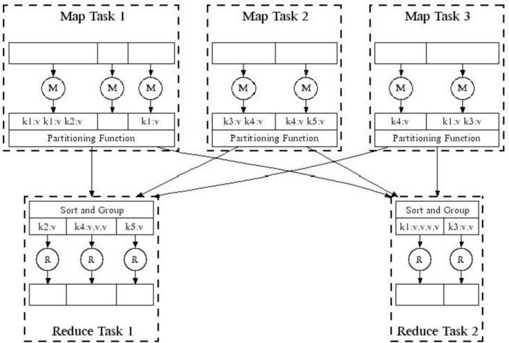
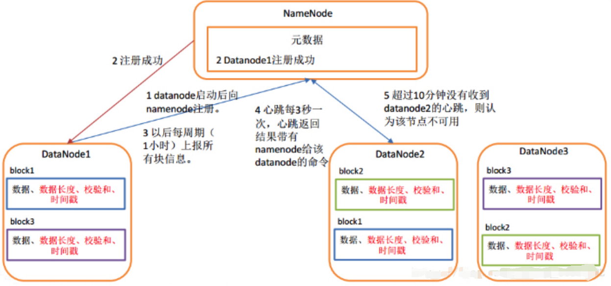
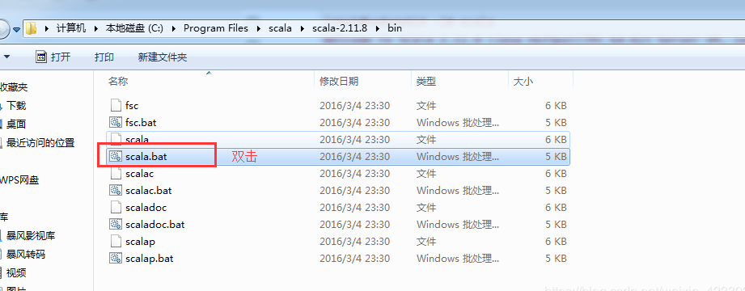
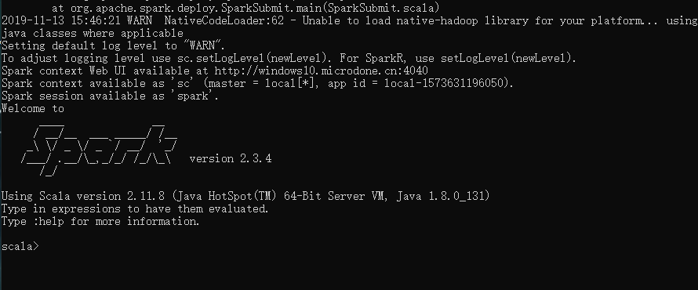

# 海量数据处理与挖掘

## 1  Hadoop海量数据实现原理

### 1.1 单点结构

单点结构：也就是一台计算机，对于大数据，高并发来讲，我们所用的计算机的性能是远远不够的。而且单台及计算机对于我们数据来讲也是十分不安全的，当我们计算机发生损坏时，我们的数据就全都没有了，在我们做一些练习时可以使用，在真正的业务中是无法使用的。


###  1.2 集群架构以及面临的问题

#### 1.2.1 集群架构

集群技术是一种较新的技术，通过集群技术，可以在付出较低成本的情况下获得在性能、可靠性、灵活性方面的相对较高的收益，其任务调度则是集群系统中的核心技术。

集群是一组相互独立的、通过高速网络互联的计算机，它们构成了一个组，并以单一系统的模式加以管理。一个客户与集群相互作用时，集群像是一个独立的服务器。集群配置是用于提高可用性和可缩放性。

- 高性能

- 降低成本

- 提高可扩展性

- 增强可靠性

- 每一个rack（机架服务器）包含16到64个Linux节点
- 2011年据统计Google约有100万台机器


#### 1.2.2 面临问题

- 节点故障
  - 1000台服务器的集群=》平均故障率 1次/天
  - 100万台服务器的集群=》平均故障率1000次/天

- 如何保持数据的持续性
  - 某些节点故障的情形下不影响数据的使用
  - 长时间集群的运算，如何应对节点的故障
  - 所拥有的所有资源将故障转移到服务器群集中的其他节点

- 网络带宽瓶颈
  - 网络带宽 = 1 Gbps
  - 移动10TB数据需要花费将近一天

- 分布式编程非常复杂
  - 需要一个简单的模型能够隐去所有的复杂性

###  1.3 Hadoop集群架构

#### 1.3.1 Hadoop简介

Hadoop是一个分布式系统基础架构，一套行业大数据标准开源软件，在分布式环境下提供了海量数据的存储和计算。运行于一般的商用服务器上，具有高容错、高可靠性、高扩展性等特点，特别适合写一次，读多次的场景。

- ##### 架构核心

其框架最核心的设计是HDFS、Map Reduce和YARN。


- HDFS: 分布式文件存储
- YARN:分布式资源管理
- Map Reduce: 分布式计算
- Others: 利用YARN的资源管理功能实现其他的数据处理方式

#### 1.3.2 Hadoop 分布式集群

- hadoop是依据Map Reduce的原理，用Java语言实现的分布式处理机制
- Hadoop是一个能够对大量数据进行分布式处理的软件框架，实现了Google的MapReduce编程模型和框架，能够把应用程序分割成许多的小的工作单元，并把这些单元放到任何集群节点上执行
- Map Reduce是Hadoop中的一个数据运算核心模块
- Map Reduce是一种模式，一种云计算的核心计算模式，一种分布式运算技术，也是简化的分布式编程模式，它主要用于解决问题的程序开发模型，也是开发人员拆解问题的方法。

#### 1.3.3 Map Reduce集群运算问题的解决方案

- 在多节点上冗余地存储数据，以保证数据的持续性
- 将计算移向数据端，以最大程度减少数据移动
- 简单的程序模型，隐藏所有的复杂度

###  1.4 冗余化数据存储

数据冗余是指数据之间的重复，也可以说是同一数据存储在不同数据文件中的现象。可以说增加数据的独立性和减少数据冗余是企业范围信息资源管理和大规模信息系统获得成功的前提条件。

- 分布式文件存储系统
  - 提供全局的文件命名空间，冗余度和可获取性
  - 例如Google的GFS，hadoop的HDFS

- 典型的应用场景与模式
  - 超大级别的数据量（100GB到100TB级别）
  - 数据很少被全部替换
  - 最常见的操作为读取和追加数据

###  1.5 分布式文件系统

分布式文件系统是指文件系统管理的物理存储资源不一定直接连接在本地节点上，而是通过计算机网络与节点【可简单的理解为一台计算机】相连。分布式文件系统的设计基于客户机/服务器模式。一个典型的网络可能包括多个供多用户访问的服务器。另外，对等特性允许一些系统扮演客户机和服务器的双重角色。

- 数据以‘块状’形式在多台机器上存储
- 每个数据块都会重复地在多台机器上存储
- 保证数据的持续性和随时可取性

- 服务器块同时也用作计算服务器
- 把运算挪向数据处


- 服务器块
  - 文件被分作16-64MB大小的连续块
  - 每个文件块会被重复的存储2到3次
  - 尽量保证重复的数据块在不同的机架上

- 主节点
  - Hadoop的HDFS里叫做Name节点
  - 存储元数据记录文件存储结构和地址
  - 最常见的操作为读取和追加数据

- 文件访问的客户端库
  - 询问主节点以获取块服务器地址
  - 直接连接相应服务器块获取数据

## 2 Map Reduce

### 2.1 Map Reduce 简介

 Map Reduce 借鉴了函数式程序设计语言的设计思想，其软件实现是指定一个Map 函数，把键值对(key/value)映射成新的键值对(key/value)，形成一系列中间结果形式key/value 对，然后把它们传给Reduce(规约)函数，把具有相同中间形式key 的value 合并在一起。Map 和Reduce 函数具有一定的关联性。

 Map Reduce致力于解决大规模数据处理的问题，分布式处理策略，计算模型，对海量数据处理。

Map Reduce技术特征总结：

- 自动并行化：系统自动进行作业并行化处理；

- 自动可靠处理：系统自动处理节点/任务的故障检测和恢复；

- 灵活扩展：节点可以灵活加入和退出，系统自动感知节点状态并进行处理；

- 高性能：计算任务将被调度至数据所在的节点，减少网络开销，提升执行性能。

Map Reduce 应用场景：

- 从web服务器日志中找出高频热门url
- 搜索词统计
- 区分垃圾邮件和短信
- 舆情分析（正负面评论）

### 2.2 Map Reduce 工作流程

- Map
  - 逐个文件逐行扫描
  - 扫描的同时抽取出我们感兴趣的内容（Keys）
- Group by key
  - 排序和洗牌
- Reduce
  - 聚合，总结，过滤或转换
  - 写入结果


- 文件准备

- Map过程：接受一个键值对，产生一组键值对，比如（Deer，1），代表Deer为键，1为值，代表Deer单词的数量

- 派发过程：Shuffle将键值对派发给Reduce

- Reduce过程：将相同键的值累加（计算靠近的数据）

- 输出计算结果

Map Reduce主要是先读取文件数据，然后进行Map处理，接着Reduce处理，最后把处理结果写到文件中。Map和Reduce函数要根据具体问题具体实现。

Map Reduce集群由普通PC机构成，为无共享式架构。在处理之前，将数据集分布至各个节点。处理时，每个节点就近读取本地存储的数据处理（map），将处理后的数据进行合并（combine）、排序（shuffle and  sort）后再分发（至reduce节点），避免了大量数据的传输，提高了处理效率。无共享式架构的另一个好处是配合复制（replication）策略，集群可以具有良好的容错性，一部分节点的down机对集群的正常工作不会造成影响。

### 2.3 Map步骤

- 每个输入分片会让一个map任务来处理，默认情况下，以HDFS的一个块的大小（默认为64M，可设置）为一个分片。map输出的结果会暂时放在一个环形内存缓冲区中（该缓冲区的大小默认为100M）。当该缓冲区快要溢出时，会在本地文件系统中创建一个溢出文件，将该缓冲区中的数据写入这个文件。

- 在写入磁盘之前，线程首先根据reduce任务的数目将数据划分为相同数目的分区，也就是一个reduce任务对应一个分区的数据。这样做是为了避免有些reduce任务分配到大量数据，而有些reduce任务却分到很少数据，甚至没有分到数据的尴尬局面。然后对每个分区中的数据进行排序，将排序后的结果进行合并操作，这样做可以有效减少磁盘IO和网络IO。

- 当map任务输出最后一个记录时，可能会有很多的溢出文件，这时需要将这些文件合并。合并的过程中会不断地进行排序和合并操作，这样做是为了尽量减少每次写入磁盘的数据量和尽量减少下一复制阶段网络传输的数据量。最后合并成了一个已分区且已排序的文件。为了减少网络传输的数据量，这里可以将数据压缩。

- 将分区中的数据拷贝给相对应的reduce任务。那么分区中的数据如何知道它对应的reduce是哪个呢？ 程序保存了整个作业的宏观信息，只要reduce任务向程序获取对应的map输出位置就可以了。


### 2.4 Reduce 步骤

- Reduce会接收到不同map任务传来的数据，并且每个map传来的数据都是有序的。如果reduce接受的数据量相当小，则直接存储在内存中，如果数据量超过了该缓冲区大小的一定比例，则对数据合并后溢写到磁盘中。

- 随着溢写文件的增多，后台线程会将它们合并成一个更大的有序文件，这样做是为了给后面的合并节省时间。其实不管在map端还是reduce端，Map Reduce都是反复地执行排序、合并操作，所以说排序是hadoop的灵魂。

- 在合并的过程中会产生许多的中间文件，但Map Reduce会让写入磁盘的数据尽可能地少，并且最后一次合并的结果并没有写入磁盘，而是直接输入到reduce函数。


### 2.5 词频统计

```Python
# map函数
import os
import sys
import re

if __name__ == '__main__':
    handler = sys.stdin
    for line in handler:
        if not line:
            continue
        terms = line.strip().split(" ")
        for i in terms:
            print(i)

        
# Reduce函数
import os
import sys
import re

if __name__ == '__main__':
    handler = sys.stdin
    word_dict = {}
    for line in handler:
        if not line:
            continue
        terms = line.strip().split(" ")
        for i in terms:
            if i in word_dict:
                word_dict[i] += 1
            else:
                word_dict[i] = 1

    for j in word_dict:
        print(j, word_dict[j])
```


### 2.5 Map Reduce并行化

- 将输入的海量数据切片分给不同的机器处理；

- 执行 Map 任务的 Worker 将输入数据解析成 key/value pair，用户定义的 Map 函数把输入的 key/value 转成中间形式的 key/value ；

- 按照 key 值对中间形式的 key/value 进行排序、聚合；

- 把不同的 key 值和相应的 value 集分配给不同的机器，完成 Reduce 运算；

按照Map Reduce的执行步骤，将海量的数据进行分割，然后传递给不同的map，这样就实现了并行化的操作。



### 2.6 Map Reduce环境

- 运行Map-Reduce模型，还需要hadoop环境解决
  - 对原始数据进行区分(Partition)
  - 调度程序在一系列的机器集群上都并行运行
  - 执行中间过程的group by key 步骤
  - 处理运行过程中的突发节点故障
  - 处理并行运行过程中的节点和节点之间的通信

### 2.7 数据流

数据流是一组有序，有起点和终点的字节的数据序列。包括输入流和输出流。数据流是一串连续不断的数据的集合，就象水管里的水流，在水管的一端一点一点地供水，而在水管的另一端看到的是一股连续不断的水流。数据写入程序可以是一段、一段地向数据流管道中写入数据，这些数据段会按先后顺序形成一个长的数据流。对数据读取程序来说，看不到数据流在写入时的分段情况，每次可以读取其中的任意长度的数据，但只能先读取前面的数据后，再读取后面的数据。不管写入时是将数据分多次写入，还是作为一个整体一次写入，读取时的效果都是完全一样的。 

- 输入和输出都被存储在分布式文件系统HDFS上
- 实际调度操作时，调度器会尽可能将map任务移至靠近数据物理存储的节点上
- 中间结果将会被存储在map和reduce操作的本地文件系统上
- 实际运行过程中，一个Map-Reduce产生的结构，很有可能作为另一个Map-Reduce任务的输入

### 2.8 Data Node和Name Node工作机制

NameNode：管理数据块映射；处理客户端的读写请求；配置副本策略；管理HDFS的名称空间；

DataNode：负责存储client发来的数据块block；执行数据块的读写操作。

Namenode是中心服务器，单一节点（简化系统的设计和实现），负责管理文件系统的名称空间（namespace）以及客户端对文件的访问。Namenode负责文件元数据的操作，DataNode负责处理文件内容的读写请求。Namenode全权管理数据块的复制，它周期性地从集群中的每个Datanode接收心跳信号和块状态报告。接收到心跳信号意味着该Datanode节点工作正常。块状态报告包含了一个该Datanode上所有数据块的列表。Namenode是主节点，存储文件的元数据如文件名，文件目录结构，文件属性（生成时间，副本数，文件权限）以及每个文件的块列表，以及块所在的DataNode等等。



### 2.9 节点

#### 2.9.1 主节点的协调功能

- Namenode ： 目录的管理者，每一个集群都有一个，记录实时的数据变化

- Datanode ：是文件系统的工作节点

- Secondarynode ：一个用来监控HDFS状态的辅助后台程序

- Resourcemanager ：与客户端进行交互，处理来自于客户端的请求

- Nodemanager ：NM是ResourceManager在每台机器上的代理，负责容器管理，并监控它们的资源使用情况
  - 主节点主要负责系统的协调
  - 任务状态：等待初始，进行中，完成
  - 一旦有能工作的worker，待初始任务被调度运行
  - 一个Map任务完成后，它会向主节点发送它的产生的R个中间文件	的位置和大小，每个文件对应一个reducer
  - 主节点将这些信息传送至reducer

#### 2.9.2 节点故障

- Map任务节点故障
  - 所有运行中和已经完成的map任务，都被重置为待初始
  - 所有这些待初始Map任务，将重新被分配到能工作的节点worker
- Reduce任务节点故障
  - 只有运行中而未完成的reduce任务被设定为待初始
  - 这些待初始reduce任务被重新分配至其他worker上
- 主节点故障
  - 整个Map-Reduce任务中断，同时通知客户端管理员

### 2.10 调优

#### 2.10.1 Map与Reduce

- 启动多少个Map和Reduce任务
  - M个Map任务和R个Reduce任务
  - 实际操作经验法则：
    	通常情况下我们会让M远大于集群中的节点数
      	通常设置一个分布式文件系统块对应一个Map任务
      	提升动态加载平衡，同时加速节点故障时的任务恢复
  - 通常R比M要小，因为输出要分布在R文件上

- 动态添加map和reduce的大小，增加并行度
  - map是配置mapred.max.split.size，来定义map处理文件的大小，默认是256000000字段，换算就是256M。 如果想增加map的并行度，那么就是减少map处理文件的大小 setmapred.max.split.size（更小的字节）
  - reduce和map是一致的，修改hive.exec.reducers.bytes.per.reducer这个参数 通过控制这个来定义一个reduce处理文件的大小 hive.exec.reducers.bytes.per.reducer

|                  属性                   |    默认值    |                             描述                             |
| :-------------------------------------: | :----------: | :----------------------------------------------------------: |
|               io.sort.mb                |     100      |              映射输出分类时所使用缓冲区的大小.               |
|         io.sort.record.percent          |     0.05     | 剩余空间用于映射输出自身记录.在1.X发布后去除此属性.随机代码用于使用映射所有内存并记录信息. |
|          io.sort.spill.percent          |     0.80     |        针对映射输出内存缓冲和记录索引的阈值使用比例.         |
|             io.sort.factor              |      10      | 文件分类时合并流的最大数量。此属性也用于reduce。通常把数字设为100. |
|       min.num.spills.for.combine        |      3       |                组合运行所需最小溢出文件数目.                 |
|       mapred.compress.map.output        |    false     |                        压缩映射输出.                         |
|   mapred.map.output.compression.codec   | DefaultCodec |                 映射输出所需的压缩解编码器.                  |
|      mapred.reduce.parallel.copies      |      5       |             用于向reducer传送映射输出的线程数目.             |
|       mapred.reduce.copy.backoff        |     300      | 时间的最大数量，以秒为单位，这段时间内若reducer失败则会反复尝试传输 |
|             io.sort.factor              |      10      |                组合运行所需最大溢出文件数目.                 |
| mapred.job.shuffle.input.buffer.percent |     0.70     |           随机复制阶段映射输出缓冲器的堆栈大小比例           |
|    mapred.job.shuffle.merge.percent     |     0.66     | 用于启动合并输出进程和磁盘传输的映射输出缓冲器的阀值使用比例 |
|      mapred.inmem.merge.threshold       |     1000     | 用于启动合并输出和磁盘传输进程的映射输出的阀值数目。小于等于0意味着没有门槛，而溢出行为由 mapred.job.shuffle.merge.percent单独管理. |
| mapred.job.reduce.input.buffer.percent  |     0.0      | 用于减少内存映射输出的堆栈大小比例，内存中映射大小不得超出此值。若reducer需要较少内存则可以提高该值. |

#### 2.10.2 combiners

- 很多时候一个Map任务为同一个key k会产生如（k,v1）,(k,v2)的键值对：
  - 例如，词频统计任务中的高频词产生的中间结果
- 在Mapper中，进行预聚合操作，来节约网络的时间成本
  - 合并（k, list(v1)）-> v2
  - 合并器(combiner)通常和reduce函数是一致的

- 合并器（Combiner）预先合并了单个mapper（单个节点）中键值对


### 2.11 总结

- 资源链接

  - [Hadoop Wiki](http：//wiki.apache.org/lucene-hadoop/)
  - [开始向导](http：//wiki.apache.org/lucene-hadoop/GettingStartedWithHadoop)

  - [Map/Reduce Overview](http：//wiki.apache.org/lucene-hadoop/HadoopMapReduce)
  - [Map/Reduce Overview](http：//wiki.apache.org/lucene-hadoop/HadoopMapRedClasses)

- reduce需要写函数，map有时候都不用写

- map工作主要修改key ，reduce主要修改values

- 对已有的算法进行map-reduce化

- map 对一个键值对输入产生一序列中间键值对

- map函数将对所有输入键值对操作

- 相同的key 值 v 被reduce放一起，Reduce函数对每一个不同的key进行操作

- map和reduce属于分治思想，通过hash分桶来处理，map是发散的过程，reduce是收敛的过程

- map任务数目要远大于Reduce

- map-reduce会有输入和输出，输出后再次进入map-reduce，如此循环迭代，在磁盘级别的操作，所以开销

- 会很大，spark是在内存级别的操作，所有对内存开销会很大，但速度很快

- spark稳定不如map，spark只读一次

- map-reduce主要做特征的转换，数据的提取，转换，处理，写入

- 做特征的用map，reduce，导出的特征用于机器学习训练的用spark建模， 用hadoop streaming方便任何语言编写map-reduce

## 3 HDFS

Hadoop分布式文件系统HDFS。它和现有的分布式文件系统有很多共同点。但同时，它和其他的分布式文件系统的区别也是很明显的。HDFS是一个高度容错性的系统。HDFS能提供高吞吐量的数据访问，非常适合大规模数据集上的应用。HDFS放宽了一部分系统约束，来实现流式读取文件系统数据的目的。

### 3.1 HDFS 架构


- ##### Block数据块

  基本存储单位，一般大小为64M，一般硬盘传输速率比寻道时间要快，大的块可以减少寻道时间；减少管理块的数据开销，每个块都需要在NameNode上有对应的记录，对数据块进行读写，减少建立网络的连接成本

- ##### NameNode

  运目录的管理者，每一个集群都有一个，记录实时的数据变化，NameNode失效则整个HDFS都失效了，所以要保证NameNode的可用性

- ##### Secondary NameNode

  定时与NameNode进行同步（定期合并文件系统镜像和编辑日志，然后把合并后的传给NameNode，替换其镜像，并清空编辑日志，类似于CheckPoint机制），但NameNode失效后仍需要手工将其设置成主机

- ##### DataNode

  保存具体的block数据，负责数据的读写操作和复制操作，DataNode启动时会向NameNode报告当前存储的数据块信息，后续也会定时报告修改信息，DataNode之间会进行通信，复制数据块，保证数据的冗余性

### 3.2 HDFS 读取原理

- #### 写文件

  - 客户端将文件写入本地磁盘的HDFS Client文件中
  - 当临时文件大小达到一个block大小时，HDFS client通知NameNode，申请写入文件
  - NameNode在HDFS的文件系统中创建一个文件，并把该block id和要写入的DataNode的列表返回给客户端
  - 客户端收到这些信息后，将临时文件写入DataNodes
  - 文件写完后（客户端关闭），NameNode提交文件

- #### 读文件
  - 客户端向NameNode发送读取请求
  - NameNode返回文件的所有block和这些block所在的DataNodes（包括复制节点）
  - 客户端直接从DataNode中读取数据，如果该DataNode读取失败，则从复制节点中读取

### 3.3 HDFS 总结

- #### HDFS优点总结：

  - 支持任意超大文件存储；硬件节点可不断扩展，低成本存储（真实案例为：4000节点，目前最大5000节点）；
  - 对上层应用屏蔽分布式部署结构，提供统一的文件系统访问接口，感觉就是一个大硬盘；应用无需知道文件具体存放位置，使用简单；
  - 文件分块存储（1块缺省64MB)，不同块可分布在不同机器节点上，通过元数据记录文件块位置；应用顺序读取各个块；
  - 系统设计为高容错性，允许廉价PC故障；每块文件数据在不同机器节点上保存3份；这种备份的另一个好处是可方便不同应用就近读取，提高访问效率。

- #### HDFS缺点总结：

  - 适合大数据文件保存和分析，不适合小文件，由于分布存储需要从不同节点读取数据，效率反而没有集中存储高；一次写入多次读取，不支持文件修改；
  - 是最基础的大数据技术，基于文件系统层面提供文件访问能力，不如数据库技术强大，但也是海量数据库技术的底层依托；
  - 文件系统接口完全不同于传统文件系统，应用需要重新开发。

## 4 YARN

### 4.1 YARN架构概述

YARN 是一个资源调度平台，负责为运算程序提供服务器运算资源，相当于一个分布式的操 作系统平台，而 Map Reduce 等运算程序则相当于运行于操作系统之上的应用程序。

MapReduce 是 YARN 的一个特例。 YARN 则是 Map Reduce 的一个更加通用和高级的框架形式，并在其上增加了更多的功能。例如通过加载分布式执行脚本可以在集群节点上执行独立的脚本任务。所以我们可以看到，YARN 可以直接运行在 Map Reduce 运行的框架上而不会造成更多的干扰，并且会为集群的运算带来更多的好处。更一步的开发显示了 YARN 会允许开发者根据自己的需求运行不同版本的 MapReduce 在集群中，这将为开发者提供更为便捷的服务。
YARN 是 Hadoop2.x 版本中的一个新特性。它的出现其实是为了解决第一代 MapReduce 编程 框架的不足，提高集群环境下的资源利用率，这些资源包括内存，磁盘，网络，IO等。Hadoop2.X 版本中重新设计的这个 YARN 集群，具有更好的扩展性，可用性，可靠性，向后兼容性，以 及能支持除 MapReduce 以外的更多分布式计算程序

- YARN 并不清楚用户提交的程序的运行机制

- YARN 只提供运算资源的调度（用户程序向 YARN 申请资源，YARN 就负责分配资源）

- YARN 中的主管角色叫 ResourceManager

- YARN 中具体提供运算资源的角色叫 NodeManager

- YARN 其实与运行的用户程序完全解耦，就意味着YARN上可以运行各种类型的分布式运算程序，MapReduce 只是其中的一种，Spark、Storm 、flink等运算框架都可以整合在 YARN 上运行，只要他们各自的框架中有 符合 YARN 规范的资源请求机制即可。

- YARN 就成为一个通用的资源调度平台，从此，企业中以前存在的各种运算集群都可以整 合在一个物理集群上，提高资源利用率，方便数据共享

- #### 任务过程

  - 首先是任务的提交。对于任务的提交，与 MapReduce 相类似，客户端向 MapReduce 提交任务。在提交任务后，返回一个新的可供运行的应用管理器对其进行管理。

  - ResourcesManager返回一个新的Job ID。

  - Job 客户端计算输入分片，拷贝资源(包括 Job JAR文件、配置文件，分片信息)到 HDFS。

  - 用SubmitApplication 方法提交Job 给 MapReduce 进行处理。

  - 任务提交申请资源调用

### 4.2 YARN组成

- #### ResourceManager（RM）

YARN分层结构的本质是ResourceManager。这个实体控制整个集群并管理应用程序向基础计算资源的分配。ResourceManager将各个资源部分（计算、内存、带宽等）安排给NodeManager（YARN的每节点代理）。

1. 处理客户端请求

2. 启动或监控ApplicationMaster

3. 监控NodeManager

4. 资源的分配与调度

- #### ApplicationMaster（AM）

ApplicationMaster管理在YARN内运行的每个应用程序实例。ApplicationMaster负责协调来自ResourceManager的资源，并通过NodeManager监视容器的执行和资源使用（CPU、内存等的资源分配）。

1. 计算应用的资源需求，

2. 根据数据来申请对应位置的资源

3. 向ResourceManager申请资源，与NodeManager交互进行程序的运行和监控，监控申请的资源的使用情况，监控作业进度

4. 跟踪任务状态和进度，定时向ResourceManager发送心跳消息，报告资源的使用情况和应用的进度信息

5. 负责本作业内的任务的容错

- #### NodeManager（NM）

NodeManager管理YARN集群中的每个节点。NodeManager提供针对集群中每个节点的服务，从监督对一个容器的终生管理到监视资源和跟踪节点健康。

1. 启动时向ResourceManager注册并定时发送心跳消息，等待ResourceManager的指令

2. 监控Container的运行，维护Container的生命周期，监控Container的资源使用情况

3. 启动或停止Container，管理任务运行时的依赖包

- #### Container

Container是YARN中的资源抽象，它封装了某个节点上的多维度资源，如内存、CPU、磁盘、网络等，当AM向RM申请资源时，RM为AM返回的资源便是用Container表示的。

1. 基本的资源单位（CPU、内存等）
2. Container可以加载任意程序，而且不限于Java
3. 一个Node可以包含多个Container，也可以是一个大的Container
4. ApplicationMaster可以根据需要，动态申请和释放Container

## 5 Hive

### 5.1 Hive与Spark介绍

- #### Hive 

在Hadoop的Map-Reduce之上提供的类SQL数据提取操作功能。 Hive是基于 Hadoop 的一个【数据仓库工具】，可以将结构化的数据文件映射为一张数据库表，并提供简单的 sql 查询功能，可以将 sql 语句转换为 MapReduce
任务进行运行。使用SQL来快速实现简单的MapReduce 统计，不必开发专门的MapReduce 应用，学习成本低，十分适合数据仓库的统计分析。

- #### Spark

Spark是一个围绕速度、易用性和复杂分析构建的大数据处理框架，Spark提供了一个全面、统一的框架用于管理各种有着不同性质（文本数据、图表数据等）的数据集和数据源（批量数据或实时的流数据）的大数据处理的需求，是Map-Reduce替代方案，兼容HDFS和Hive，可兼容hadoop生态，弥补Mapduce不足

| Hadoop                                                       | Spark                                                        |
| ------------------------------------------------------------ | ------------------------------------------------------------ |
| 抽象层次低，编码难以上手。                                   | 通过使用RDD的统一抽象，实现数据处理逻辑的代码非常简洁。      |
| 只提供Map和Reduce两个操作，欠缺表达力。                      | 通过RDD提供了许多转换和动作，实现了很多基本操作，如sort、join等。 |
| 一个job只有map和reduce两个阶段，复杂的程序需要大量的job来完成。且job之间的依赖关系需要应用开发者自行管理。 | 一个job可以包含多个RDD的转换操作，只需要在调度时生成多个阶段。 |
| 处理逻辑隐藏在代码细节中，缺少整体逻辑视图。                 | RDD的转换支持流式API，提供处理逻辑的整体视图                 |
| 对迭代式数据的处理性能比较差，reduce与下一步map的中间结果只能存放在HDFS的文件系统中。 | 通过内存缓存数据，可大大提高迭代式计算的性能，内存不足时可溢写到磁盘上。 |
| reduce 需要等所有的map全部执行完毕才能开始执行。             | 分区相同的转换可以在一个工作中以流水线的形式执行。分区不同的转换需要shuffle操作。 |
| 时延高，只适合批数据处理，对交互式数据处理和实时数据处理支持不够。 | 将流拆成小的批次，处理一段一段的数据                         |

### 5.2 Hive架构


- 用户接口主要有三个：CLI，Client 和 WUI。
  - 其中最常用的是CLI，CLI启动的时候，会同时启动一个Hive副本。
  - Client是Hive的客户端，用户连接至Hive Server。在启动 Client模式的时候，需要指出Hive Server所在节点，并且在该节点启动Hive Server。 
  - WUI是通过浏览器访问Hive。

- Hive将元数据存储在数据库中，如mysql。Hive中的元数据包括表的名字，表的列和分区及其属性，表的属性，表的数据所在目录等。
  - 元数据库内嵌模式：此模式连接到一个内存中的数据库，一般用于单元测试。
  - 元数据库mysql模式：通过网络连接到一个数据库中，是最经常使用到的模式。
  - MetaStoreServe访问元数据库模式：用于非Java客户端访问元数据库，在服务器端启动MetaStoreServer，客户端利用Thrift协议通过MetaStoreServer访问元数据库。

- HQL生成的查询计划存储在HDFS中，并在随后有MapReduce调用执行，Hive的数据存储在HDFS中，大部分的查询、计算由MapReduce完成
  - HQL中对查询语句的解释、优化、生成查询计划是由Hive完成的
  - 所有的数据都是存储在Hadoop中
  - 查询计划被转化为MapReduce任务，在Hadoop中执行

### 5.3 HQL语句

HQL是Hibernate 查询语言，提供更加丰富灵活、更为强大的查询能力；HQL更接近SQL语句查询语法。

#### 5.3.1 数据库

- 查询数据库列表

```dart
show databases ;
```

- 使用指定的数据库

```php
use default;
```

- 查看数据库的描述信息

```undefined
desc database extended db_hive_03 ;
```

#### 5.3.2 表

- 查询表列表

```dart
show tables ;
```

- 查询表的描述信息:

```undefined
desc student ;
desc extended student ;
desc formatted student ;
```

- 创建表

```csharp
create table student(
id int, 
name string) 
ROW FORMAT DELIMITED FIELDS TERMINATED BY '\t';
load data local inpath '/opt/datas/student.txt'into table student ;
```

- 创建一张表并复制一个表的结构和数据

```csharp
create table if not exists default.dept_cats as select * from dept ;
```

- 使用另一张表的结构创建一张新表

```cpp
create table if not exists default.dept_like like default.dept ;
```

- 清空表：

```undefined
truncate table dept_cats ;
```

- 删除表

```rust
drop table if exists dept_like_rename ;
```

- 修改表名

```undefined
alter table dept_like rename to dept_like_rename ;
```

- 查询表

```csharp
select * from student ;
select id from student ;
```

#### 5.3.3 客户端配置

- 关闭CLI客户端命令:

```bash
exit
```

- 在启动hive时设置配置属性信息

```csharp
hive --hiveconf <property=value>
```

- 查看当前所有的配置信息

```bash
set ;
set system:user.name ;
```

- 查看帮助

```ruby
bin/hive -help
```

#### 5.3.4 进阶

- 创建一个外部表，并指定导入文件的位置和字段分割符：

```csharp
create EXTERNAL table IF NOT EXISTS default.emp_ext2(
empno int,
ename string,
job string,
mgr int,
hiredate string,
sal double,
comm double,
deptno int
)
ROW FORMAT DELIMITED FIELDS TERMINATED BY '\t'
location '/user/hive/test';
```

- 创建分区表：

```csharp
create EXTERNAL table IF NOT EXISTS default.emp_partition(
empno int,
ename string,
job string,
mgr int,
hiredate string,
sal double,
comm double,
deptno int
)
partitioned by (month string,day string)
ROW FORMAT DELIMITED FIELDS TERMINATED BY '\t' ;
```

- 向分区表中导入数据：

```csharp
load data local inpath '/usr/local/test/test.txt' into table default.emp_partition partition (month='201912',day='31') ;
```

- 查看分区表列表：

```dart
show partitions emp_partition ;
```

- 查询分区表中的数据：

```csharp
select * from emp_partition where month = '201911' and day = '13' ;
```

- 加载数据到hive：

```csharp
1）加载本地文件到hive表
load data local inpath '/opt/test/test.txt' into table default.emp ;

2）加载hdfs文件到hive中
load data inpath '/user/hive/test/test.txt' overwrite into table default.emp ;

3）加载数据覆盖表中已有的数据
load data inpath '/user/hive/test/test.txt' into table default.emp ;

4）创建表是通过insert加载
create table default.emp_ci like emp ;
insert into table default.emp_ci select * from default.emp ;

```

- hive到文件：

```csharp
insert overwrite local directory '/opt/hive/hive1'
select * from default.emp ;

insert overwrite local directory '/opt/hive/hive2'
ROW FORMAT DELIMITED FIELDS TERMINATED BY '\t' COLLECTION ITEMS TERMINATED BY '\n'
select * from default.emp ;

bin/hive -e "select * from default.emp ;" > /opt/datas/test.txt
```

- 将查询结果导出到本地文件中：

```csharp
insert overwrite directory '/test/export.txt' select * from emp;

select * from emp ;
select t.empno, t.ename, t.deptno from emp t ;
```

- = >= <= between and

```csharp
select * from emp limit 5 ;
select t.empno, t.ename, t.deptno from emp t where  t.sal between 800 and 1500 ;
```

- is null / is not null  /in  /not in

```csharp
select t.empno, t.ename, t.deptno from emp t where comm is null ;
```

- max/min/count/sum/avg

```csharp
select count(*) cnt from emp ;
select max(sal) max_sal from emp ;
select sum(sal) from emp ;
select avg(sal) from emp ;
```

- having

```bash
* where 是针对单条记录进行筛选
* having 是针对分组结果进行筛选
求每个部门的平均薪水大于2000的部门

select deptno, avg(sal) from emp group by deptno ;
select deptno, avg(sal) avg_sal from emp group by deptno having avg_sal > 2000;
```

- join 两个表进行连接

```csharp
##等值jion  join ... on
select e.empno, e.ename, d.deptno, d.dname from emp e join dept d on e.deptno = d.deptno ;

##左连接  left join
select e.empno, e.ename, d.deptno, d.dname  from emp e left join dept d on e.deptno = d.deptno ;

##右连接  right join
select e.empno, e.ename, e.deptno, d.dname  from emp e right join dept d on e.deptno = d.deptno ;

##全连接  full join
select e.empno, e.ename, e.deptno, d.dname  from emp e full join dept d on e.deptno = d.deptno ;
```

### 5.4 Spark框架

Spark 是开源的类Hadoop MapReduce的通用并行框架, 专门用于大数据量下的迭代式计算。是为了跟 Hadoop 配合而开发出来的,不是为了取代 Hadoop, Spark 运算比 Hadoop 的 MapReduce 框架快的原因是因为 Hadoop 在一次 MapReduce 运算之后,会将数据的运算结果从内存写入到磁盘中,第二次 Mapredue 运算时在从磁盘中读取数据,所以其瓶颈在2次运算间的多余 IO 消耗. Spark 则是将数据一直缓存在内存中,直到计算得到最后的结果,再将结果写入到磁盘,所以多次运算的情况下, Spark 是比较快的，其优化了迭代式工作负载。

#### 5.4.1 Spark特性

- 速度快

与Hadoop的MapReduce相比，Spark基于内存的运算要快100倍以上，基于硬盘的运算也要快10倍以上。Spark实现了高效的DAG执行引擎，可以通过基于内存来高效处理数据流。

- 易用性

Spark支持Java、Python和Scala的API，还支持超过80种高级算法，使用户可以快速构建不同的应用。

- 通用性

Spark提供了统一的解决方案。Spark可以用于批处理、交互式查询、实时流处理、机器学习和图计算。

- 兼容性

Spark可以非常方便地与其他的开源产品进行融合。

#### 5.4.2 RDD

RDD 是 Spark 提供的最重要的抽象概念，它是一种有容错机制的特殊数据集合，可以分布在集群的结点上，以函数式操作集合的方式进行各种并行操作。通俗点来讲，RDD 就是一个分布式对象集合，本质上是一个只读的分区记录集合。

一个 RDD 是一个只读，被分区的数据集。我们可以通过两种对稳定的存储系统和其他的RDD进行操作而创建一个新的RDD。为了区别开RDD的其他操作，我们称这些操作为 转换，比如 map，filter 以及 join 等都是转换操作。

RDD 并不要始终被具体化，一个 RDD 有足够的信息知道自己是从哪个数据集计算而来的，这是一个非常强大的属性：其实，一个程序你能引用一个不能从失败中重新构建的 RDD。

我们可以控制 RDD 的两个方面：数据存储和分区。对于需要复用的 RDD，我们可以明确的选择一个数据存储策略（比如内存缓存）。他们也可以基于一个元素的 key 来为 RDD  所有的元素在机器节点间进行数据分区，这样非常利于数据分布优化，比如给两个数据集进行相同的 hash 分区，然后进行 join，可以提高 join的性能。

RDD 具有以下几个属性。

- 只读：不能修改，只能通过转换操作生成新的 RDD。
- 分布式：可以分布在多台机器上进行并行处理。
- 弹性：计算过程中内存不够时它会和磁盘进行数据交换。
- 基于内存：可以全部或部分缓存在内存中，在多次计算间重用。

### 5.5 RDD基本操作

RDD 的操作分为转化操作和行动操作。转化操作就是从一个 RDD 产生一个新的 RDD，而行动操作就是进行实际的计算。RDD 的操作是惰性的，当 RDD 执行转化操作的时候，实际计算并没有被执行，只有当 RDD 执行行动操作时才会促发计算任务提交，从而执行相应的计算操作。

#### 5.5.1 构建操作

Spark 里的计算都是通过操作 RDD 完成的，学习 RDD 的第一个问题就是如何构建 RDD，构建 RDD 的方式从数据来源角度分为以下两类。

- 从内存里直接读取数据。

```python
rdd1 = sc.makeRDD([1, 2, 3, 4])
```

- 从文件系统里读取数据，文件系统的种类很多，常见的就是 HDFS 及本地文件系统。

```python 
rdd1 = sc.textFile(“file:///D:/sparkdata.txt”,1)
```

#### 5.5.2 转化操作

许多转换操作都是针对各个元素的，也就是说，这些转换操作每次只会操作 RDD 中的一个元素，不过并不是所有的转换操作都是这样的

| 函数名         | 作用                                                         |
| -------------- | ------------------------------------------------------------ |
| map()          | 将函数应用于 RDD 的每个元素，返回值是新的 RDD                |
| flatMap()      | 将函数应用于 RDD 的每个元素，将元素数据进行拆分，变成迭代器，返回值是新的 RDD |
| filter()       | 函数会过滤掉不符合条件的元素，返回值是新的 RDD               |
| distinct()     | 将 RDD 里的元素进行去重操作                                  |
| union()        | 生成包含两个 RDD 所有元素的新的 RDD                          |
| intersection() | 求出两个 RDD 的共同元素                                      |
| subtract()     | 将原 RDD 里和参数 RDD 里相同的元素去掉                       |
| cartesian()    | 求两个 RDD 的笛卡儿积                                        |

#### 5.5.3 行动操作

行动操作用于执行计算并按指定的方式输出结果。行动操作接受 RDD，但是返回非 RDD，即输出一个值或者结果。在 RDD 执行过程中，真正的计算发生在行动操作。

| 函数                     | 作用                                                         |
| ------------------------ | ------------------------------------------------------------ |
| collect()                | 返回 RDD 的所有元素                                          |
| count()                  | RDD 里元素的个数                                             |
| countByValue()           | 各元素在 RDD 中的出现次数                                    |
| take(num)                | 从 RDD 中返回 num 个元素                                     |
| top(num)                 | 从 RDD 中，按照默认（降序）或者指定的排序返回最前面的 num 个元素 |
| reduce()                 | 并行整合所有 RDD 数据，如求和操作                            |
| fold(zero)(func)         | 和 reduce() 功能一样，但需要提供初始值                       |
| foreach(func)            | 对 RDD 的每个元素都使用特定函数                              |
| saveAsTextFile(path)     | 将数据集的元素，以文本的形式保存到文件系统中                 |
| saveAsSequenceFile(path) | 将数据集的元素，以顺序文件格式保存到指 定的目录下            |

## 6 关联规则挖掘

在网上购物时，系统会主动推荐一些商品，赠送一些优惠券，并且这些推荐的商品和赠送的优惠券往往都能直抵我们的需求，诱导我们消费。这背后主要使用使用了关联分析技术，通过分析哪些商品经常一起购买，可以帮助商家了解用户的购买行为。从大规模数据中挖掘对象之间的隐含关系被称为关联规则学习

### 6.1 关联规则介绍

- 数据挖掘是一项从大量的记录数据中提取有价值的、人们感兴趣的知识，这些知识是隐含的、事先未知的有用信息，提取的知识一般可表示为概念(Concepts)、规则(Rules)、规律(Regular ides)、模式(Patterns)等形式。
- 规则：样本和样本之间的关联性
- 模式：通过特征X，经过函数f得到结构y 
- 关联规则是当前数据挖掘研究的主要方法之一，它反映一个事物与其他事物之间的相互依存性和关联性 
- 典型的关联规则发现问题是对超市中的货篮数据(MarketBasket)进行分析。通过发现顾客放入货篮中的不同商品之间的关系来分析顾客的购买习惯。 

### 6.2 基础概念

- 每一个样本叫一个项目
- 一个顾客购买商品的购物车，项目的组合叫事务
- 事务中有意义的项目集合叫做项集，比如面包和牛奶，就是二项集、我们要挖掘的是项集
- 项集的出现频率是包含项集的事务数，简称为项集的频率、支持计数或计数
- 1000个人购物，1000个购物单，牛奶在购物单中出现的次数叫支持度
- 当支持度高到一定程度，才会观测出有意义的信息和规则，设定一个阈值
- 项集A在事务数据库D中出现的次数占D中总事务的百分比叫做项集的支持度。如果项集的支持度超过用户给定的最小支持度阈值，就称该项集是频繁项集(或频集)
- 支持度（相对支持度）：项集A、B同时发生的概率。
- 置信度：项集A发生，则项集B发生的概率。
- 最小支持度：用户或专家定义的衡量支持度的一个阈值，表示项集在统计意义上的最低重要性。
- 最小置信度：用户或专家定义的衡量置信度的一个阈值，表示关联规则的最低可靠性。同时满足最小支持度阈值和最小置信度阈值的规则成为强规则。

- 关联规则是形如X⇒Y的逻辑蕴含式，其中X⊂I ，Y⊂I，且X∩Y=∅ 

- 如果事务数据库D中有s%的事务包含X∪Y，则称关联规则X⇒Y的支持度为s% 

- 
  关联规则的信任度为support (X∪Y)/support (X) 也就是: 

  ​	support (X⇒Y)=P (X ∪Y) 

  ​	confidence (X⇒Y)=P (Y | X) 

### 6.3 强关联规则

关联规则挖掘的 3 个度量指标：支持度、置信度

- 支持度：关联规则产出的是规则，找到频繁项集，再找出有意义的规则，支持度确定哪些是经常出现的
  - X → Y 的支持度表示{X,Y} 在总项集中出现的概率，就是购买了X同时购买了Y的记录占所有记录的概率

- 信任度：信任度产出规则，知道X和Y是一个频繁项目集  ，谁对谁的影响更大
  - X → Y 的置信度表示在先决条件 X 发生的情况下，由规则 X → Y 推出 Y 的概率。就是已知购买了X，还可能再购买Y的概率

强关联规则就是支持度和信任度分别满足用户给定阈值的规则

- 衡量关联规则有两个标准，一个叫支持度，另一个叫置信度。如果两个都高于阈值，那么叫做强关联规则。如果只有一个高于阈值，则称为弱关联规则

### 6.4 关联规则算法

- Agrawal等人提出的AIS，Apriori和AprioriTid 

- Cumulate和Stratify，Houstsma等人提出的SETM 

- Park等人提出的DHP 

- Savasere等人的PARTITION 

- Han等人提出的不生成候选集直接生成频繁模式FPGrowth

常用的关联规则算法

| 算法名称  | 描述                                                         |
| --------- | ------------------------------------------------------------ |
| Apriori   | 关联规则最常用、最经典的挖掘频繁项集的算法，核心思想是通过连接产生候选项及其支持度，然后通过剪枝生成频繁项集无法处理连续型数值变量，往往分析之前需要对数据进行离散化 |
| FPgrowth  | 针对Apriori算法固有的多次扫描事务数据集的缺陷，提出的不产生候选频繁项集的方法 |
| DHP       | 基于hash的优化算法，利用散列技术改进产生频繁项目集的方法：把扫描的项目放在不同的hash桶中，这样可以对每个桶的项目子集进行测试，减少候选集生成的代价 |
| PARTITION | 基于划分的优化算法                                           |

#### 6.4.1 Apriori 

Apriori算法是常用于挖掘出数据关联规则的算法，能够发现事物数据库中频繁出现的数据集，这些联系构成的规则可帮助用户找出某些行为特征，以便进行企业决策。通过该算法我们可以对数据集做关联分析——在大规模的数据中寻找有趣关系的任务频繁项集【经常出现在一块的物品的集合】、关联规则【暗示两种物品之间可能存在很强的关系】。

Apriori算法命名源于算法使用了频繁项集性质的先验知识，Apriori算法将发现关联规则的过程分为两个步骤: 

- 通过迭代，检索出事务数据库中的所有频繁项集，即支持度不低于用户设定的阈值的项集利用频繁项集构造出满足用户最小信任度的规则 

- 挖掘或识别出所有频繁项集是该算法的核心，占整个计算量的大部分

Apriori算法的性质与优缺点

- 性质
  - 频繁项集的所有非空子集必为频繁项集
  - 非频繁项集的超集一定是非频繁的

- 优点
  - 适合稀疏数据集。
  - 算法原理简单，易实现。
  - 适合事务数据库的关联规则挖掘。
- 缺点
  - 可能产生庞大的候选集。
  - 算法需多次遍历数据集，算法效率低，耗时。

##### 原理与步骤

- 剪枝步:C(k)要过滤掉未达到阈值的项集
- 连接步（组合）:为找L(k)，通过将L(k-1)与⾃⾝连接产生候选k项集的集合 C(k)
- 剪枝-》连接-》剪枝-》连接-》剪枝-》连接-》….执行K次，剪掉项集中包含不频繁项的项集，留下项集是频繁项集的，以此类推。所以**C2**中所有的项集都不需要剪掉。到此连接步、剪枝步全部完成。

#### 6.4.2 DHP

DHP算法生效于Apriori算法的剪枝步过程中。在第k次扫描时，生成每个事务的k+1项集，代入一个Hash函数中，生成一个Hash表，同时记录每个桶中元素个数。

数据挖掘领域的频繁模式中，`Apriori`算法算是经典，然而该算法有如下的问题：

- 对数据库多次扫描

- 候选集数量庞大

- 为计算候选集支持度所需负载较重

所以有了很多改进算法，`DHP`是其中一个基于散列优化的算法，主要用于缩小Ck的项集个数

DHP算法作为Apriori算法的一个优化，基本过程还是与Apriori无异，但是通过建立k项集的Hash表，再生产Ck时，可以有效过滤掉非频繁项集，从而达到压缩Ck的目的,提高剪枝效率。

DHP算法的效率高低直接受所选用的hash函数影响，需要有一个比较好的hash函数

DHP 算法有以下主要恃点。

- 关联规则算法生成候选集的个数，从而提高了查找每个事务中候选项目集的速度，在很大程度上优化了Apriori 算法的性能瓶颈问题。

- 减少事务数据库的内容。DHP 算法生成的更小的候选集在生成2-项目集的时候，就可以通过使用剪技技术逐渐减少事务数据库的内容，包括减少整个数据库中事务的数量(即行数)和每个事务项中的个数(即每行包含的项目数量) ，从而显著地减少后面迭代的计算量。

- 减少数据库扫描，降低对磁盘的 I/0 访问。经过剪枝，要处理的候选集小了，更多的内容可以在内存中进行，而且由于DHP 算法在每趟扫描数据库的时候没有得到项目集，这样可以节省某些数据库扫描.把频繁项目集的确定推迟到后一趟中，从而减少对磁盘 I/0 的访问。

#### 6.4.3 PARTITION

Partition算法基于划分的优化算法：首先将大容量的数据库从逻辑上分成几个不同的互不相交的块，每块用关联规则算法Aprior生成局部的频繁项集，然后将这些频繁项集作为候选的全局频繁项目集，通过测试它们的支持度得到最终的全局频繁项目集

#### 6.4.4 FPGrowth

FP-growth算法基于Apriori构建，但采用了高级的数据结构减少扫描次数，大大加快了算法速度。FP-growth算法只需要对数据库进行两次扫描，而Apriori算法对于每个潜在的频繁项集都会扫描数据集判定给定模式是否频繁，因此FP-growth算法的速度要比Apriori算法快。

- 主要步骤：
  - 构建频繁模式树
  - 构造条件模式基
  - 挖掘频繁模式

- 特点：两次扫描数据库，采用分治的策略有效降低搜索开销

FP-growth算法将数据存储在一中成为FP树的紧凑数据结构中。一棵FP树看上去与计算机科学中的其他树结构类似，但是它通过链接（link）来连接相似元素，被连起来的元素项可以看成一个链表。

但是与树不同的是，一个元素项可以在一棵FP树中出现多次。存在相似元素的集合会共享树的一部分。只有当集合之间完全不同时，树才会分叉。

FP树的树节点上会存储单个元素、及其在数据集中的出现频率，而每个项集会以路径的方式存储在树中，且可以通过该路径最末尾的树节点上元素的频率来判断该路径的出现次数。

## 7 Windows 下 Hadoop的配置与安装

### 7.1 环境变量的配置

- 在进行正式的安装之前，我们先来明确一下环境变量的配置步骤

- 计算机鼠标右键，之后点击属性，然后点击左侧栏中的高级系统设置


- 点击环境变量


- 选中系统变量中的Path，然后进行编辑，如下图所示。


- 点击新建，将需要配置的路径复制到框中


- 然后点击确定


- ##### 到此，环境变量就配置成功了【一下进行环境变量安装过程与以上步骤是一致的，只需要注意路径即可】

### 7.2 安装 Jdk

- 使用版本：**1.8版本**  [下载路径](https://www.oracle.com/technetwork/java/javase/downloads/jdk8-downloads-2133151.html)
- 注意：路径千万不要在默认路径Program File下，路径文件中中间不能存在空格（踩的第一个坑）,可以存储在d盘

-  解压jak1.8.rar的压缩包到文件夹内


- 将 bin目录的路径配置到环境变量中


- 测试：在命令行中测试 `java –version`,出现下图,说明安装成功.


### 7.3 安装scala

- 版本：scala-2.11.8   [下载地址](https://www.scala-lang.org/download/)

- 解压 scala 压缩包


- 配置环境变量


- 测试安装



### 7.4 安装spark

- 版本 spark-2.4.3-bin-hadoop2.7.tgz   [下载地址](http://spark.apache.org/downloads.html)

- 解压包


- 配置环境变量


- 测试安装



### 7.5 安装Hadoop

- 版本  hadoop 2.7.3  [下载地址](https://hadoop.apache.org/release/page/3.html)

- 解压压缩包
  - 在解压过程中，有可能会遇见管理员权限不够问题，[解决方法](https://zhidao.baidu.com/question/748219085624348732.html)


- 原版的Hadoop不支持Windows系统，我们需要修改一些配置方便在Windows上运行所需文件hadooponwindows-master.zip 【[下载地址](https://github.com/sardetushar/hadooponwindows)】解压,复制解压开的bin文件和etc文件到hadoop-2.7.3文件中，并替换原有的bin和etc文件   


-  替换之后，配置Hadoop环境变量: bin文件夹路径的配置


- 在hadoop-2.7.3\etc\hadoop找到hadoop-env.cmd,修改 jdk的文件路径


- 测试  hadoop version,如下图,则安装成功


- 配置核心文件:

  更改 hadoop-2.7.3/etc/hadoop/hdfs-site.xml文件,在hadoop-2.7.3下建立data文件夹,然后在同级建立datanode,namenode,temp文件夹.根据的链接修改对文件内对应的路径，[配置连接](https://www.jianshu.com/p/7fd1fe1e771f)


- 管理员运行cmd， 执行hdfs namenode -format，出现下图所示，之后，namenode文件里会自动生成一个current文件，则格式化成功。


- 将handoop的sbin文件夹添加到环境变量内，cmd输入 start-all.cmd 启动hadoop服务


- 输入JPS  可以查看运行的所有服务


- 安装完成


 